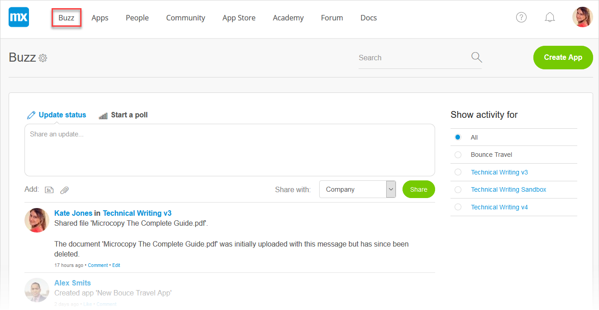
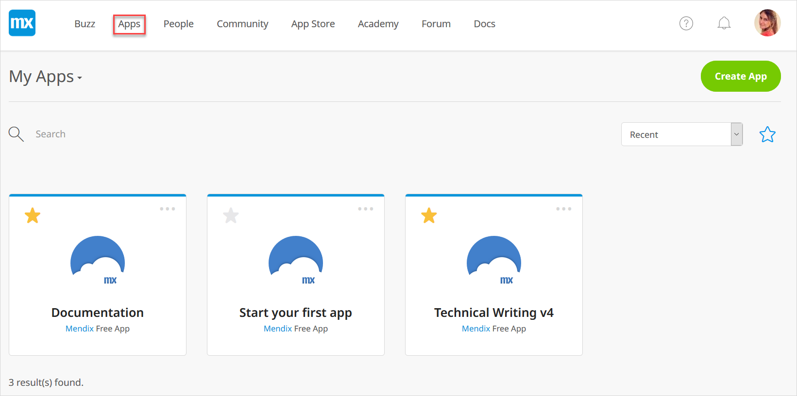
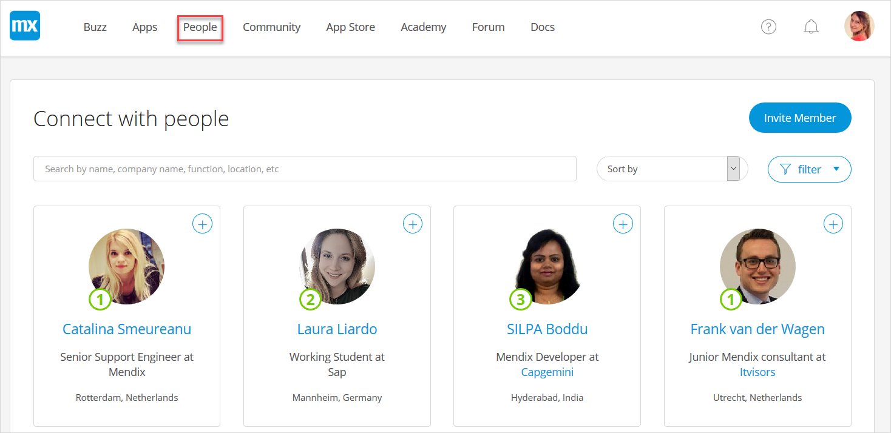
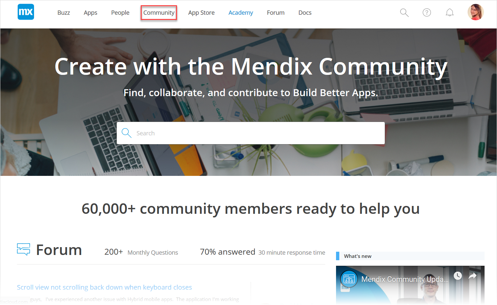
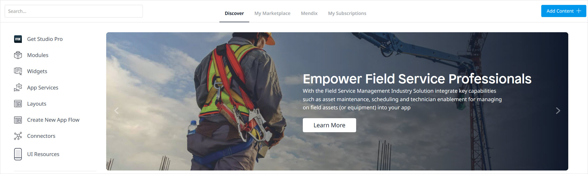
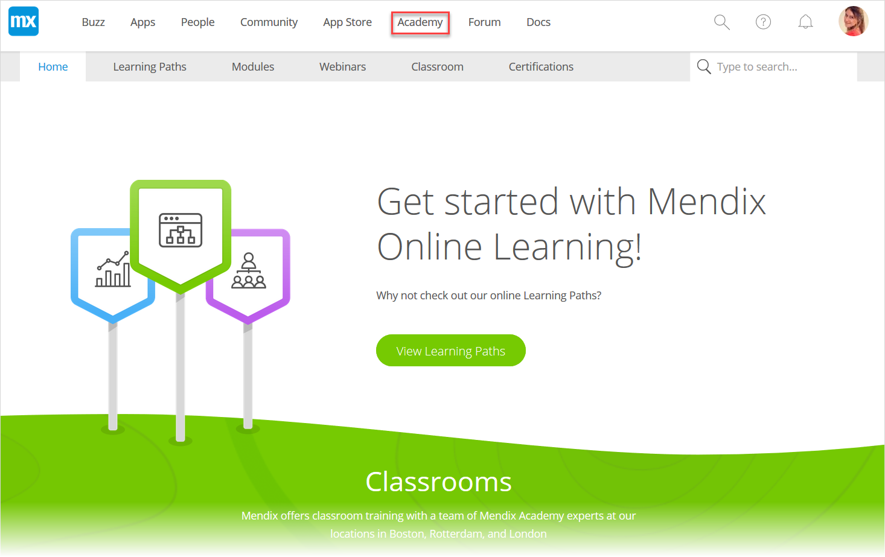
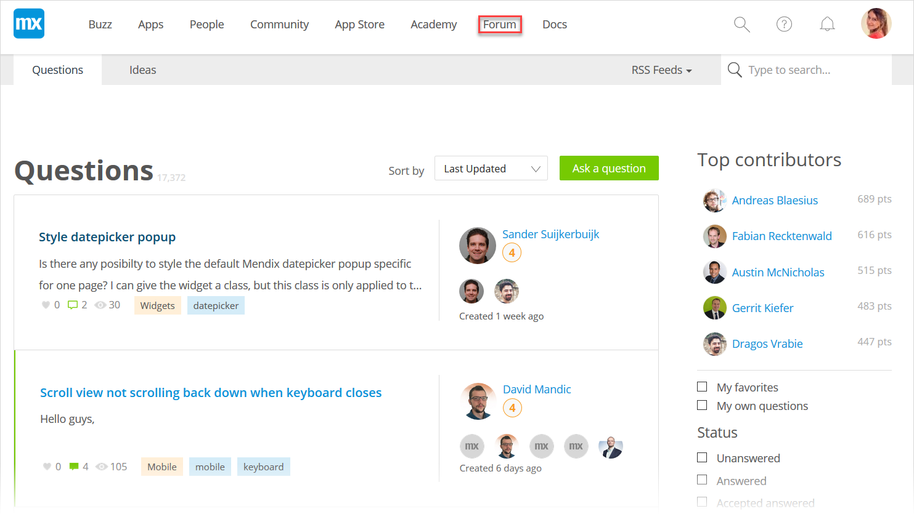
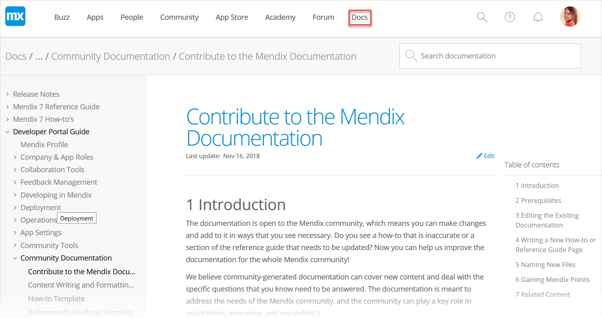
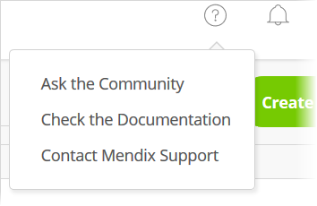

## 1 What Is the Developer Portal?

The [Developer Portal](http://home.mendix.com) is one of the three key components of the Mendix Platform. The other two are [Mendix Studio Pro](/refguide/modeling) and [Mendix Studio](/studio/index). In the Developer Portal, Mendix developers can collaborate, deploy, and manage their apps, and manage their company and users. 

The Developer Portal also offers open, well-defined APIs, enabling third-party developers to integrate their own widgets and plugins. For more information, see [API Documentation](/apidocs-mxsdk/apidocs/).

You can go to any part of the Developer Portal using the menu items described below.

## 2 Buzz {#buzz}

In the company [Buzz](collaborate/buzz), you can communicate with colleagues, App Team members, stakeholders, and any other Mendix users in your company:

To start a new app project click **Create App**, which will open a page where you can choose a starting pointing for your new app:

## 3 Apps

In [Apps](/developerportal/apps-list/index), you can find your free and licensed apps, nodes, and other apps created by your company:

If you are an App Team member, you can go to the app [Buzz](collaborate/buzz). Here you can  manage not only the deployment of the app itself but the entire development process via user stories which can be refined and allocated to Sprints.

## 4 People

In [People](mendix-profile/index#connections), you can view the other members of the Mendix community and also invite people to the Mendix Platform :

## 5 Community

In [Community](/developerportal/community-tools/index), you can explore various resources for the vibrant Mendix community of users, from blog posts about how Mendix is being used in the wider world of low-code development to the [Mendix job board](/developerportal/community-tools/mendix-job-board) and [Mendix Shop](https://shop.mendix.com/):

## 6 App Store

In the [Mendix App Store](/appstore/general/app-store-overview), you can share Mendix content you have created, check out complete sample apps that can be used right away, and browse connectors, [widgets](https://appstore.home.mendix.com/link/app/48902/), and modules that can be used to build custom apps more quickly:

## 7 Academy 

The [Mendix Academy](https://gettingstarted.mendixcloud.com/link/home) offers both self-paced online training (via learning paths) and classroom instruction from our team of experts:

## 8 Forum

In the [Mendix Forum](/developerportal/community-tools/mendix-forum), you can interact with the Mendix community to help out with [questions](https://forum.mendixcloud.com/link/questions/) and answers on the best ways to use Mendix as well as propose [ideas](https://forum.mendixcloud.com/link/ideas/) for improving the Mendix Platform:

## 9 Docs

The [Mendix Documentation](https://docs.mendix.com/) is open to the Mendix community, which means you can [make changes and contribute](/developerportal/community-tools/contribute-to-the-mendix-documentation) to benefit the whole Mendix community:

## 10 Getting Assistance

Clicking the question icon in the Developer Portal brings up the options Mendix provides for getting assistance:

* **Ask the Community** – click this to go to the [Mendix Forum](https://forum.mendixcloud.com/index4.html)
* **Check the Documentation** – click this to go to the [Mendix Documentation](https://docs.mendix.com/)
* **Contact Mendix Support** – click this to go to [Mendix Support](https://support.mendix.com/hc/en-us)

## 11 Guide Categories

The *Developer Portal Guide* is divided into the following categories:

{}
