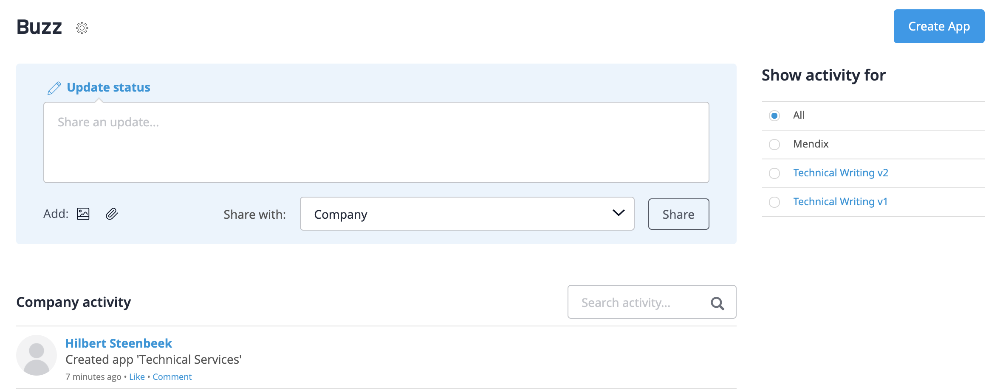
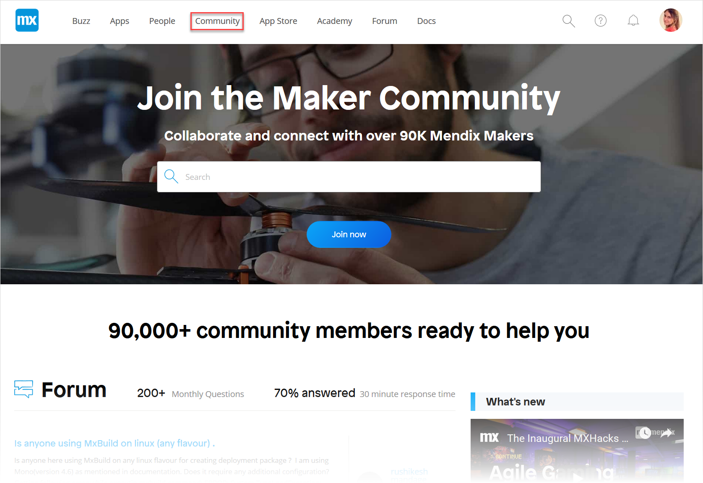
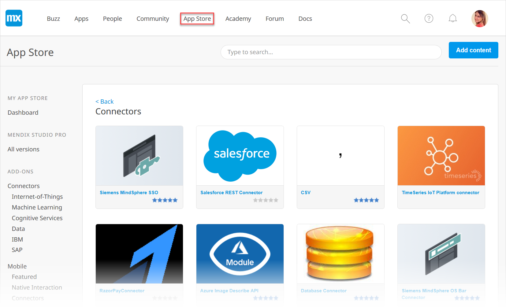
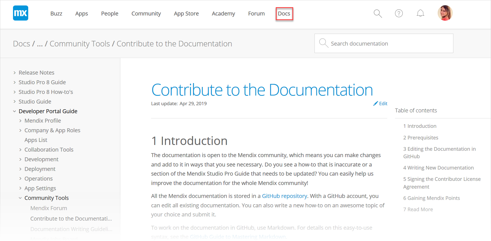
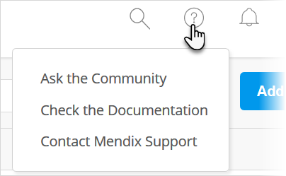

## 1 What Is the Developer Portal?

The [Developer Portal](http://home.mendix.com) is one of the three key components of the Mendix Platform. The other two are Mendix Studio Pro and Mendix Studio. More information on these other components can be found in [Mendix Studio Pro](/refguide/modeling), and [Mendix Studio](/studio/index).

The Developer Portal is where Mendix developers can collaborate, deploy, and manage their apps, company, and users. 

The Mendix Developer Portal takes a lightweight and social approach to enterprise project collaboration. The portal provides a unique combination of requirements management tools and social activity streams, offering a way to interact with colleagues, app project team members, and even external stakeholders involved in app projects.

As a collaboration tool that can be used across the enterprise, the Developer Portal breaks down walls between different departments and roles. All employees are part of the same private social network and share a wall that shows all the company **Buzz** conversations. These conversations can turned into app ideas, and ideas can be organized using a voting system and then converted into projects. The portal offers all the tools you expect from a social network, including two-way email integration. 

Besides operating as a powerful social platform, Mendix also provides tools for the Agile management of your projects. The social backlog management tools enable project team members and stakeholders to collaborate and create, refine, and prioritize user stories. Each user story has its own conversation thread, which is also published on the wall for an intuitive mix of company buzz and project activity streams. User stories can be estimated and planned in Sprints. The planning overview gives team members and stakeholders the ability to monitor the progress of the current Sprint using Scrum boards and burn-down charts as well as to plan the Sprints and releases that define the future of the project.

The Developer Portal can be used separately from other Mendix products, and the [Mendix Feedback Widget](feedback/use-feedback-widget) can be included in any web application. As a whole, the Mendix Platform offers an open, well-defined API, enabling third-party developers to create their own widgets, plugins, and any other innovative products they come up with.

The Developer Portal is integrated using the menu items described below. Follow the highlighted links for more information.

## 2 Buzz {#buzz}

In the company [Buzz](collaborate/buzz), you can communicate with the users in your company:

## 3 Apps

In **Apps**, you can find your nodes, sandboxes, and company's apps:

After you select an app, you can collaborate, develop, deploy, and operate the app with your App Team:

## 4 People

In [People](mendix-profile/index#connections), you can view the other members of the Mendix community and also invite people to the Mendix Platform :

## 5 Community

In [Community](/developerportal/community-tools/index), you can explore various resources for the vibrant Mendix community of users, from blog posts about how Mendix is being used in the wider world of low-code development to the [Mendix job board](/developerportal/community-tools/mendix-job-board) and [Mendix Shop](https://shop.mendix.com/):

## 6 App Store

In the [Mendix App Store](/developerportal/app-store/app-store-overview), you can share Mendix content you have created, check out complete sample apps that can be used right away, and browse connectors, [widgets](https://appstore.home.mendix.com/link/app/48902/), and modules that can be used to build custom apps more quickly:

## 7 Academy 

The [Mendix Academy](https://gettingstarted.mendixcloud.com/link/home) offers both self-paced online training (via learning paths) and classroom instruction from our team of experts:

## 8 Forum

In the [Mendix Forum](/developerportal/community-tools/mendix-forum), you can interact with the Mendix community to help out with [questions](https://forum.mendixcloud.com/link/questions/) and answers on the best ways to use Mendix as well as propose [ideas](https://forum.mendixcloud.com/link/ideas/) for improving the Mendix Platform:

## 9 Docs

The [Mendix Documentation](https://docs.mendix.com/) is open to the Mendix community, which means you can [make changes and contribute](/developerportal/community-tools/contribute-to-the-mendix-documentation) to benefit the whole Mendix community:

## 10 Getting Assistance

Clicking the question icon in the Developer Portal brings up the options Mendix provides for getting assistance:

* **Ask the Community** – click this to go to the [Mendix Forum](https://forum.mendixcloud.com/index4.html)
* **Check the Documentation** – click this to go to the [Mendix Documentation](https://docs.mendix.com/)
* **Contact Mendix Support** – click this to go to [Mendix Support](https://support.mendix.com/hc/en-us)

## 11 Document Categories

The *Developer Portal Guide* is divided into the following categories:

{}
