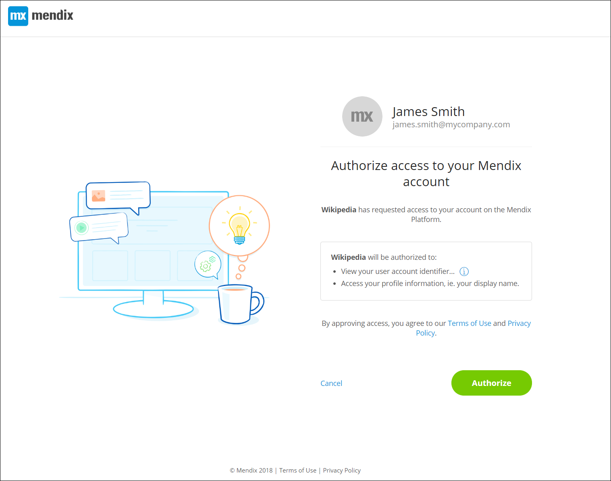

## Introduction
#### OAuth
OAuth is a standard for access delegation. It is commonly used as a way for internet users to grant websites or applications limited access (scopes) to their data without giving them their credentials.

In other words, OAuth allows users that have an account to a website/application B (let's say Gmail) to use those credentials to get connected to the website/application A (for example Wikipedia).

Mendix uses OAuth 2.0, the second version of the OAuth standard.

###### Step by step, this is what it looks like:
1. The user goes to the login page of website A and clicks on the button "I want to login with my credentials from website B".
1. The user is asked to authenticate himself(themselves) on website B.
1. Website B is going to confirm the identity of the user to the website A.

So, if there were an OAuth process between Wikipedia and Gmail, a user could connect to wikipedia using their Gmail credentials.

#### Scopes
Once the user is authenticated by website B, website A will have a guarantee of the real identity of the user. But OAuth provides more complex functionalities.
 For example, website B can communicate a set of information (for example email address or profile picture) and / or a set of rights to website A.
 This can only happen if the user grants the rights to enable it. 
In our example above, if a user grants Gmail permissions to send their profile picture and last name to Wikipedia (through a specific "authorization page"), then Wikipedia will be able to display that information on their website.

The access to that information or rights is granted **manually** by the user during the authentication process.

These rights are called **scopes**.

*Here is a hypothetical example of a page where a user is asked to accept some **scopes** on their Mendix account, so that Wikipedia can display thier name and access their profile information*
 

## Scopes
The following scopes, with user consent, provide access to otherwise restricted user data.

##### Profile scope
With this scope, the website or application will have access to the user's basic profile information as recorded on Mendix.
This contains:

* the user’s full name,
* the user’s preferred username,
* the user’s avatar,
* the URL of the user's Web page or blog.

##### Email scope
With this scope, the website or application will have access to the user's email address.

##### OpenID scope
This is one of the most common scopes. With this scope, the website or application B (Mendix) will be informed that application A (Wikipedia) wants to authenticate the user. Application A will receive the user's unique identifier.

##### Mendix Profile scope
With this scope, which is an extension of the *Profile scope*, the website or application will have access to the information of the user's Mendix profile.
This contains:

 * the OpenID2 identifier of the user,
 * the username of the user,
 * the display name of the user,
 * the avatar of the user,
 * the biography of the user,
 * the URL of the user's Web page or blog,
 * the phone number of the user,
 * the job title of the user,
 * the department of the user (in his company),
 * the location of the user (his company work place),
 * the country of the user (his company work place),
 * the LinkedIn profile of the user,
 * the Twitter account of the user,
 * the Skype account of the user,
 * the name of the of the company the user belongs to,
 * the Mendix internal Identifier of the Company the user belongs to.
 
##### Create a Mendix application scope
This is a Mendix-specific scope. It is used by several strategic entities such as SAP, IBM and  internal Mendix applications, to allow the website to create a Mendix Application on behalf of the user.

##### Change the deployment cloud target of a Mendix application scope
This is a Mendix-specific scope. It is used by several strategic entities such as SAP, IBM and  internal Mendix applications, to allow the website to change the deployment target cloud provider of an application.