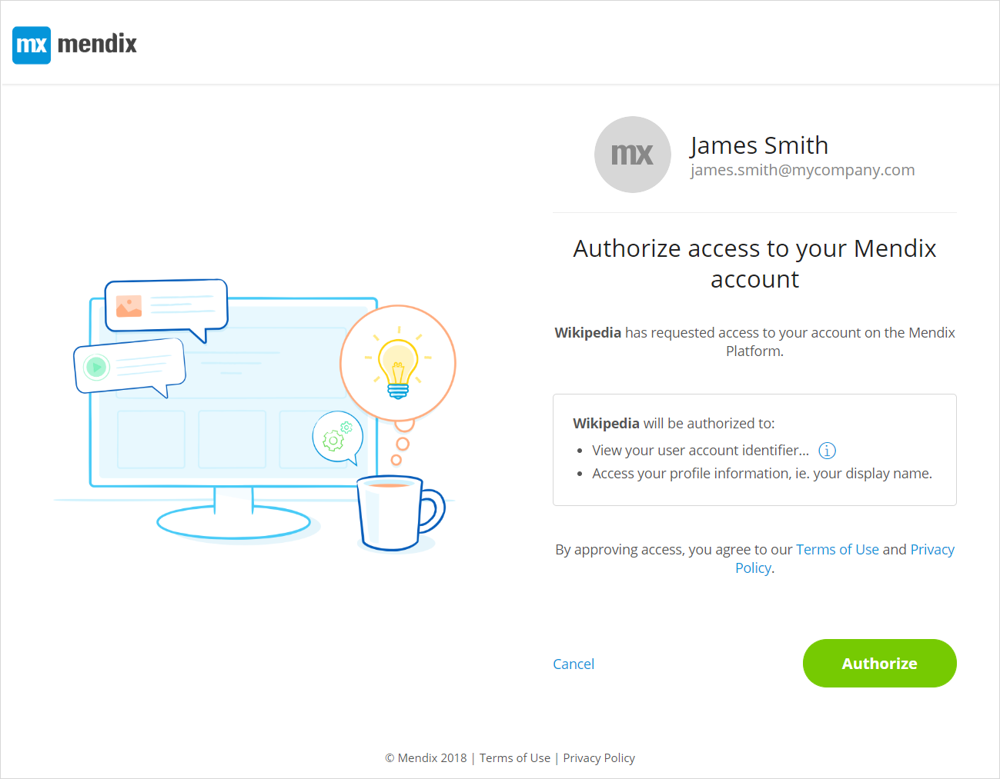

## 1 Introduction

### 1.1 OAuth

OAuth is a standard for access delegation. It is commonly used as a way for users to grant websites or applications limited access (scopes) to their data without providing their credentials. Mendix uses [OAuth 2.0](https://oauth.net/2/).

In other words, OAuth allows a user with an account from website A (for example, Gmail) to use those credentials to get connected to website B (for example, Wikipedia). The process generally looks like this:

1. The user goes to the login page of website A and clicks the button for logging in with credentials from website B.
2. The user is asked to authenticate themselves on website B.
3. Website B confirms the identity of the user to website A.

### 1.2 Scopes

Once the user is authenticated by website B, website A has a guarantee of the real identity of the user. OAuth also provides more complex functionality. For example, website B can communicate a set of information (for example, the email address or profile picture) and a set of rights to website A. This can only happen if the user grants the rights to enable it.

In the example above, if the user grants Gmail permission to send their profile picture and last name to Wikipedia (through a specific authorization page), then Wikipedia is able to display that information on their website. The scopes are the access rights to that information granted manually by the user during the authentication process.

Here is an example page where a user is asked to accept scopes on their Mendix account so that Wikipedia can access their profile information and display thier name:

 

## 2 Scopes

The following scopes, with user consent, provide access to otherwise restricted user data.

### 2.1 Profile Scope {#profile}

With this scope, the website or application will have access to the user's basic profile information as recorded on Mendix.
This contains:

* the user’s full name,
* the user’s preferred username,
* the user’s avatar,
* the URL of the user's Web page or blog.

### 2.2 Email Scope {#email}

With this scope, the website or application will have access to the user's email address.

### 2.3 OpenID Scope {#openid}

This is one of the most common scopes. With this scope, the website or application B (Mendix) will be informed that application A (Wikipedia) wants to authenticate the user. Application A will receive the user's unique identifier.

### 2.4 Mendix Profile Scope {#mx:user:profile:v1:read}

With this scope, which is an extension of the *Profile scope*, the website or application will have access to the information of the user's Mendix profile. This contains:

 * OpenID2 identifier of the user
 * Username of the user
 * Display name of the user
 * Avatar of the user
 * Biography of the user
 * URL of the user's Web page or blog
 * Phone number of the user
 * Job title of the user
 * Department of the user (in his company)
 * Location of the user (his company work place)
 * Country of the user (his company work place)
 * LinkedIn profile of the user
 * Twitter account of the user
 * Skype account of the user
 * Name of the of the company the user belongs to
 * Mendix internal Identifier of the Company the user belongs to
 
### 2.5 Create a Mendix Application Scope {#mx:app:create}

This is a Mendix-specific scope. It is used by several strategic entities such as SAP, IBM and  internal Mendix applications, to allow the website to create a Mendix Application on behalf of the user.

### 2.6 Change the Deployment Cloud Target of a Mendix Application Scope {#mx:app:cloudswitch}

This is a Mendix-specific scope. It is used by several strategic entities such as SAP, IBM and  internal Mendix applications, to allow the website to change the deployment target cloud provider of an application.
