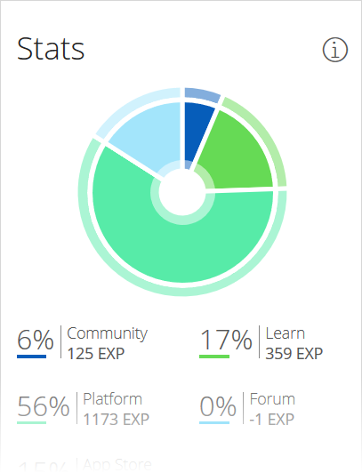
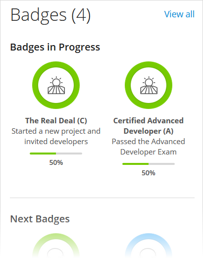
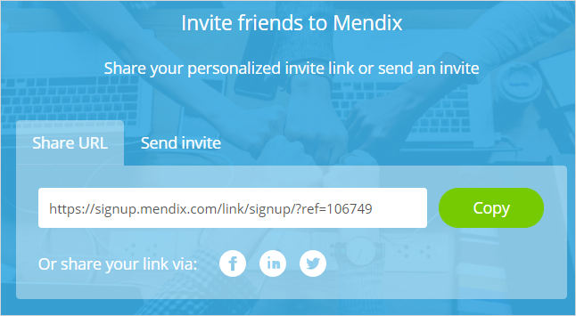
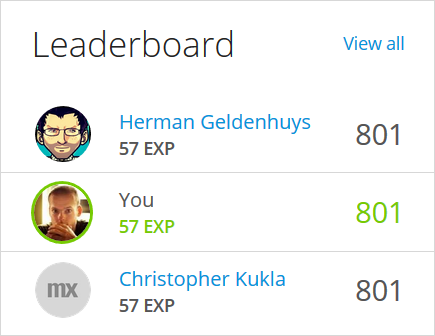
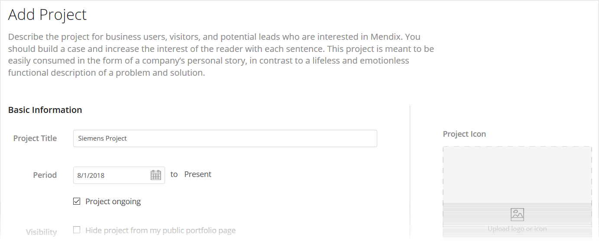

## 1 Introduction

Your Mendix Profile is your main point of contact with members of the Mendix community, as it displays your activities on the Mendix Platform as well as details about your background and plans for the future. There are plenty of ways to get more involved with the Mendix community, and your profile is the best place to start!

To access your Mendix Profile, hover over your picture on the right side of the Developer Portal navigation bar and select **My Profile** from the context menu.

## 2 Header

On the profile header, you can see your location, number of [connections](#connections), Mendix level and points in that level, [credits ](#credits), and [badges](#badges). Other personal information is presented in the header as well as on the **Personal Info** card. This information can be easily edited to present accurate personal details, project roles, and skills you have gained. For all the details on editing your Mendix Profile, see the [Settings](#settings) section below.

## 3 Overview

Your profile will open to the **Overview** tab. The first profile card below the header presents your **Stats**. The chart and its legend display your points divided between various Mendix products and activities. When analyzing your points, be sure to also check out the [Leaderboard](#leaderboard) card on this tab to see the top Mendix community contributors!

{}

{}

## 4 Badges {#badges}

In addition to the **Stats** chart, on the **Overview** tab you gain an overview of your **Badges**. These badges represent your achievements and progress on the Mendix Platform. You can see your **Badges in Progress** as well as **Next Badges**. The badges are color-coded based on their rarity, from green (least rare), to blue, purple, and orange (most rare). 

To see all of your badges as well as the badges you can work towards, click **View all** to go to the **Badges** tab of your profile.

{}

{}

{}
The **Badges in progress** section of the **Badges** tab only displays the current level in progress of a multi-level badge. Furthermore, multi-level badges that you have already earned are not shown in the **Earned badges** section when there is a higher level badge available.
{}

## 5 Challenges {#challenges}

The **Challenge** card presents a featured challenge you can complete on the Mendix Platform to gain credits. Once you complete a challenge, you can claim the credits and use them in the Mendix Shop. Challenges are not only about keeping engaged with the platform and exploring new challenges, but picking up some swag in the process!

{}

{}

Clicking **View all** will bring you to the **Challenges** tab of your profile, which gives you more details on your challenges. You can complete these activities in any order you like.

When you complete a challenge, click **Claim Credits** to claim the Mendix credits which you will be able to spend in the Mendix Shop.

{}

{}

Completing your challenges and gaining credits is a great way to stay engaged with the Mendix community. And the Mendix Shop will always have cool items for you to spend credits on!

## 6 Connections {#connections}

One of the greatest strengths of Mendix is our awesome developers community, and the **Connections** card is the perfect place to start networking with other Mendix developers. When you are invited by a Mendixite to connect, you can check out their profile and make a decision to accept or ignore the invitation.

You can also see a list of people you may know so that you can add further connections to your profile. To connect with someone, click the plus icon, and an invitation will be sent.

{}

{}

Clicking **View All** on the card will bring you to the **Connections** tab of your profile. On this tab, you can invite friends and colleagues to Mendix in two ways:

* **Share URL** – copy the personalized invite link and share it on your personal website, blog, and social media channels, or share it directly via specific social media
* **Send invite** – send someone a Mendix invite by entering their email address and clicking **Send invite**

{}

{}

## 7 Leaderboard {#leaderboard}

This card on your profile presents your points and ranking for the last 30 days:

Clicking **View all** takes you to the **Leaderboards** page, which presents all the boards available for viewing Mendix Platform user activity: **Top Overall**, **Top Forum**, **Top App Store**, **Top Platform**, **Top Community**, and **Top Learning**.

To earn points and climb the leaderboards, start performing different activities in the Mendix community. For example, let's say you have some time to spare while your app is deploying. You get a cup of coffee and check out the [Mendix Forum](http://forum.mendix.com). One questions pops out because you came across a similar problem a few weeks back. You decide to help the community member and post an answer to their question. Not long after, the author marks your answer as accepted. Boom! 15 points right there.

Check out the tables below for ways to earn points.

### 7.1 Forum Points

These are points you can gain through activity on the [Mendix Forum](https://forum.mendixcloud.com/).

| Activity | Points | Max. Points per Day |
| --- | --- | --- |
| Have your answer marked as accepted | 15 | N/A |
| Receive an upvote | 10 | 50 |
| Mark an answer on your question as accepted | 2 | N/A |
| Downvote someone | -1 | N/A |
| Receive a downvote | -2 | N/A |

### 7.2 App Store Points {#app-store-points}

These are points you can gain through activity in the [Mendix App Store](https://appstore.home.mendix.com/).

| Activity | Points | Max. Points per Day |
| --- | --- | --- |
| Publish an app | 50 | N/A |
| Publish a new app version | 25 | N/A |
| Add an app review | 5 | N/A |
| Download [Mendix Studio Pro](https://appstore.home.mendix.com/link/modelers/) | 5 | 5 |
| Download an app from the App Store | 1 | 5 |

### 7.3 Platform Points

| Activity | Points | Max. Points per Day |
| --- | --- | --- |
| Be the first member of your company to sign up for Mendix | 25 | N/A |
| Upload to Model Share | 10 | 10 |
| Send an app invite | 10 | 50 |
| Download a microflow from [Model Share](https://modelshare.mendix.com/) | 5 | 5 |
| Send a Mendix Platform invite | 5 | 50 |
| Create an app project | 5 | 5 |
| Submit a feedback item | 2 | 10 |
| Have your feedback item marked as accepted | 2 | 10 |
| Commit to the Team Server | 2 | 10 |
| Send a project invite | 2 | 20 |
| Create a user story | 1 | 20 |
| Post a message on the Buzz | 1 | 10 |
| Deploy to a licensed node | 1 | 5 |
| Deploy a Free App | 1 | N/A |

### 7.4 Community Points {#github}

| Activity | Points | Max. per Day |
| --- | --- | --- |
| Win a Mendix Hackathon! | 300 | N/A |
| Reach the [Mendix MVP](https://developer.mendixcloud.com/link/mvp) status | 300 | N/A |
| Be the runner-up in a Mendix Hackathon | 150 | N/A |
| Organize a [Mendix Meetup ](https://developers.mendix.com/)  | 100 | N/A |
| Complete your Mendix Profile | 50 | N/A |
| Make your Mendix Profile public | 50 | N/A |
| Attend a Mendix Hackathon | 50 | N/A |
| Successfully refer a friend to Mendix | 25 | N/A |
| Attend a Mendix Meetup | 25 | N/A |
| Attend Mendix World 2016 | 25 | N/A |
| Get a GitHub pull request merged | 15 | N/A |
| Invite a friend to Mendix | 5 | 50 |
| Have a user sign up via your referral URL | 5 | 50 |

{}
In order to receive Mendix points for your contributions to Mendix GitHub repositories (for example, [mendix / docs](https://github.com/mendix/docs)), you are required to authorize the connection to your GitHub profile. For more information, see the [Social](#social) section below.
{}

### 7.5 Learning Points

| Activity | Points | Max. per Day |
| --- | --- | --- |
| Pass the [Expert Developer Certification](https://gettingstarted.mendixcloud.com/link/certification/expert) exam | 100 | N/A |
| Pass the [Advanced Developer](https://gettingstarted.mendixcloud.com/link/certification/advanced) exam | 50 | N/A |
| Give a presentation on Mendix | 25 | N/A |
| Write a blog post that is featured on the Mendix [Community Blog](https://developers.mendix.com/community-blog/) | 25 | N/A |
| Pass the [Rapid Developer Certification](https://gettingstarted.mendixcloud.com/link/certification/rapid) exam | 25 | N/A |
| Complete a learning path in the [Mendix Academy](https://gettingstarted.mendixcloud.com/link/home) | 25 | N/A |
| Make a large contribution to the [Mendix documentation](https://docs.mendix.com/) | 15 | N/A |
| Attend the [Advanced Developer Classroom](https://gettingstarted.mendixcloud.com/link/classroom/advanced) course | 10 | N/A |
| Attend the [Rapid Developer Classroom](https://gettingstarted.mendixcloud.com/link/classroom/rapid) course | 10 | N/A |
| Make a small contribution to the Mendix documentation | 5 | N/A |
| Complete a unit in the Mendix Academy | 1 | N/A |

{}
For details on how to gain Mendix points on documentation work, see [How to Contribute to the Mendix Documentation](../community-tools/contribute-to-the-mendix-documentation).
{}

### 7.6 Point Levels

When you earn enough points, you gain a level:

| Level | Points Needed |
| --- | --- |
| 1   | 100 |
| 2   | 500 |
| 3   | 1000 |
| 4   | 2500 |
| 5   | 5000 |
| 6   | 8500 |
| 7   | 13000 |
| 8   | 18500 |
| 9   | 25000 |
| 10  | 32500 |

## 8 Portfolio

The **Portfolio** card presents a selection of Mendix app projects you have worked on. Click the project name to see more details about it (including a description of the app, business need, solution, results, and collaborators), or click **View all projects** to be taken to the  **Portfolio** tab, which presents a complete view of all your projects. 

To add a project to your portfolio, click **Add Project**, which will open the project editor. There are tips in the editor for what you should enter in each field. All of the fields in the project editor must be filled out before submitting the project.

If you cannot finish your project or do not want to publish it right away, click **Save as Draft** in the project editor to finish it later. The project draft will be visible only to you in your **Portfolio** tab and available for further editing.

## 9 Activity

On the **Activity** tab, you can see a list of the most important public events for which you have gained Mendix points.

You can also view details in the following sections.

### 9.1 Latest Messages

In this section, you can see all the notifications from [Buzz](../collaborate/buzz) of which you are a part (for example, when your colleague has created an app or added a new story).

### 9.2 Documents

This section presents all of the documents  you have shared within different apps in the Developer Portal.

### 9.3 Feedback {#feedback}

{}
{}

In this section, you can view feedback submitted on the following:

* Apps of which you are an App Team member
* Your company’s apps of which you are not an App Team member

When you click **Details** for feedback on an app of which you are an App Team member, you can manage the feedback. For details on how to do this, see [Feedback](/developerportal/collaborate/feedback).

### 9.4 Team Server

Changes made through Studio Pro are stored in the Mendix Team Server. This section provides an overview of the revisions you have committed.

{}
{}

### 9.5 Pending Invites

In this section, you can view the invitations you have sent and received. There are two types of invitations:

* Project invitation – an invitation to join an App Team to work on an app project
* App invitation – an invitation to join an app project as a user

## 10 Settings {#settings}

You can easily edit the information on your Mendix Profile by clicking the **Settings** cog icon. The settings page has a sidebar menu that allows you to edit the sections described below.

### 10.1 General Information

In this section, you can upload your profile image as well as fill in personal details such as **Job title**, **location**, **Summary**, and **Website URL**.

Under **Contact**, you can select how much information you want to receive from Mendix:

* **Receive daily digest** – disabled by default
* **Receive updates for threads in which I am active** – enabled by default

There is also a link to [Mendix Support](https://support.mendix.com/hc/en-us) if you need to perform certain account actions that require their assistance.

### 10.2 Work Experience

In this section, you can tell the Mendix community about yourself and your work experience by stating if you are **Looking for** a job or a project and by selecting your areas of **Industry Experience** and **Skills**.

{}
{}

### 10.3 Social {#social}

Here you can connect  your social accounts for **GitHub**, **Meetup**, **Twitter**, **LinkedIn**, and **Skype**.

### 10.4 Security {#security}

You can change your password in this section. By default, you are requested to change your password every 90 days. Only a [Company Admin](../company-app-roles/companyadmin-settings) is allowed to change the expiration period.

### 10.5 API Keys {#api-key}

In this section, you can create and view API keys that can be used by external applications to connect to the Mendix Platform APIs on behalf of your user account. These keys allow you to execute operations (or have them executed on your behalf) that require authentication but for which you do not want to pass your actual password. 

An example of this is to use an API key to perform scripted operations on your application model with the Platform SDK.

To obtain a Mendix API key, follow these steps, click **Create new API key** and follow the instructions.

{}
Make a note of the API key, as it will only be shown once.
{}

The obtained API key will allow apps that use it to act on behalf of the user. Therefore, the app will have the same privileges as the user who created the API key.

For more information, see the following:

* [Authentication](/apidocs-mxsdk/apidocs/authentication)
* [API Documentation](/apidocs-mxsdk/apidocs/)
* [Mendix Platform SDK](/apidocs-mxsdk/mxsdk)
* [How to Manage App API Keys](../settings/api-key)

### 10.6 Advanced

In this section, you can merge your accounts and select your profile visibility.

#### 10.6.1 Merging Your Accounts {#merging}

With use of the Mendix Profile, you can merge your old Mendix account(s) into your current Mendix account. This action combines all your hard-earned points, certifications, and achievements in your efforts to climb the leaderboards.

All you have to do is make your profile public (for details, see the [Selecting Your Profile Visibility](#public) section below), enter the email address of the account you want to merge with the account you are currently logged in to, and send a merge request.

We’ll take things from there!

{}
Once an old account has been merged to a new account, you will no longer have access to the app projects you were invited to via your old account. With your new account, you will need to be invited to those app projects again in order to gain access. Adding your new account to the relevant app projects prior to the merge is recommended.
{}

{}
With the merge, the accounts are only combined. The old account is not deactivated. That should be done by the Company Admin.
{}

#### 10.6.2 Selecting Your Profile Visibility {#public}

If you have started editing your profile but it is not yet visible to other Mendix community members, you will see a banner inviting you to make it public at the top of your profile. You can make it public by clicking **Make this profile public**.

Be sure to do the following in order to make your profile public:

* Add an avatar
* Enter a **Function**
* Enter a **Location**
* Confirm if you are looking for a **job**, a **project**, both, or neither
* Enter a **Summary**
* Add at least 1 **Skill**
* Add at least 1 **Industry Experience** item

{}
To make your public profile private again, click **Make this profile private**.
{}

#### 10.6.3 Viewing Your Audit Trail

The Mendix Platform stores certain personal information about you. To view this information, click **View Audit Trail** in the **Personal Information Stored by Mendix** section of the **Advanced** settings.

{}
Mendix has been tracking these data changes since November, 2018.
{}

## 11 Main Document in This Category

* [OAuth & Scopes](oauth-scopes) – provides introductory information on how OAuth and scopes work as well as details on scopes generated in the Developer Portal
