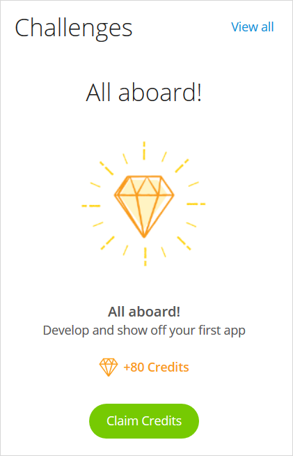
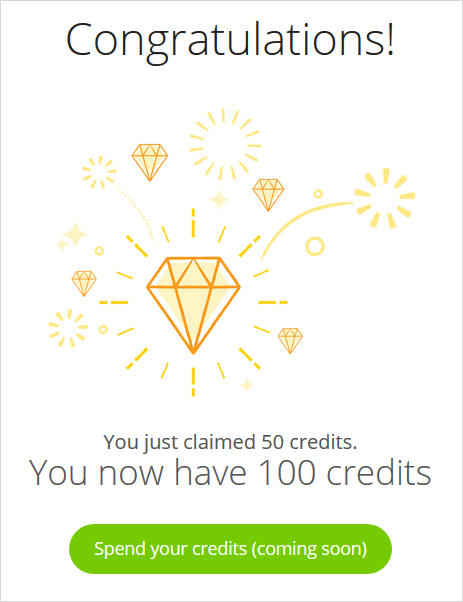
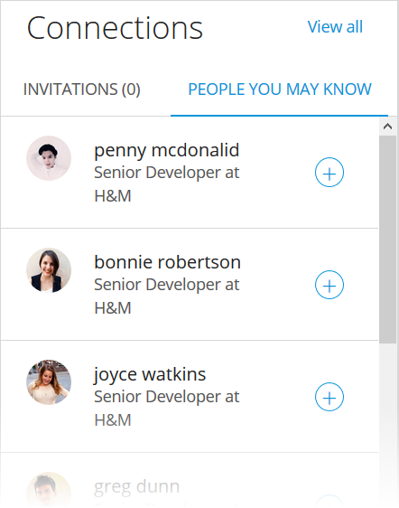
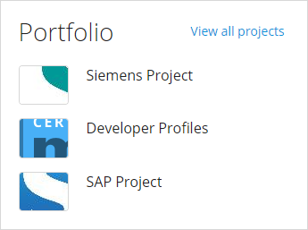
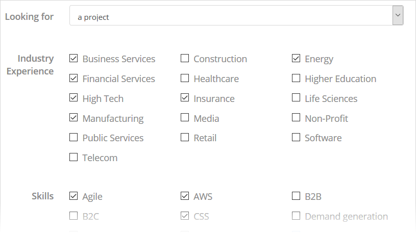
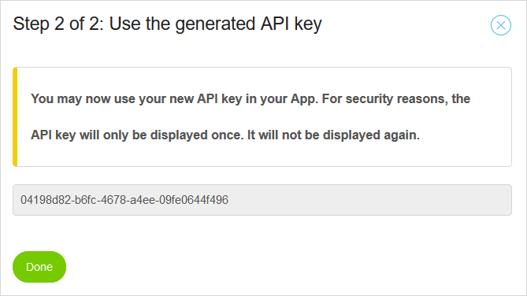
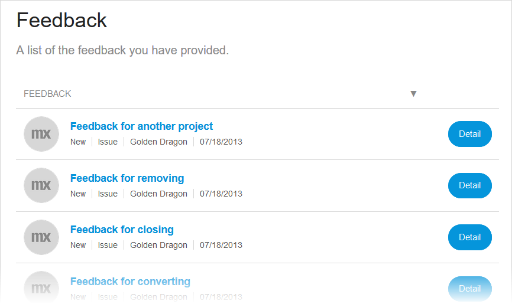

## 1 Introduction

Your Mendix Profile is your main point of contact with members of the Mendix community. It displays your activities on the Mendix Platform and details about your background. 
To get more involved in the Mendix community, your profile is the best way to start. 

You can access your Mendix profile by clicking your picture in the top-right corner of the Developer Portal and then selecting **See Your Profile**.

## 2 Header {#header}

Your profile header displays a quick overview of information about you. Your Mendix experience in level and points, your number of [credits](#challenges), and your number of [connections](#connections) are all found here. You can also select up to four featured [badges](#badges) to display your progress on the Mendix Platform. If you have a certificate from the Mendix [Academy](https://academy.mendix.com), this will also be displayed. The **Personal Info** card presents other information.

You can change these details in the [Settings](#settings).

## 3 Overview & Stats

Your profile opens to the **Overview** tab, which shows you at a quick glance how you are doing on the platform. You can see the following:

* Stats 
* Badges in progress and the next badges to work towards
* Assigned challenge
* Personal information
* Invitations
* Position on the leaderboard
* Portfolio

The first profile card below the header presents your **Stats**, which are your points divided between Mendix products and activities:

{}

{}

{}
Don't get bummed out about a low number of points, because everyone in the Mendix community started like that, even our Expert developers! There are plenty of opportunities to gain more points and climb the [Leaderboard](#leaderboard).
{}

## 4 Badges {#badges}

In addition to the **Stats** chart, on the **Overview** tab you gain an overview of your **Badges**. These badges represent your achievements and progress on the Mendix Platform. You can see your **Badges in Progress** as well as **Next Badges**. The badges are color-coded based from green (least rare), to blue, purple, and orange (most rare).

To see all your badges as well as the badges you can work towards, click **View all** to go to the **Badges** tab of your profile. On that tab, you can select up to four badges from the **Earned badges** section to make visible in your profile [header](#header) by clicking **Select as featured**.

{}
In the **Earned badges** section, you find the badges you have completed. If the badge is a multi-level badge, only the highest completed badge is shown.
{}

The percentage on the card of the **Badges in progress** shows how far you have come to earn that particular badge. If the badge is a multi-level badge, only the highest completed badge is shown, so don't get distracted while earning it!

{}

{}

## 5 Challenges {#challenges}

The **Challenge** card presents a featured challenge you can complete to gain credits. You can use the credits in the [Mendix Shop](https://shop.mendix.com) to order low-code t-shirts or other Mendix swag. Some challenges are going to be easy for you, whilst others might be harder to complete!

{}

{}

Click **View all** to go to the **Challenges** tab of your profile. This tab presents more details on the challenge steps, the time left, and how many credits you can earn with them. You can complete these activities in any order you like.

{}

{}

When you complete a challenge, click **Claim Credits** to claim the Mendix credits. You can then spend your credits on cool items in the Mendix Shop.

## 6 Connections {#connections}

One of the greatest strengths of Mendix is our awesome developers community, and the **Connections** card is the perfect place to start connecting to other Mendix developers. When you get an invitation to connect, you can check out their profile and decide whether to accept or ignore it. 

You can also see a list of people you may know so that you can add further connections to your profile. To connect with someone, click the plus icon to send an invitation.

{}

{}

Clicking **View All** on the card will bring you to the **Connections** tab of your profile. On this tab, you can invite friends and colleagues to Mendix in two ways:

* **Share URL** – copy the personalized invite link and share it directly
* **Send invite** – send someone a Mendix invite by entering their email address

{}

{}

## 7 Leaderboard {#leaderboard}

This card on your profile presents your points and ranking for the last 30 days:

Clicking **View all** takes you to the **Leaderboards** page, where you can view leaders per category, for the whole Mendix Platform, or for your company only.

You can climb the leaderboard by earning points through various activities on the Mendix Platform. For example, let's say you have some time to spare while your app is deploying. You get a cup of coffee and check out the [Mendix Forum]. One questions pops out because you came across a similar problem a few weeks back. You decide to help the community member and post an answer to their question. Not long after, the author marks your answer as accepted. Boom! 15 points right there.

Check out the tables below for all the ways to earn points.

### 7.1 Forum Points

These are points you can gain through activity on the [Mendix Forum](https://forum.mendix.com/).

| Activity | Points | Max. Points per Day |
| --- | --- | --- |
| Have your answer marked as accepted | 15 | N/A |
| Receive an upvote | 10 | 50 |
| Mark an answer on your question as accepted | 2 | N/A |
| Downvote someone | -1 | N/A |
| Receive a downvote | -2 | N/A |

### 7.2 Marketplace Points {#app-store-points}

These are points you can gain through activity in the [Mendix Marketplace](https://marketplace.mendix.com/).

| Activity | Points | Max. Points per Day |
| --- | --- | --- |
| Publish an app | 50 | N/A |
| Publish a new app version | 25 | N/A |
| Add an app review | 5 | N/A |
| Download [Mendix Studio Pro](https://marketplace.mendix.com/link/studiopro/) | 5 | 5 |
| Download an app from the Marketplace | 1 | 5 |

### 7.3 Platform Points

| Activity | Points | Max. Points per Day |
| --- | --- | --- |
| Be the first member of your company to sign up for Mendix | 25 | N/A |
| Send an app invite | 10 | 50 |
| Send a Mendix Platform invite | 5 | 50 |
| Create an app | 5 | 5 |
| Submit a feedback item | 2 | 10 |
| Have your feedback item marked as accepted | 2 | 10 |
| Commit to the Team Server | 2 | 10 |
| Send a project invite | 2 | 20 |
| Create a user story | 1 | 20 |
| Post a message on the Buzz | 1 | 10 |
| Deploy to a licensed node | 1 | 5 |
| Deploy a Free App | 1 | N/A |

### 7.4 Community Points

| Activity | Points | Max. per Day |
| --- | --- | --- |
| Win a Mendix Hackathon! | 300 | N/A |
| Reach the [Mendix MVP](https://www.mendix.com/mvp-program/) status | 300 | N/A |
| Be the runner-up in a Mendix Hackathon | 150 | N/A |
| Organize a [Mendix Meetup ](https://www.meetup.com/nl-NL/pro/mendix-maker-community/)  | 100 | N/A |
| Complete your Mendix Profile | 50 | N/A |
| Make your Mendix Profile public | 50 | N/A |
| Attend a Mendix Hackathon | 50 | N/A |
| Successfully refer a friend to Mendix | 25 | N/A |
| Attend a Mendix Meetup | 25 | N/A |
| Invite a friend to Mendix | 5 | 50 |
| Have a user sign up via your referral URL | 5 | 50 |

### 7.5 Learning Points

| Activity | Points | Max. per Day |
| --- | --- | --- |
| Pass the [Expert Developer Certification](https://academy.mendix.com/link/certification/expert) exam | 100 | N/A |
| Pass the [Advanced Developer Certification](https://academy.mendix.com/link/certification/advanced) exam | 50 | N/A |
| Pass the [Intermediate Developer Certification](https://academy.mendix.com/link/certification/intermediate) exam | 35 | N/A | 
| Pass the [Rapid Developer Certification](https://academy.mendix.com/link/certification/rapid) exam | 25 | N/A |
| Attend the [Advanced Developer Course](https://academy.mendix.com/link/classroom/5/Advanced/Course) | 10 | N/A |
| Attend the [Rapid Developer Course](https://academy.mendix.com/link/classroom/1/Rapid/Course) | 10 | N/A |
| Give a presentation on Mendix | 25 | N/A |
| Write a blog post that is featured on the [Mendix Community Blog](https://developers.mendix.com/community-blog/) | 25 | N/A |
| Complete a lecture in the Mendix Academy | 1 | N/A |
| Complete a learning path in the [Mendix Academy](https://academy.mendix.com/link/home) | 25 | N/A |

### 7.6 Point Levels

When you earn enough points, you gain a level:

| Level | Points Needed |
| --- | --- |
| 1   | 100 |
| 2   | 500 |
| 3   | 1000 |
| 4   | 2500 |
| 5   | 5000 |
| 6   | 8500 |
| 7   | 13000 |
| 8   | 18500 |
| 9   | 25000 |
| 10  | 32500 |

## 8 Portfolio

The **Portfolio** card presents a selection of Mendix apps you have worked on. Clicking an app name presents details about the customer, business need, solution, and results. You can also view other developers and their apps to get inspired. You can also click **View all projects** to go to the **Portfolio** tab, which presents all of your apps.

To add an app to your portfolio, click **Add Project**, which will open the editor. There are tips in the editor for what you should put in each field. All the fields in the editor are required before submission.

If you cannot finish your portfolio entry or do not want to publish yet, click **Save as Draft** to finish it later. The draft will be visible only to you in the **Portfolio** tab for further editing.

## 9 Activity

On the **Activity** tab, you can see a list of the last 20 public events for your badges, Marketplace, and Forum activity.

The sidebar menu will take you to [My Activity Overview](#my-activity-overview) in your profile settings, where you can find more details about your other platform activity.

## 10 Settings {#settings}

You can edit the information on your Mendix Profile by clicking the **Settings** cog icon. The settings page has a sidebar menu that allows you to edit the sections described below.

### 10.1 General Information

In this section, you can upload your profile image and fill in your personal details

Under **Contact**, you can select how much information you want to receive from Mendix:

* **Receive daily digest** – disabled by default
* **Receive updates for threads in which I am active** – enabled by default

There is also a link to [Mendix Support](https://support.mendix.com/hc/en-us) if you need to perform certain account actions that require their assistance.

### 10.2 Work Experience

Here you can tell the Mendix community about yourself and your work experience. Let everyone know your area of expertise by filling in your **Skills** and **Industry Experience**. You can also let the community know if you are looking for a job or an app to contribute to. 

{}
{}

### 10.3 Social {#social}

Here you can connect your social accounts for **Meetup**, **Twitter**, and **LinkedIn**.

### 10.4 Security {#security}

You can change your password in this section. By default, you are requested to change your password every 90 days. Only a [Mendix Admin](/developerportal/control-center#security) can change this.

### 10.5 API Keys {#api-key}

In this section, you can create and view the API keys that external applications can use to connect via the [Mendix Platform APIs](/apidocs-mxsdk/apidocs/) on behalf of your user account. An API key created here allow apps using it to act on behalf of the user who created the key, which means the apps will have the same privileges as the user who created the key. An API key allows you to execute operations that need authentication without a password. 

For example, you can use an API key to perform scripted operations on your application model with the SDK. 

To get a Mendix API key, click **Create new API key** and follow the instructions.

{}
Make a note of the API key, as it will only be shown once. 
{}

For more information, see the following:

* [Authentication](/apidocs-mxsdk/apidocs/authentication)
* [APIs](/apidocs-mxsdk/apidocs/)
* [Mendix Platform SDK](/apidocs-mxsdk/mxsdk)
* [How to Manage App API Keys](/developerportal/settings/api-key)

### 10.6 My Activity Overview {#my-activity-overview}

### 10.6.1 Latest Messages

In this section, you can see all the notifications of the [Buzz](/developerportal/collaborate/buzz) instances you participate in (for example, when a colleague has created an app or added a new story).

### 10.6.2 Documents

This section presents all the documents you have shared within different apps. 

### 10.6.3 Feedback {#feedback}

{}
{}

In this section, you can view feedback submitted on the following:

* Apps of which you are a [team](/developerportal/collaborate/team) member
* Your company’s apps of which you are not a team member

When you click **Details** for a feedback item on an app of which you are a team member, you can manage that feedback. For more information, see [Feedback](/developerportal/collaborate/feedback).

### 10.6.4 Team Server

Changes made through Studio Pro are stored in the Mendix [Team Server](/developerportal/collaborate/team-server). This section provides an overview of the revisions you have committed for all your apps.

{}
{}

### 10.6.5 Pending Invites

In this section, you can view the invitations you have sent and received. There are two types of invitations:

* Project invitation – an invitation to join a [team](/developerportal/collaborate/team) to work on an app
* App invitation – an invitation to join an app as an an [App User](/developerportal/collaborate/general-settings#managing-app-users)

### 10.7 Advanced

In this section, you can merge your accounts and select your profile visibility.

#### 10.7.1 Merging Your Accounts {#merging}

With use of the Mendix Profile, you can merge your old Mendix account(s) into your current Mendix account. This action combines all your points, certifications, and achievements to support you as you clim the leaderboards or on your way to the Expert certification.

Before merging, make sure your profile is public and that you logged in with the right email address. Enter the email address you want to have merged into the logged-in account, then send the merge request.

We’ll take things from there!

{}
Once the old account has been merged into the new account, you no longer have access to the apps of your old account. With your new account, you will need a new invitation to those apps to gain access. Adding your new account to the relevant apps before the merge is recommended.{}

{}
With the merge, the accounts are only combined. The old account is not deactivated from the Mendix Platform. That should be done by a [Mendix Admin](/developerportal/control-center/#members).
{}

#### 10.7.2 Selecting Your Profile Visibility {#public}

A banner will be present if you have not made your profile public to the Mendix community. You can make it public by clicking **Make this profile public**.

Be sure to do the following to make your profile public:

* Add an avatar
* Enter a **Function**
* Confirm if you are looking for a **job**, a **project**, both, or neither
* Enter a **Summary**
* Add at least 1 **Skill**
* Add at least 1 **Industry Experience** item

{}
To make your public profile private again, click **Make this profile private**. 
{}

#### 10.7.3 Viewing Your Audit Trail

The Mendix Platform stores certain personal information about you. You can view this information by clicking  **View Audit Trail** in the **Personal Information Stored by Mendix**.

{}
Mendix has been tracking these data changes since November 2018.
{}

#### 10.7.4 Removing Your Account

If you do not want to use Mendix anymore, you can remove your account from here.

## 11 Point Penalties

Abusing the Mendix Forum, point system, or other community tools is not allowed. Any such action can result in a point penalty. Mendix reserves the right to penalize a user who bypasses or games the system without informing them.

## 12 Main Document in This Category

* [OAuth & Scopes](oauth-scopes) – provides introductory information on how OAuth and scopes work, as well as details on scopes generated in the Developer Portal
