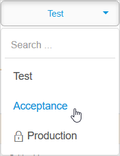

## 1 Introduction

This how-to describes creating a backup of a licensed cloud node. This option is not available for Free Apps.

**This how-to will teach you how to do the following:**

*   Create a backup of a licensed cloud node

## 2 Prerequisites

Before starting this how-to, make sure you have completed the following prerequisite:

*   You have a licensed cloud node
*   You have the correct [Node Permissions](/developerportal/deploy/node-permissions)

## 3 Create a Backup

Follow these steps to create a backup of a licensed app:

1. Go to the [Developer Portal](http://home.mendix.com) and click **Apps** in the top navigation panel.
2. Click **My Apps** and select **Nodes**.
3. Select the node from which you want to download the backup.
4. Click **Backups** under the **Operate** category.
5. Select the environment from which you want to download the backup.

    

6. Click **Create Backup**.

    

## 4 Read More

* [How to Deploy to the Mendix Cloud](/developerportal/deploy/mendix-cloud-deploy)
* [How to Download a Backup](download-backup)
* [Licensing Mendix Cloud Apps](/developerportal/deploy/licensing-apps)
* [How to Restore a Backup](restore-backup)
