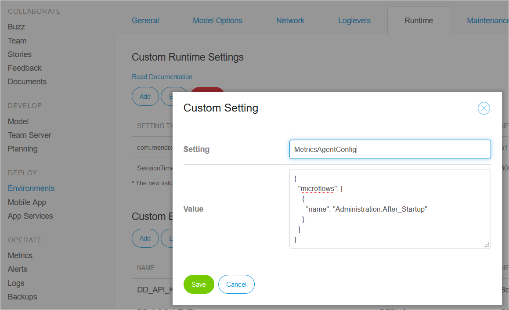

## 1 Introduction

**Datadog** is a monitoring and analysis tool for cloud applications, providing monitoring of servers, databases, tools, and services, through a SaaS-based data analytics platform. You can link your Mendix Cloud v4 apps to Datadog to provide additional monitoring.

This document explains how to configure your Mendix Cloud v4 app to send data to Datadog.

{}
Datadog is not supported in Mendix Cloud v3, nor in default deployment buildpacks for other cloud platforms.
{}

## 2 Datadog API Key

To make use of Datadog you will need a Datadog API key. If you already use Datadog, skip to section 2.2 [Existing Datadog User](#existing-datadog-user) to learn how to get one.

### 2.1 New Datadog User

If you are new to Datadog, you will need to get an account first.

1. Go to the Datadog site ([https://www.datadoghq.com/](https://www.datadghq.com/)) and choose **GET STARTED FREE**.

2. Enter your Datadog account details.

    Once you have entered your details you cannot continue until you have set up your agent.

3. Choose the option **From Source**.

    

4. Copy the value of *DD_API_KEY* key shown on the install script.

    

5. You now need to use this API key with your app: see section 3 [Connect Node to Datadog](#connect-node).

### 2.2 Existing Datadog User{#existing-datadog-user}

To find your existing API key, or to request a new one for your app, do the following:

1. Login to your Datadog account.

2. Go to the **Integrations > API** screen.

    

3. Copy an existing **API Key** or create a new one.

    

4. For more information on Datadog API keys, see the following page on the Datadog site: [How do I reset my Application Keys](https://docs.datadoghq.com/account_management/faq/how-do-i-reset-my-application-keys/) and related documentation.

## 3 Connect Node to Datadog{#connect-node}

To send your runtime information to Datadog, you need to provide the Datadog API key to your environment.

1. Go to the **Environments** page of your app in the *Developer Portal*.

2. Click **Details** to select the environment you wish to monitor with Datadog. 

3. Open the **Runtime** tab.

4. Add a **Custom Environment Variable**.

5. Select **DD_API_KEY** from the *Name* dropdown.

    

6. Enter the Datadog **API key** obtained in section 2 as the *Value* of the Environment Variable.

7. Add a second **Custom Environment Variable**:

    * **Name**: *DD_LOG_LEVEL*
    * **Value**: *INFO*

        This will ensure that some messages are sent to Datadog. You can change the log level later once you have confirmed that Datadog is receiving them.

7. Return to the **Environments** page for your app and *Deploy* or *Transport* your app into the selected environment.

    {}Your app must be **redeployed** as additional dependencies need to be included.<br/><br/>Restarting the app is not sufficient to start sending data to Datadog.{}

8. **Restart** the application.

## 4 Customizing the Metrics Agent

By default, Mendix will pass a log of *all microflow* executions, and a wide range of Mendix activities and request handlers to Datadog.

**Activities**

The following Mendix activities will be passed to Datadog:

* `CastObject`
* `ChangeObject`
* `CommitObject`
* `CreateObject`
* `DeleteObject`
* `RetrieveObject`
* `RollbackObject`
* `AggregateList`
* `ChangeList`
* `ListOperation`
* `JavaAction`
* `Microflow`
* `CallRestService`
* `CallWebService`
* `ImportWithMapping`
* `ExportWithMapping`

**Request Handlers**

The following Mendix activities will be passed to Datadog:

* `WebserviceRequestHandler`
* `ServiceRequestHandler` – OData requests
* `RestRequestHandler`
* `ProcessorRequestHandler`
* `ClientRequestHandler`
* `FileRequestHandler`
* `PageUrlRequestHandler`

However, it is possible to restrict the activities which are passed to DataDog by using JSON to configure the metrics agent. 

### 4.1 Format of Metrics Agent Configuration

You can specify which request handlers, microflows, and activities are reported to Datadog, together with the sample rate.

```json
{
  "standardSampleRate": <samplerate>,
  "requestHandlers": [
    {
      "name": "*" | "<requesthandler>",
      "sampleRate": <samplerate>
    }
  ],
  "microflows": [
    {
      "name": "*" | <microflow>,
      "sampleRate": <samplerate>
    }
  ],
  "activities": [
    {
      "name": "*" | "<activity>",
      "sampleRate": <samplerate>
    }
  ]
}


```

| Value | What is Sent | Note |
| --- | --- | --- |
| `"name": "*"` | all | default |
| `"name": "<activity>"` | all activities of this type | see list of activities above |
| `"name": "<microflow>"` | each time this microflow is run | format is `<module>.<microflow>`<br />for example `TrainingManagement.ACT_CancelScheduledCourse`
| `"standardSampleRate": <samplerate>` | the proportion of samples to send for all items | value between 0 and 1, <br/>optional |
| `"sampleRate": <samplerate>` | the proportion of samples to send for this item | value between 0 and 1, <br/>optional |

**Example**

The following example will send logs for:

* SOAP, OData, and REST calls (`WebserviceRequestHandler`, `ServiceRequestHandler`, and `RestRequestHandler`)
* the microflow `After_Startup` in the module `Administration`
* all activities

```json
{
  "requestHandlers": [
    {
      "name": "WebserviceRequestHandler"
    }
    {
      "name": "ServiceRequestHandler"
    },
    {
      "name": "RestRequestHandler"
    }
  ],
  "microflows": [
    {
      "name": "Administration.After_Startup"
    }
  ],
  "activities": [
    {
      "name": "*"
    }
  ]
}
```

### 4.2 Passing a Configuration to the Metrics Agent

You pass the configuration to the metrics agent by adding a *Custom Runtime Setting* to your Mendix Cloud environment.

1. Go to the **Environments** page of your app.
2. Click **Details** next to the environment you have configured for Datadog.
3. Add the **Custom Runtime Setting** *MetricsAgentConfig* with the value of the JSON required for your configuration.

    

4. Click **Save**.
5. Restart your app to apply the new settings.

## 5 Additional Information

### 5.1 Log Levels

The valid values for **DD_LOG_LEVEL** are:

* CRITICAL
* ERROR
* WARNING
* INFO
* DEBUG

### 5.2 Datadog Events Log

The Datadog Events log contains events which come from your app: those are the same events that would appear in the Mendix Console. It does not contain events from the environment.


### 5.3 Datadog Issues

If you have any issues related to accessing Datadog, please contact their support here: [Support | Datadog](https://www.datadoghq.com/support/), or by email at [support@datadoghq.com](mailto:support@datadoghq.com).

## 6 Read More

* [Metrics](metrics)
