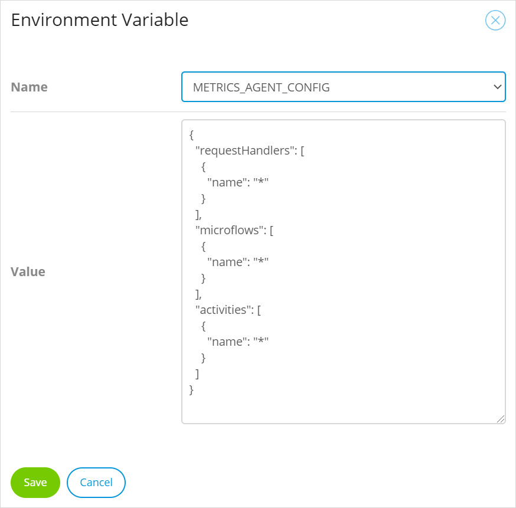

## 1 Introduction

**Datadog** is a monitoring and analysis tool for cloud applications, providing monitoring of servers, databases, tools, and services through a SaaS-based data analytics platform. You can link your Mendix Cloud v4 apps to Datadog to provide additional monitoring.

{}
Datadog logging and application metrics are supported in Mendix version 7.15 and above.
{}

This document explains what information can be provided to Datadog and how to configure your Mendix Cloud v4 app to send data to Datadog. If you want to know more about the capabilities of Datadog and, in particular, using Datadog with Mendix, have a look at the Mendix blog [Monitor Your Mendix Apps with Datadog](https://www.mendix.com/blog/monitor-your-mendix-apps-with-datadog/).

A summary of the useful metrics provided by Mendix is in the section [Summary of Mendix Metrics](#summary), below.

{}
Datadog is not supported in the deprecated Mendix Cloud v3, nor in default deployment buildpacks for other cloud platforms.
{}

## 2 What Information Can Mendix Supply to Datadog?

Mendix provides two types of data to Datadog:

* Data from the Mendix Runtime, the Java Virtual Machine (JVM), the database, and the SaaS (Software as a Service, for example Cloud Foundry) environment – this is described in [Environment Metrics](#environment), below
* Data from within the Mendix app itself – this is described in [App Metrics](#app-metrics), below

There are some additional ways of controlling what is sent to Datadog using environment variables. See [Additional Information](#additional-info), below, for more information.

### 2.1 Environment Metrics{#environment}

Once you have configured Datadog for your app, it will automatically send information about the environment in which your app is running.

#### 2.1.1 Environment Metrics Namespaces

The metrics from your app's environment are supplied in the following namespaces:

* database – metrics on the database performance — by default, these are just *gauge* metrics (see [Rate and Count Database Metrics](#database-metrics), below)
* datadog  – metrics on datadog usage
* jmx – metrics from the Mendix runtime
* jvm – metrics from the Java virtual machine in which the Mendix runtime runs (see the Datadog [Java Runtime Metrics](https://docs.datadoghq.com/tracing/runtime_metrics/java/) documentation)
* postgresql – database metrics specific to PostgreSQL databases (see the Datadog [Postgres](https://docs.datadoghq.com/integrations/postgres/) documentation)
* system – metrics from the base system running on the platform or PaaS (see the Datadog documentation [System Check](https://docs.datadoghq.com/integrations/system/)) — Mendix only supplies [Processes](https://docs.datadoghq.com/integrations/process/) metrics which are reported in the `system.process` space as platform limitations render other system information inaccurate

#### 2.1.2 Useful Metrics for Mendix Apps

The following metrics are useful when monitoring the performance of your Mendix app:

* mx.database.diskstorage_size
* jvm.heap_memory
* jvm.heap_memory_committed
* jvm.heap_memory_init
* jvm.heap_memory_max
* jvm.non_heap_memory
* jvm.non_heap_memory_committed
* jvm.non_heap_memory_init
* jvm.non_heap_memory_max
* postgresql.connections
* postgresql.database_size
* postgresql.max_connections
* postgresql.percent_usage_connections

Note that the absolute values are often not useful, but looking at trends over time can indicate performance issues or future action which might be required. Some of these trends are similar to those described in [Trends in Mendix Cloud v4](trends-v4).

## 3 App Metrics {#app-metrics}

Mendix provides logging of various actions within the app. These are sent to Datadog with the namespace `mx`. Timing values are sent in milliseconds.

By default, Mendix will only pass request handler activity to Datadog, but you can configure it to provide metrics for microflows and activities as well. You can find how to do this in [Customizing the Metrics Agent](#customizing), below.

### 3.1 What Metrics Can You Get From Your App?

#### 3.1.1 Request Handler Metrics

Unless you customize your metrics agent, the metrics agent will provide metrics for all your request handlers. The metrics provided are listed below:

##### 3.1.1.1 mx.soap.time

A timing/histogram value for SOAP requests.

##### 3.1.1.2 mx.odata.time

A timing/histogram value for OData requests.

##### 3.1.1.3 mx.rest.time

A timing/histogram value for REST requests.

##### 3.1.1.4 mx.client.time

The time it takes to handle a request to a request handler used by the web UI. You can get results for all of the following types of request
* REST, ODATA, SOAP **doc** requests
* `/xas` requests (general queries for data in data grids, sending changes to the server, and triggering the execution of microflows)
* File upload/download requests
* `/p` requests

Each metric is also tagged with `resource:{resource_name}` to indicate which resource was being requested.

This metric helps you to gain an overview of how long users have to wait for individual requests, and hence indicates overall application performance.

#### 3.1.2 Microflow Metrics

For the microflows you select (see [Customizing the Metrics Agent](#customizing), below), the metrics agent will provide the following metrics relating to the time the microflow takes to run:

* mx.microflow.time.avg
* mx.microflow.time.count
* mx.microflow.time.max
* mx.microflow.time.median
* mx.microflow.time.95percentile

In addition, each metric will be tagged with the `microflow:{microflow_name}` tag which indicates which microflow the metric came from. The microflow name is in the format `{module}.{microflow}`.

This metric can indicate how long individual microflows are taking to run and enables you to target long-running microflows for improvement, if required.

#### 3.1.3 Activity Metrics

For the activities you select (see [Customizing the Metrics Agent](#customizing), below), the metrics agent will provide the following metrics:

* mx.activity.time.avg
* mx.activity.time.count
* mx.activity.time.max
* mx.activity.time.median
* mx.activity.time.95percentile

In addition, all activities reported by Mendix will have the tags `activity:{activity_name}` and `microflow:{microflow_name}` to indicate which activity and microflow the metric came from.

The activity name will be one of the following activities which are reported:

* CastObject
* ChangeObject
* CommitObject
* CreateObject
* DeleteObject
* RetrieveObject
* RollbackObject
* AggregateList
* ChangeList
* ListOperation
* JavaAction
* Microflow
* CallRestService
* CallWebService
* ImportWithMapping
* ExportWithMapping

This information can be used during performance optimization. Even when you cannot identify the exact activity (for example, if there are several different *retrieveObject* activities in the same microflow), you can still use this information to identify which activities might be related to trends in performance, or to compare performance between different versions or environment configurations.

### 3.2 Tagging Metrics for Datadog

As described above, Mendix adds the following tags to metrics from microflows and activities:

* **microflow:{microflow_name}** – indicates which microflow the metric came from — the microflow name is in the format `{module}.{microflow}`
* **activity:{activity_name}** – indicates which activity the metric came from

However, if you use Datadog to monitor more than one app and environment you will not be able to tell which app or environment these metrics apply to. To identify the metrics for your app and environment in Datadog, you need to add tags for the app name and environment.

Our recommendation is that you use the following tags:

* app:{app_name} – this enables you to identify all metrics sent from your app (for example, **app:customermanagement**)
* env:{environment_name} – this enables you to identify metrics sent from a particular environment so you can separate out production metrics from test metrics (for example, **env:accp**)

To set these tags, do the following:

1. Go to the **Environments** page of your app in the *Developer Portal*.
2. Click **Details** to select an environment you are monitoring with Datadog. 
3. Open the **Tags** tab.
4. Add a **Tag** – this is the string which is sent to Datadog as a tag.
  
5. **Restart** the application.

Setting these values for your app means that all metrics from this environment of your app will have these tags. For example, the tags for mx.microflow.time.avg for this set of metrics include **app:customermanagement** and **env:accp**.


{}
You can add more tags if you want, but note that Datadog's charges include an element for [custom metrics](https://docs.datadoghq.com/developers/metrics/custom_metrics/) as described on the Datadog site.
{}

### 3.3 Customizing the Metrics Agent{#customizing}

By default, Mendix will pass a log of *all* **request handler** activity to Datadog and no other information. However, by using JSON to configure the metrics agent, you can add logs of microflows and activities within microflows, and restrict which request handler calls are sent.

#### 3.3.1 Format of Metrics Agent Configuration

You can specify which request handlers, microflows, and activities are reported to Datadog using a JSON configuration with the following format (note that this is the syntax and not an example of this custom setting):

```json
{
  "requestHandlers": [
    {
      "name": "*" | "<requesthandler>"
    }
  ],
  "microflows": [
    {
      "name": "*" | "<microflow>"
    }
  ],
  "activities": [
    {
      "name": "*" | "<activity>"
    }
  ]
}
```

| Value | What Is Sent | Note |
| --- | --- | --- |
| `"name": "*"` | All | Default |
| `"name": "<requesthandler>"` | All request handler calls of this type | click **Request Handlers<sup><small>1</small></sup>** below to see the list of options |
| `"name": "<microflow>"` | Each time this microflow is run | The format is `<module>.<microflow>`<br />For example, `TrainingManagement.ACT_CancelScheduledCourse` |
| `"name": "<activity>"` | All activities of this type | click **Activities<sup><small>2</small></sup>** below to see the list of options |

{}
Microflow names are case-sensitive. If the case is not exactly matched, metrics will not be properly submitted.
{}

**<details><summary><sup><small>[1]</small></sup>Request Handlers (click to see list)</summary>**

The following Mendix *request handler* calls will be passed to Datadog:

| Request Handler | Call Type | Namespace |
| --- | --- | --- |
| `WebserviceRequestHandler` | SOAP requests | `mx.soap.time` |
| `ServiceRequestHandler` | OData requests | `mx.odata.time` |
| `RestRequestHandler` | REST requests | `mx.rest.time` |
| `ProcessorRequestHandler` | REST, ODATA, SOAP **doc** requests | `mx.client.time` |
| `ClientRequestHandler` | `/xas` requests (general queries for data in data grids, sending changes to the server, and triggering the execution of microflows) | `mx.client.time` |
| `FileRequestHandler` | File upload/download requests | `mx.client.time` |
| `PageUrlRequestHandler` | `/p` requests | `mx.client.time` |

You can find help in analyzing some of these values in [Trends in Mendix Cloud v4](trends-v4).
</details>

**<details><summary><sup><small>[2]</small></sup>Activities (click to see list)</summary>**

The following Mendix *activities* can be passed to Datadog:

* `CastObject`
* `ChangeObject`
* `CommitObject`
* `CreateObject`
* `DeleteObject`
* `RetrieveObject`
* `RollbackObject`
* `AggregateList`
* `ChangeList`
* `ListOperation`
* `JavaAction`
* `Microflow`
* `CallRestService`
* `CallWebService`
* `ImportWithMapping`
* `ExportWithMapping`
</details>

**Example**

The following example will send logs for:

* All request handlers
* The microflow `After_Startup` in the module `Administration`
* The `CreateObject` and `DeleteObject` activities

```json
{
  "requestHandlers": [
    {
      "name": "*"
    }
  ],
  "microflows": [
    {
      "name": "Administration.After_Startup"
    }
  ],
  "activities": [
    {
      "name": "CreateObject"
    },
    {
      "name": "DeleteObject"
    }
  ]
}
```

#### 3.3.2 Passing a Configuration to the Metrics Agent

You pass the configuration to the metrics agent by adding a *Custom Runtime Setting* to your Mendix Cloud environment.

1. Go to the **Environments** page of your app.
2. Click **Details** next to the environment you have configured for Datadog.
3. Add a **Custom Environment Variable** *METRICS_AGENT_CONFIG* with the value of the JSON required for your configuration.

	

4. Click **Save**.
5. Restart your app to apply the new settings if you have already [connected your node to Datadog](#connect-node). If you are in the process of connecting your node to Datadog, you must *redeploy* your application to apply the changes.

## 4 Setting Up Datadog For Your Mendix App

### 4.1 Datadog API Key{#api-key}

To make use of Datadog you will need a Datadog API key. If you already use Datadog, skip to the [Existing Datadog User](#existing-datadog-user) section to learn how to get one.

#### 4.1.1 New Datadog User

If you are new to Datadog, you will need to get an account first.

1. Go to the Datadog site (for example, [https://www.datadoghq.com/](https://www.datadoghq.com/)) and choose **GET STARTED FREE**.
2. Enter your Datadog account details. Once you have entered your details you cannot continue until you have set up your agent.
3.  Choose the option **From Source**.

    

4.  Copy the value of *DD_API_KEY* key shown on the install script.

    

5. You now need to use this API key with your app: see [Connect Node to Datadog](#connect-node).

#### 4.1.2 Existing Datadog User{#existing-datadog-user}

To find your existing API key, or to request a new one for your app, do the following:

1. Login to your Datadog account.
2.  Go to the **Integrations > API** screen.

    

3.  Copy an existing **API Key** or create a new one.

    

4. For more information on Datadog API keys, see the following page on the Datadog site: [How do I reset my Application Keys](https://docs.datadoghq.com/account_management/faq/how-do-i-reset-my-application-keys/) and related documentation.

### 4.2 Connect Node to Datadog{#connect-node}

To send your runtime information to Datadog, you need to provide the Datadog API key to your environment.

1. Go to the **Environments** page of your app in the *Developer Portal*.
2. Click **Details** to select the environment you wish to monitor with Datadog. 
3. Open the **Runtime** tab.
4. Add a **Custom Environment Variable**.
5.  Select **DD_API_KEY** from the *Name* drop-down.

	

6. Enter the Datadog **API key**, obtained in the [Datadog API Key](#api-key) section, above, as the *Value* of the Environment Variable.
7. Add a second **Custom Environment Variable**:

	* **Name**: *DD_LOG_LEVEL*
	* **Value**: *INFO*

	This will ensure that some messages are sent from the Mendix Datadog agent to Datadog – for example, that the agent has started. You can change the log level later once you have confirmed that Datadog is receiving them. See [Log Levels](#log-levels), below for more information on valid values for this custom environment variable.

8. By default, the Datadog integration defaults to the US region (datadoghq.com). If you want to use a Datadog site which is another region, set the `DD_SITE` environment variable to the required site. For example, for the EU Datadog site, set `DD_SITE` to `datadoghq.eu`.

9.  Return to the **Environments** page for your app and *Deploy* or *Transport* your app into the selected environment.

	{}Your app must be **redeployed** before it is started as additional dependencies need to be included.<br/><br/>Restarting the app is not sufficient to start sending data to Datadog.{}

## 5 Additional Information{#additional-info}

### 5.1 Log Levels{#log-levels}

The **DD_LOG_LEVEL** sets the level for which log messages *from the Mendix Datadog agent* will be sent to the Mendix application logs. It does not affect the [log level set in your app](/howto/monitoring-troubleshooting/log-levels). Valid values are:

* CRITICAL
* ERROR
* WARNING
* INFO
* DEBUG

### 5.2 Datadog Regions

The valid values for **DD_SITE** are:

* datadoghq.com
* datadoghq.eu

### 5.3 Database Disk Storage Availability

You can decide whether a metric for the disk storage size available to the database is sent to Datadog. To disable this metric, set **DATADOG_DATABASE_DISKSTORAGE_METRIC** to *false*.

*Default value: true*

### 5.4 Email Address Redaction{#redact-emails}

Email addresses are automatically redacted before log entries are sent to Datadog. To disable this redaction, set **DATADOG_LOGS_REDACTION** to *false*.

*Default value: true*

### 5.5. Rate and Count Database Metrics{#database-metrics}

Datadog sends gauge database metrics to Datadog as a default. Rate and Count metrics are not compatible with the Datadog PostgreSQL integration. You can enable these additional metrics by setting **DATADOG_DATABASE_RATE_COUNT_METRICS** to *true*.

If these additional metrics are enabled, the rate and counter metrics will be sent to Datadog. The metrics will be suffixed by _rate and _count, respectively, to prevent collisions with the official Datadog metrics. You can change the metric types in the Datadog console to reflect this — see [Modify a metric’s type within Datadog](https://docs.datadoghq.com/developers/metrics/type_modifiers/?tab=count#modify-a-metrics-type-within-datadog) in the Datadog documentation for more information. We also set a helpful `interval` tag (10s) which can be used here. The correct type and unit for submitted metrics can be found in the GitHub repo for [Datadog core integrations](https://github.com/DataDog/integrations-core/blob/master/postgres/metadata.csv).

*Default value: false*

### 5.6 Datadog Events Log

The Datadog Events log contains events which come from your app: those are the same events that would appear in the Mendix Console. It does not contain events from the environment.


By default all email addresses contained in log events will be redacted. You can change this – see [Email Address Redaction](#redact-emails), above.

### 5.7 Datadog Agent not Started

If you configure your app for Datadog but the Datadog agent is not started, the events will be sent to the app log files.

### 5.8 Datadog Issues

If you have any issues related to accessing Datadog, please contact their support here: [Support | Datadog](https://www.datadoghq.com/support/), or by email at [support@datadoghq.com](mailto:support@datadoghq.com).

## 6 Summary of Mendix Metrics{#summary}

| Metric | Description |
| --- | --- |
| jmx.com.mendix.* | Core runtime metrics |
| mx.database.diskstorage_size | Disk storage available to the application database (this is a fixed value) |
| mx.activity.time | How long a microflow activity takes to run |
| mx.client.time | The time to handle a request to a request handler that is used by the web ui |
| mx.microflow.time | How long a microflow takes to run |
| mx.odata.time | The time to handle an OData request |
| mx.rest.time | The time to handle a REST request |
| mx.soap.time | The time to handle a SOAP request |

## 7 Read More

* [Metrics](metrics)
