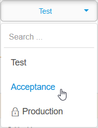

## 1 Introduction

This how-to describes downloading a back up from a Free App environment or a licensed cloud node.

**This how-to will teach you how to do the following:**

* Download a full backup of a Free App environment
* Download a full backup of a licensed cloud node

## 2 Prerequisites

Before starting this how-to, make sure you have completed the following prerequisite:

* Have a Free App or licensed cloud node with backups
* In case of an licensed node, you have the correct [Node Permissions](/developerportal/deploy/node-permissions)

## 3 Downloading a Free App Backup

To download a backup of a Free App, follow these steps:

1. Go to the [Developer Portal](http://home.mendix.com) and click **Apps** in the top navigation panel.
2. Select the app from which you want to download the backup.
3. Click **Backups** under the **Operate** category.
4. Select the backup you want to download and click **Download Backup**.

    

5. Select the backup type **Full Snapshot**, **Database Only**, or **Files Only**

## 4 Downloading a Licensed Cloud Node Backup

To download a backup of a licensed app, follow these steps:

1. Go to the [Developer Portal](http://home.mendix.com) and click **Apps** in the top navigation panel.
2. Click **My Apps** and select **Nodes**.
3. Select the node from which you want to download the backup.
4. Click **Backups** under the **Operate** category.
5. Select the environment from which you want to download the backup.

    

6. If you want to create a backup first, click **Create Backup**.

    

7. Select a backup and click **Download Backup**.
8. Select the backup type **Full Snapshot**, **Database Only**, or **Files Only**

## 5 Read More

* [How to Create a Backup](create-backup)
* [Licensing Mendix Cloud Apps](/developerportal/deploy/licensing-apps)
* [How to Restore a Backup](restore-backup)
