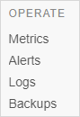

## 1 Introduction

The category **Operate** is devided into these four sections:

These sections are described below.

## 2 Metrics

On this page you can monitor the performance and health of your app.

For more information, see [Metrics](/developerportal/operate/metrics).

This page is divided into the three tabs described in the sections below.

### 2.1 Trends

In this section you can view the graphs of the App about:

*   Application Statistics
*   Database Statistics
*   Application Node Statistics
*   Database Node Statistics

The **Trends** are different for the Mendix Cloud versions:

*   [Trends in Mendix Cloud v3](/developerportal/operate/trends)
*   [Trends in Mendix Cloud v4](/developerportal/operate/trends-v4)

### 2.2 Running now

Running requests are all requests that are currently in progress for this environment. Please note that interrupting a request will actually stop it, and the end user may receive an error.

At this section you can view the following information about the running requests:

*   User - the user that is running the action
*   Action - the currently running actions
*   Type - the action type that is running
*   Duration - for how long the action has been running

### 2.3 Cache

Mendix 4 and up have an object cache for non-persistent objects. Here you can see how many objects of each type currently live in memory, and the same but broken down per user session.

At this section you can view the following:

*   Entity in cache
*   User sessions

## 3 Alerts

On this page you can view the following:

*   The status of the Application and the Platform
*   The history of the alerts

For more information, see [Alerts](/developerportal/operate/monitoring-application-health)

## 4 Logs

On this page you can **Fetch the current log**. Logs are rotated and archived every 5MB. The logs are kept for at least 3 months. Besides archived logs, the current log file can be fetched at any time.

For more information, see [Logs](/developerportal/operate/logs)

## 5 Backups

On this page you can manage the backups of your Application.

The following backups are retained:
Nightly Backups: maximum 2 weeks history (counting from yesterday)
Sunday Backups: maximum 3 months history (counting from yesterday)
Monthly Backups (1st Sunday of each month): maximum 1 year history

This pruning schedule applies to nightly backups and backups initiated by users. If you want to keep a backup for longer than the schedule, you will have to download it.

For more information, see [Backups](/developerportal/operate/backups)
