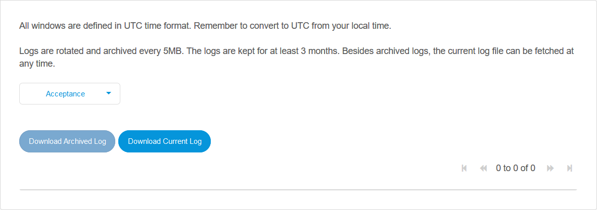

## 1 Introduction

From this page of the Developer Portal, you can access the logs produced by your app. What you see depends on the environment to which your app is deployed.

The page is accessed through the **Logs** page under the **Operate** category:

## 2 Mendix Cloud Version 4

This is the default Mendix deployment for a licensed app.

For apps deployed on Mendix Cloud Version 4 (V4), you can select which environment you want logs for. Production logs will require two-step authentication.

You can view the current log, download it, or view and download an archived log.
 
Logs on Mendix Cloud V4 are rotated and archived every day. The logs are kept for at least 3 months.

Action Button | Performs the Action
:---|:---
Download archived log | download a log selected from the list underneath 
Download today's log file | download today's log
View Live Log | view today's log on the screen

## 3 Mendix Cloud Version 3

For apps deployed on Mendix Cloud Version 3 (V3), you can select which environment you want logs for. Production logs will require two-step authentication.

You can fetch the current log and download it, or you can view and download an archived log.
 
Logs on Mendix Cloud V3 are rotated and archived every 5MB. The logs are kept for at least 3 months.

Action Button | Performs the Action
:---|:---
Download archived log | download a log selected from the list underneath
Fetch current Log | view the current log on the screen and download it, if required

## 4 SAP Cloud Platform

For apps deployed on SAP Cloud Platform you can see the logs using Kibana. More information is available on the SAP help site here: [Application Logging for the Cloud Foundry Environment](https://help.sap.com/viewer/ee8e8a203e024bbb8c8c2d03fce527dc/Cloud/en-US/68454d44ad41458788959485a24305e2.html) and within Kibana.

{}For apps deployed to environments created before 18 October 2018, the *Application Logging (application-logs)* service will not have been bound to your app automatically. To resolve this you can either:

1. Create a new environment and deploy your app there.

2. Bind the service to your existing app by:

    * Going to the SAP Cloud Platform cockpit
    * Going to the space for your environment
    * Finding *Application Logging* in the Service Marketplace
    * Going to *Instances*
    * Creating a *New Instance* and following the instructions, ensuring that you bind it to your app
    * Stopping and starting the app
{}

## 5 Free App

Logs are not available for Free Apps. You will see a sample screen.

## 6 App Deployed to Other Clouds

Logs are not available in the Development Portal for apps running on clouds not mentioned above. You will need to go to the cloud management portal for the cloud to which your app is deployed.

