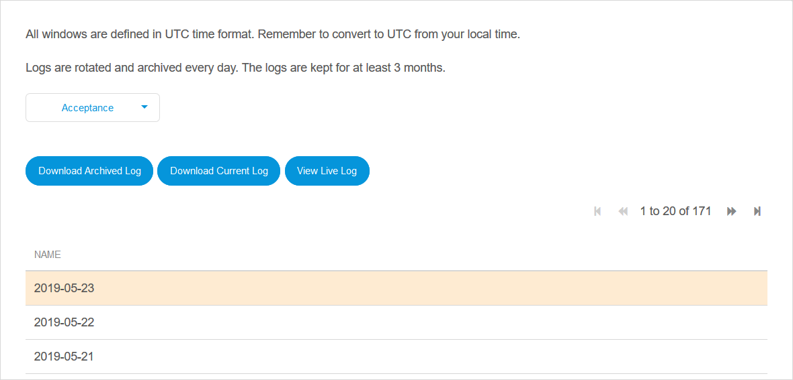
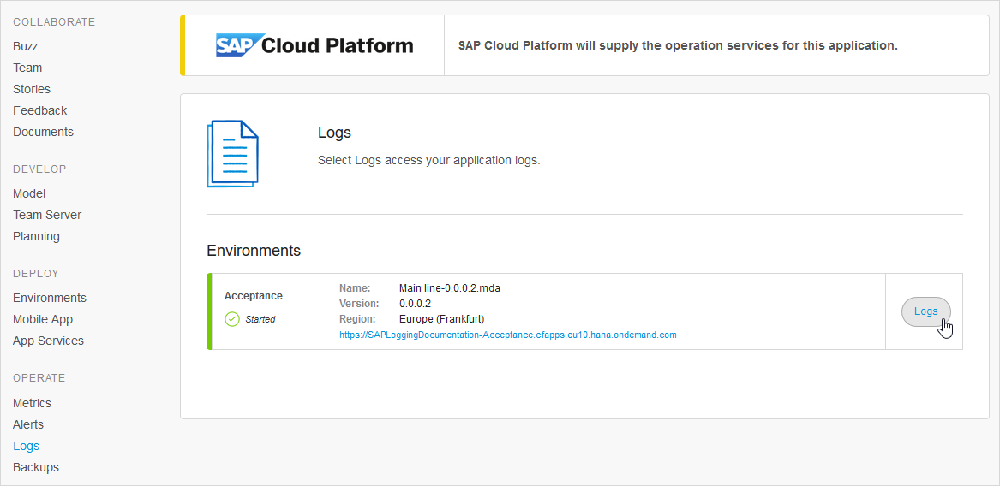

## 1 Introduction

From this page of the Developer Portal, you can access the logs produced by your app. What you see depends on the environment to which your app is deployed.

The page is accessed through the **Logs** menu item in the left-hand menu.

## 2 Apps Deployed to Mendix Cloud Version 4

{}
This is the default Mendix deployment for a licensed app.
{}

For apps deployed to Mendix Cloud Version 4 (v4), you can select which environment you want logs for. Production logs will require [Two-Factor Authentication](/developerportal/deploy/two-factor-authentication).

You can view the live (current) log, download it, or view and download an archived log.

{}
The live log is displayed in the local time of the browser. All other logs have timestamps in UTC.
{}
 
Logs on Mendix Cloud v4 are rotated and archived every day. The logs are kept for at least 6 months.

Action Button | Performs the Action
:---|:---
Download Archived Log | download a log selected from the list underneath 
Download Current Log | download the log which is currently being written to
View Live Log | view today's log on the screen

## 3 Apps Deployed to Mendix Cloud Version 3

For apps deployed to the deprecated Mendix Cloud version 3 (v3), you can select which environment you want logs for. Production logs will require two-step authentication.

You can fetch the current log and download it, or you can view and download an archived log. All timestamps are shown in UTC.
 
Logs on Mendix Cloud v3 are rotated and archived every 5MB. The logs are kept for at least 3 months.

Action Button | Performs the Action
:---|:---
Download Archived Log | download a log selected from the list underneath
Download Current Log | view the current log on the screen and download it, if required

## 4 Apps on SAP Business Technology Platform

For apps deployed to SAP Business Technology Platform (SAP BTP) you can see the logs using Kibana.

{}
To make full use of Kibana and see proper mapping of the log level, multiline log messages, and stack traces, you will need to configure the *SAP Logger Connector* in your app. For more information see [SAP Logger Connector](/partners/sap/sap-logger).
{}

The logs page shows all the environments for this app. Click the **Logs** button to open the log in Kibana.

You may be asked to provide your SAP credentials before you can see the log in Kibana.

The Kibana user guide is available here: [Kibana User Guide](https://www.elastic.co/guide/en/kibana/current/index.html) and within Kibana. More information on how Kibana is integrated with SAP BTP is available on the SAP help site here: [Application Logging for the Cloud Foundry Environment](https://help.sap.com/viewer/ee8e8a203e024bbb8c8c2d03fce527dc/Cloud/en-US/68454d44ad41458788959485a24305e2.html).

{}For apps deployed to environments created before 22 October 2018, the *Application Logging (application-logs)* service will not have been bound to your app automatically. To resolve this you can either:

1. Create a new environment and deploy your app there.

2. Bind the service to your existing app by:

    * Going to the SAP BTP cockpit
    * Going to the space for your environment
    * Finding *Application Logging* in the Service Marketplace
    * Going to *Instances*
    * Creating a *New Instance* and following the instructions, ensuring that you bind it to your app
    * Stopping and starting the app
{}

## 5 Free App

Logs are not available for Free Apps. You will see a sample screen.

## 6 App Deployed to Other Clouds

Logs are not available in the Development Portal for apps running on clouds not mentioned above. You will need to go to the cloud management portal for the cloud to which your app is deployed.
