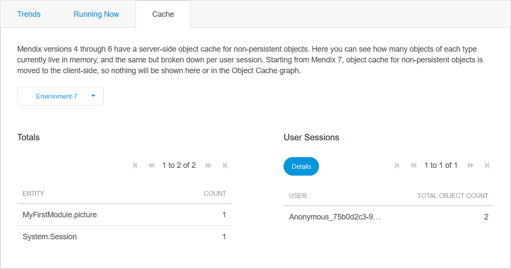
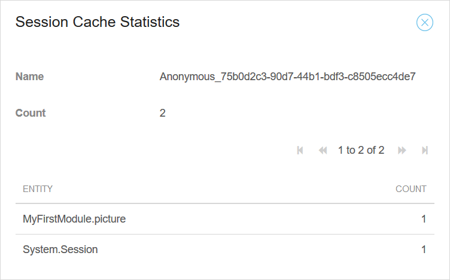

## 1 Introduction

On the **Metrics** page you can monitor the performance and health of your App. The Metrics page is divided into three tabs, each of which is described below.

## 2 Trends

In this tab you can view graphs which display the following information about the app:

*   Application Statistics
*   Database Statistics
*   Application Node Statistics
*   Database Node Statistics

The information displayed in **Trends** depends on which **Mendix Cloud version** the app is running. The following documents describe the different trends information available:

*   [Trends in Mendix Cloud v3](trends)
*   [Trends in Mendix Cloud v4](trends-v4)

You can find the Mendix Cloud version of your App in the **Environment details**. For more information, see [Cloud Version and Region in the Mendix Cloud](/developerportal/deploy/cloud-version-region).

## 3 Running Now

Running requests are all requests that are currently in progress for this environment.

This tab displays the following information about running requests:

| Column | Description |
| --- | --- |
| User | The user that started running the request. |
| Action | The name of the request. |
| Type | Microflow or Java action. |
| Duration | For how long the request has been running. |

You can click the following buttons to execute actions:

*   **Refresh** refreshes the list of running requests

*   **Kill request** stops the selected request
    {}If you stop a request, it will not complete and the end-user may receive an error.{}
    
*   **Details** shows you the **Action Stack** for the selected request. An Action Stack displays all the actions currently on the call stack. The bottom action is the one which is currently being performed. It was triggered by the action above it and so forth. The details shown for an Action Stack are:
    *   Name
    *   Type
    *   Details

## 4 Cache

Mendix Runtime version 6 has an object cache for non-persistable objects. In this tab you can see how many objects of each type currently live in memory. You can also see the number of objects broken down by user session.

If you select a user session you can click **Details** to see which entities are being used by that user session.

{}

Runtime versions 7 and above are stateless and do not cache Mendix objects on the server. See the [Mendix Desktop Modeler Release Notes 7.0](/releasenotes/studio-pro/7.0) for more information.

{}

## 5 Read More

* [Environment Details](/developerportal/deploy/environments-details)
