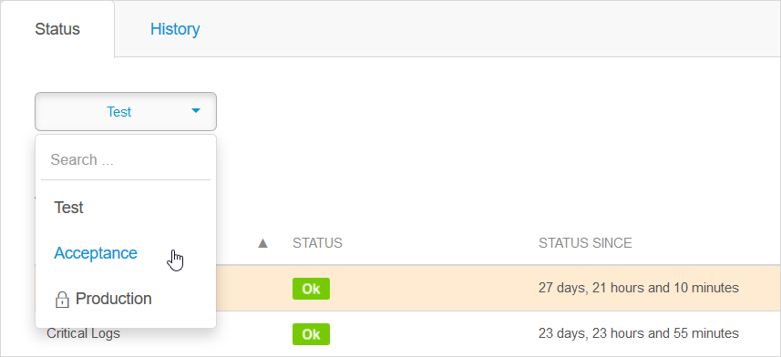
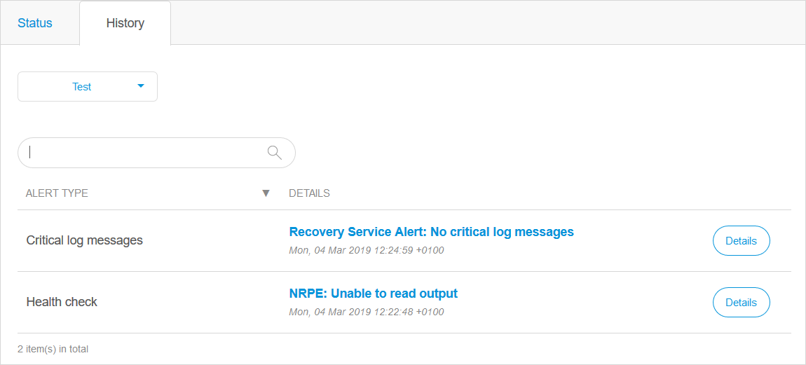

## 1 Introduction

When your application has reached production status, it's important to keep track of its status and health. When you click **Alerts** in the **Operate** category of the **Developer Portal**, you can inspect your application's health in the Mendix Cloud. 

Mendix analyzes the application and platform status periodically. All status alerts are logged in the **History** of the **Alerts**. 
If you [Receive Environment Status Alerts](receive-alerts), you will receive a status alert only once. Mendix will not send you multiple alerts of the same status.

This document will explain how to access the application status page, what the information on this page means, and how to look at the alerts for your app.

## 2 Application Status

The Mendix Cloud automatically monitors the health and status of apps that are deployed on cloud nodes. To access the information gathered in this way, follow these steps:

1.  Go to the [Developer Portal](https://home.mendix.com).
2.  Open the app that you want to monitor.
3.  Click **Alerts** under the **Operate** category. This will display the status of your app node in various categories.

	

	{}The dropdown at the top lets you switch between viewing the status for your node environments. Note that accessing production information may require additional authentication and is subject to your project's security settings.{}

4.  If one of the status items is not listed as **OK**, click the line to show an additional information box with details about the error.

	

This status information will tell you important information that you either need in order to resolve the issue, or that needs to be included when submitting a support request to [Mendix Support](https://support.mendix.com). You can download a log of the alerts on the **Log** page under the **Operate** category.

Any status that could cause your app to stop functioning will result in an alert. For example, the monitoring information from the image shows that one of the status indicators was **Critical**. When this happens to one of your nodes, all users that are subscribed to alerts will receive an email alert.

## 3 Cloud V4 Alerting Categories and Thresholds

There are a number of categories on the status overview that are related to various technical parts of your application environment. Any category that does not display as *OK* needs to be investigated. Each category indicates a different part of the app infrastructure that is monitored.

### 3.1 Application Status

Application Status | |
:---|:---|
Description | Our application runtime sends a heartbeat signal every few minutes to show it is still alive. If no heartbeat timeout has been received for some time, the system will generate an alert.|
Example message | No runtime heartbeat received for 8m45s.
Warning Threshold | Not used.                                              |
Critical Threshold | If the runtime heartbeat of the application has not been received for 5 minutes, a critical alert will be generated.
First actions to take | Check the application logs for issues. Also check [https://status.mendix.com/](https://status.mendix.com/) for any planned maintenance.                         |

Application Container CPU Percentage | |
:---|:---|
Description | Track the CPU utilization of the application container |
Example message | Application container 34234543-6543-6543-6543-153d247b6543 - Instance Index: 0 has high CPU usage: 90.5
Warning Threshold | CPU utilization is between 75% and 85%. |
Critical Threshold | CPU utilization is higher than 85%.
First actions to take | Inspect the trends for **Application node CPU usage** combined with all **Application Statistics** for anomalies and correlate those with application behavior. |

Application Container Disk Percentage | |
:---|:---|
Description | Track the disk utilization for the database belonging to the application |
Example message | Application container 34234543-6543-6543-6543-153d247b6543 - Instance Index: 0 has high disk usage: 90.5
Warning Threshold | Disk utilization is between 75% and 85%. |
Critical Threshold | Disk utilization is higher than 85%.
First actions to take | Inspect the trends for **Application node CPU usage** combined with all **Application Statistics** for anomalies and correlate those with application behavior. |

Application Container Memory Percentage | |
:---|:---|
Description | Track the memory utilization for the database belonging to the application |
Example message | Application container 34234543-6543-6543-6543-153d247b6543 - Instance Index: 0 has high memory usage: 90.5
Warning Threshold | Memory utilization is between 75% and 85%. |
Critical Threshold | memory utilization is higher than 85%.
First actions to take | Inspect the trends for **Application node operating system memory** combined with all **Application Statistics** for anomalies and correlate those with application behavior. |

CPU Credit Balance status | |
:---|:---|
Description | This only appears if you run into a warning or a critical Credit Balance. See the [CPU Credits on AWS](#burstable) section for a more detailed discussion
Example message | Application container 34234543-6543-6543-6543-153d247b6543 - Instance Index: 0 has low CPU credit balance: 16.315528
Warning Threshold | Credit balance goes below 80.0
Critical Threshold | Credit balance goes below 20.0
First actions to take | Inspect the trends for **Application node CPU usage** combined with **Application node disk throughput** and **Application node load** for anomalies and correlate those with application behavior.

Critical Logs | |
:---|:---|
Description | The CRITICAL log level is reserved for issuing messages in rare cases where the application may not be able to function reliably anymore. For example, there is a chance of data corruption when the application continues to be running. Internal JVM errors are logged to this level. Out of memory errors (which are JVM errors) must be treated as harmful for the stability and integrity of your Mendix application process.
Example message | Critical errors count is 2.
Warning Threshold | Not used.
Critical Threshold | If any logging is done on the CRITICAL level, the alerts status always directly switches to Critical. The critical log message counter will only be reset when restarting the application process.
First actions to take | Inspect the application log file and look up the CRITICAL error messages. Restart the application as soon as possible in case of stability issues.

Database CPU Utilization | |
:---|:---|
Description | Track the CPU utilization for the database belonging to the application
Example message | Database has 95% CPU utilization.
Warning Threshold | Not used.
Critical Threshold | CPU utilization is higher than 90%. 
First actions to take | Inspect the trends for **Application node CPU usage** combined with **Application node disk throughput** and **Application node load** for anomalies and correlate those with application behavior.

Database Free Space | |
:---|:---|
Description | Track the amount of disk space used for the database belonging to the application.
Example message | Database has less than 5% free space.
Warning Threshold | Database has less than 25% and more than 10% free space available. 
Critical Threshold | Database has less than 10% free space available.
First actions to take | Check if there is a sudden increase or a slow increase over time. Resolve by either stopping a runaway process, removing old data, or ordering more storage.

Health Check | |
:---|:---|
Description | Each application can define a health check microflow. This microflow is called every 10 seconds by the Mendix Runtime to determine if the application is still healthy. This can be used to check for application-specific health indicators.
Example message | Health: the nightly import job took more than an hour to complete!
Warning Threshold | If the health check microflow returns a non-empty string value, this means the application is not healthy and a WARNING alert is generated.
Critical Threshold | If the health check microflow itself experiences an error, a CRITICAL alert is generated. This will also happen when no database connection can be established.
First actions to take | Since the health check microflow is specific to your application, we cannot generically advise actions to take.

Virtual Machine Crash | |
:---|:---|
Description | Show the state of the application's virtual machine, or an error state if there is an issue with a virtual machine.
Example message | Your application's virtual machine died 1 times in the last minute.
Warning Threshold | Not used.
Critical Threshold | If the application's virtual machine should be running but has completely disappeared, or if the JVM process does not respond to any signal anymore.
First actions to take | Check the log files and application metrics for a possible cause of the crash.

Virtual Machine Error | |
:---|:---|
Description | Show the state of the application's virtual machine, or an error state if there is an issue with a virtual machine.
Example message | Your application's virtual machine died because of non-recoverable error 1 times in the last minute.
Warning Threshold | Not used.
Critical Threshold | If the application's virtual machine should be running but has completely disappeared, or if the JVM process does not respond to any signal anymore.
First actions to take | Check the log files and application metrics for a possible cause of the error.

Virtual Machine Out Of Memory | |
:---|:---|
Description | Show the state of the application's virtual machine, or an error state when the issue occurs with a virtual machine.
Example message | Your application's virtual machine ran out of memory and died 1 times in the last minute.
Warning Threshold | Not used.
Critical Threshold | If the JVM process has run out of memory and the application's virtual machine crashed.
First actions to take | Check the log files and application metrics for a possible cause of the crash.

### 3.2 CPU Credits on AWS{#burstable}

Apps running on Mendix Cloud V4 use AWS databases to store their data. These databases are classed as *burstable* and *non-burstable*. If a database is **burstable** this means that it has a specified performance baseline. This baseline is different for each sort of database and varies from 5% to 20%.

From the AWS documentation: *If a burstable performance instance uses fewer CPU resources than is required for baseline performance (such as when it is idle), the unspent CPU credits are accrued in the CPU credit balance. If a burstable performance instance needs to burst above the baseline performance level, it spends the accrued credits. The more credits that a burstable performance instance has accrued, the more time it can burst beyond its baseline when more performance is needed.*

For example, if you have a database with a baseline performance of 10%, you can only run the database at over 10% CPU resources for a limited time. How long depends on the CPU credits you have earned during your recent CPU use. After you have used up your credits, the CPU resource usage of your database will be throttled and cannot go above the baseline performance until you have earned more credits by running it below the baseline performance.

The following Mendix database options use burstable databases:

* Strato (t2.micro database)
* S (t2.micro)
* M (t2.small)
* L (t2.medium)

Meso, Iono, Magneto, XL, and XXL databases are *not* burstable.

You can find more details about the credit system, and the different baseline performance percentages for each database type, in the official AWS documentation: https://docs.aws.amazon.com/AWSEC2/latest/UserGuide/burstable-credits-baseline-concepts.html

If you are using burstable databases, and your database uses a lot of CPU resources over a sustained period, this may impact your app's performance. If you run out of CPU Credits, the **CPU Credit Balance Status** will no longer be shown as **OK**.  You should therefore monitor your database usage carefully if you expect to be using more than the baseline performance level of CPU resources to ensure that there are periods when the CPU credit balance can be restored.

High CPU usage can be triggered by things like:

* populating the database with a large amount of data (for example, during data migration)
* badly optimized databases
* app design which has sustained peak load (for example, reports which analyze a lot of data)

If you do run into issues with your CPU Credit Balance Status unexpectedly, you can look for anomalies in *Database node CPU usage*, *Application node disk throughput*, and *Application node load* and correlate those with application behavior. You can also move to a different database with a higher baseline performance, or one which is not burstable.

## 4 Cloud V3 Alerting Categories and Thresholds

Mendix Cloud V3 also has a number of alerting categories and thresholds. These differ from those in Mendix Cloud V4 and so are documented in this separate section.Again, any category that does not display as *OK* needs to be investigated.

### 4.1 Application Status

CPU | |
:---|:---|
Description | Overall system load of the application server. High values indicate high CPU load because of application activity, and/or the CPU is spending too much time waiting for disk reads or writes.
Example message | System load: CRITICAL (9.6, 10.19, 10.84)
Warning Threshold | System load is higher than 2.8 over the last 1, 5 and 15, with a maximum deviation of 20% between the values.
Critical Threshold | System load is higher than 6.0 over the last 1, 5 and 15 minutes, with a maximum deviation of 20% between the values.
First actions to take | Inspect the trends for *Application node CPU usage* combined with *Application node disk throughput* and *Application node load* for anomalies and correlate those with application behavior.

Critical Logs | |
:---|:---|
Description | The *CRITICAL* log level is reserved for issuing messages in *rare cases where the application may not be able to function reliably anymore*, for example, there's a chance of data corruption when the application continues to be running. Internal JVM Errors are logged to this level. Out of Memory errors, which are JVM Errors must be treated as harmful for the stability and integrity of your mendix application process.
Example message | 2 critical error(s) were logged
Warning Threshold | Not used.
Critical Threshold | If any logging is done on CRITICAL level, the alerts status always directly switches to Critical. The critical log messages counter will only be reset when restarting the application process.
First actions to take | Inspect the application log file and look up the CRITICAL error messages. Restart the application as soon as possible in case of stability issues.

Health Microflow | |
:---|:---|
Description | A health check microflow was implemented in the application model, but it detected a warning that needs to be reported, and returns this warning as string value when the microflow finishes. |
Example message | Health: the nightly import job took more than an hour to complete! |
Warning Threshold | The warning status is triggered as long as the defined health check microflow returns a non-empty string.
Critical Threshold | Not used.
First actions to take | Because a health check is completely defined by customizable application logic, this can vary wildly.

Running | |
:---|:---|
Description | Show the state (running, not running) of the application, or an error state when the process should be running, but is not responding or otherwise inaccessible.
Example message | Application should be running, but the application process has disappeared!
Warning Threshold | Not used.
Critical Threshold | If the application process should be running but completely disappeared, or if the JVM process does not respond to any signal any more.
First actions to take | Review the application state for Out Of Memory errors and/or review OS memory trends for a OS-level memory problem. If unavailable, restart the application.

### 4.2 Platform Status

Application Server Up | |
:---|:---|
Description | The container or virtual machine in which the application process is running is reachable over the internal network. Alerts on this subject might point at an internal network connectivity issue.
Example message | Packet loss = 5%, RTA = 226.74 ms.
Warning Threshold | Response on a series of ICMP ping packets arrives with more than 5% packet loss, or with a latency higher than 200 milliseconds.
Critical Threshold | Response on a series of ICMP ping packets arrives with more than 50% packet loss, or with a latency higher than 1 second.
First actions to take | If this alert triggers and the application seems to be slow to respond, or if you're getting the red error page with running monsters, visit https://status.mendix.com/ to see if there is an outage. Inspect trends graphs to look for any anomaly in application behavior leading up to the problem. If no outage is reported, contact Mendix Support, there might be something wrong with this specific environment.

Database Server Up | |
:---|:---|
Description | The operating system of the database server used by the application is reachable over the internal network. Alerts on this subject might point at an internal network connectivity issue.
Example message | Packet loss = 5%, RTA = 226.74 ms.
Warning Threshold | Response on a series of ICMP ping packets arrives with more than 5% packet loss, or with a latency higher than 200 milliseconds.
Critical Threshold | Response on a series of ICMP ping packets arrives with more than 50% packet loss, or with a latency higher than 1 second.
First actions to take | If this alert triggers and the application log displays errors about not being able to create database connections, visit https://status.mendix.com/ to see if there is an outage. Inspect trends graphs to look for any anomaly in application behavior leading up to the problem. If no outage is reported, contact Mendix Support, there might be something wrong with this specific environment.

Application Server Disk Usage | |
:---|:---|
Description | Track the amount of disk space used for storage of the application model, application log files and uploaded files owned by the application.
Example message | Disk usage 83% (warning=80, critical=90).
Warning Threshold | More than 80% of available disk space is in use.
Critical Threshold | More than 90% of available disk space is in use.
First actions to take | Review trends for *Application node disk usage in %* and *Application node disk usage (in bytes)* and inspect the usage value of the application files partition (usually /srv/) to see if there is a sudden increase or a slow increase over time. Resolve by either stopping a runaway process, removing old files, or ordering more storage.

Database Server Disk Usage | |
:---|:---|
Description | Track the amount of disk space used for the database belonging to the application.
Example message | Disk usage 92% (warning=80, critical=90).
Warning Threshold | More than 80% of available disk space is in use.
Critical Threshold | More than 90% of available disk space is in use.
First actions to take | Review trends for *Database node disk usage in %* and *Database node disk usage (in bytes)* and inspect the usage value of the database partition (usually /var/lib/postgresql/) to see if there is a sudden increase or a slow increase over time. Resolve by either stopping a runaway process, removing old data, or ordering more storage.

Web Server | |
:---|:---|
Description | The application URL is reachable. This check tries to visit the URL of your application, retrieving HTTP headers on the top level location /.
Example message | Did not find correct headers for URL `https://example.mendixcloud.com/`.
Warning Threshold | The application URL is not reachable.
Critical Threshold | Not used.
First actions to take | If this alert triggers, and visiting the application URL results in slow loading or unresponsiveness, visit [https://status.mendix.com/](https://status.mendix.com/) to see if there is an outage. This condition might point to an internal networking connectivity problem.

## 5 Alerts History

To access the history of the alerts from your app, follow these steps:

1.  Click the tab **History** on the **Alerts** page.

2. You will see an overview of all alerts that have been sent for this application.

    

    The overview shows alert types and details including date and time. The alert types provide a broad indication of the type of error that occurred, such as critical log messages or failures of the health check microflow. Recovery notifications will also be shown here.

    The dropdown at the top lets you switch between viewing the status for your node environments. Note that accessing production information may require additional authentication and is subject to your project's security settings.

3. Click **Details**. This will open the alert details, which contains additional information. More information might be available in your application's log file.

## 6 Read More

* [Application Trends in Mendix Cloud v3](trends)
* [Application Trends in Mendix Cloud v4](trends-v4)
* [Maintenance Windows: Configuration](/developerportal/deploy/maintenance-windows)
* [Cloud Status: Mendix Cloud](/developerportal/deploy/mendix-cloud-status)
* [How to Submit Support Requests](../support/submit-support-request)
