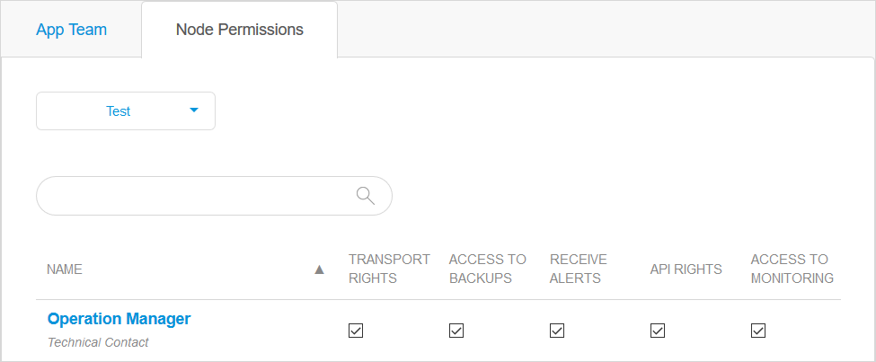

## 1 Introduction

You can manage the email alerts for each environment without the Technical Contact having to switch on the **Receive alerts** node permission.

You can switch the alerts on and off for each environment to which you are entitled.

**This how-to will teach you how to do the following:**

* Switch alerts on and off for separate environments

## 2 Prerequisites

Before starting this how-to, make sure you have completed the prerequisites described below:

* You need an **Application Operator**, **Business Engineer**, or **Scrum Master** role
* In the case that a [Mendix Admin](/developerportal/control-center/#members) has defined a new team role, that role must have the team **Edit** permission for **Monitor**    
    
## 3 Receive Alerts

There are two ways to start receiving alerts:

* The Technical Contact can grant you the **Receive Alerts** permission in **Node Permissions**
* You can click the check box of **Email Alerts** on the **Alerts** page

### 3.1 Node Permissions  

The Technical Contact can grant you the **Receive Alerts** permission by following these steps:

1. Go to the [Developer Portal](http://sprintr.home.mendix.com).
2. Open the **Switch to** menu and click **Cloud**.

    

3. Open the node by clicking **Details**.
4.  Click **Security** in the left-hand menu.
5. Switch to the **Node Permissions** tab.
6.  Select the check box below **Receive Alerts**. It is possible to set this permission separately for each environment. The changes will be automatically saved.

    

### 3.2 Alerts Page

You can manage the alerts by yourself, follow these steps:

1. Go to the [Developer Portal](http://sprintr.home.mendix.com).
2. Open the **Switch to** menu and click **Cloud**.
3. Open the node by clicking **Details**.
4. Click **Alerts** in the left-hand menu. 
5. Select the check box of **Email Alerts**.  It is possible to set this option separately for each environment. The changes will be automatically saved.

    

## 4 Read More

* [Alerts](monitoring-application-health)
* [Application Trends in Mendix Cloud v3](trends)
* [Application Trends in Mendix Cloud v4](trends-v4)
* [Mendix Cloud](/developerportal/deploy/mendix-cloud-deploy)
* [Mendix Cloud v4](/developerportal/deploy/mxcloudv4)
* [App Roles](/developerportal/collaborate/app-roles)
* [Node Permissions](/developerportal/deploy/node-permissions) 
* [Technical Contact](/developerportal/collaborate/app-roles#technical-contact)
