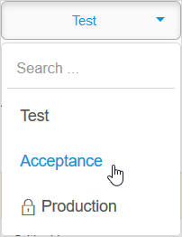

## 1 Introduction

This page describes how to restore a backup to the Mendix Cloud.

The backup can be stored in the cloud, associated with the environment from which it was made. Alternatively, for licensed nodes it can be a backup which has been stored locally, for example by downloading a backup from the Mendix Cloud (see [Download a Backup](download-backup)) for more information.

{}
You can only restore a backup if you have sufficient rights to the target node. See [Node Permissions](/developerportal/deploy/node-permissions) for more information.
{}

{}
You cannot transfer data from one app to another by restoring a backup from one app to a different app. This is because each app labels the entities uniquely, even if the name in the domain model is the same. See [Data Storage](/refguide/data-storage) for more information.

If you want to copy data to another app, we recommend using the [Database Replication](/appstore/modules/database-replication) module.
{}

## 2 Restoring a Backup for the Same Licensed Cloud Node{#restore-cloud-backup}

Mendix Cloud makes nightly backups, and you can also manually request that a backup is made. If you want to restore one of these backups to the node from which it was backed-up just follow the steps below.

If you want to restore a backup to a different cloud node, or have your backup stored locally, then see [Restoring a Backup for a Different Licensed Cloud Node](#restore-local-backup), below.

1. Go to the **Backups** page of the *Developer Portal* for your app.

2. Select the environment to which the backup should be restored (for example *Acceptance*).

    

3. Select the backup you want to restore and click **Restore Backup**.

    

4. Confirm the backup restore by clicking **Restore Backup**.

    

{}

If the app is still running, you have to stop it by clicking **Stop Application**. Then click **Restore Backup** again.

{}

{}

You can choose to restore only the database by selecting **DB only restore**. Doing a DB only restore will not restore any of your files leading to a risk that data will be missing from your app or that your app will not work as expected. Use this option with caution.

{}

## 3 Restoring a Backup for a Different Licensed Cloud Node{#restore-local-backup}

To transfer backups between environments, you will need a downloaded backup file (*.db* or *.gz*) stored locally on your computer. This could also be the case if you want to restore a backup which has expired and been deleted from the Mendix Cloud.

{}
You can only restore data to an existing database. This means that there must have been an app deployed to the licensed node before you attempt to restore data. If it is a new node environment, you must deploy an app to it before attempting to restore data to the node.

The app previously deployed to the node does not, however, need to have had the same Domain Model as the data you are restoring.
{}

1. Go to the **Backups** page of the *Developer Portal* for your app.

2. Select the environment to which the backup should be restored (for example *Acceptance*).

    

3. Click **Upload Archive**.

    In **Mendix Cloud v4**, the upload will create a new backup item in your backup list, which you can then restore via the regular restore process. This will ensure less downtime for your application.

    In the deprecated **Mendix Cloud v3**, this will *not* add a backup to the backup list but directly update the application with the newly uploaded data. Your environment will be cleared completely. The existing deployment package, uploaded files, and database will be removed. If you are uploading data to the production environment, any published app services will be unpublished.

4. In Mendix Cloud **v3** you will need to confirm this by clicking **Yes**, because this action will immediately stop your app.

5. Upload the *.db* or *.gz* backup file.

6. In Mendix Cloud **v4** you will now need to restore your backup which is held in the Mendix Cloud, as described in [Restoring a Backup for the Same Licensed Cloud Node](#restore-cloud-backup), above.

## 4 Restoring a Backup for a Free App

For a Free App, you can only restore available backups which are made from the app and held in the cloud. It is not possible to upload a backup which was created or stored elsewhere.

1. Go to the **Backups** page of the *Developer Portal* for your app.

2. Select the backup you want to restore and click **Restore Backup**.

    

3. Click **Yes** to confirm the restoration.

## 5 Format of a Backup File{#format-of-backup-file}

You may want to restore a backup which has been created on another platform, for example an on-premises deployment. In this case you will have to construct the backup file which the Mendix Cloud will recognize.

### .tar.gz archive

A **Full snapshot** backup file is a *.tar.gz* file (for example, *files_and_database-fc9e126f-201811210121.tar.gz*).

### .tar archive

The *.tar* archive within the *.tar.gz* archive (for example, *files_and_database-fc9e126f-201811210121.tar*) contains a number of files in a folder structure.

Here is an example:


contains the following files:

```
.metadata
db/db.backup
tree/0d/3e/0d3e301f-5551-46f8-ad44-8de2be084c95
tree/1f/bd/1fbdf930-67f9-47ee-b30e-e84c4c983e85
tree/22/70/22708b5d-3e9e-40ba-95e3-4a2ef1a02db3
tree/28/02/280283d7-0807-44e3-b80e-f699cee91ffa
tree/37/8c/378c70d9-605b-4cb4-a223-26e718cec733
tree/46/9c/469c9c80-34d3-4810-8494-86b63eb37214
tree/4d/8f/4d8ffd66-7ad3-4f5c-a992-985cf360581b
```
### .metadata file

This contains json describing the backup. For example:

```json
{
    "duration":"0",
    "dumpSize":"94769",
    "modelVersion":"1.0.0.40",
    "databaseSize":"9730584",
    "filesSize":"1346575"
}
```

### db folder

This contains the *db.backup* file. This is a PostgreSQL dump file created using the command `pg_dump -O -x -Fc`.

{}
If the dump does not use the *custom format* then the restore will fail.

The dump must be created with `pg_dump` version 1.14 or below, which is currently bundled with PostgreSQL 12 and 13. If it is created with a later version, then the upload will fail.
{}

### tree folder

This contains the files which are stored in external file storage. Each file has the name of the uuid used within Mendix to identify the resource.

#### Mendix Cloud V4

For Mendix Cloud V4 the files are stored in a flat structure.

#### Mendix Cloud V3

The situation for the deprecated Mendix Cloud v3 is slightly different. If you need to restore a backup to Mendix Cloud V3, you will need to implement the structure described below. The restore functionality in Mendix Cloud V4 will also recognize this structure if you are restoring a backup taken on V3 to a V4 environment.

Each file is stored in a second level location:

```
/tree
   |---/[xx]
          |---/[yy]
                 |---/file
```

The file has the name of the uuid used within Mendix to identify the resource.

The directory [xx] is the first two characters of uuid.

The directory [yy] is the third and fourth characters of the uuid.

So, for example, the first file in the example file above (0d3e301f-5551-46f8-ad44-8de2be084c95) is stored in the following structure:

```
/tree
   /0d
      /3e
         /0d3e301f-5551-46f8-ad44-8de2be084c95
```

## 6 Read More

* [Backups](backups)
* [How to Create a Backup](create-backup)
* [How to Download a Backup](download-backup)
