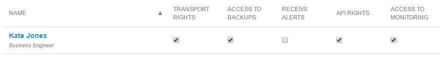
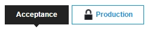

## 1 Introduction

To track the usage growth of your app and to debug performance problems, the Mendix Cloud includes detailed graphs on both infrastructure and application level. These graphs show various performance trends of all your apps in the paid editions of the Mendix Platform. In case you experience issues with your app, always check the **Alerts** and **Trends** in the **Developer Portal** under **Operate**.

## 2 Monitor Trends Access  

To view the **Trends**, you must have permission to **Access the Monitoring**.

{}

Note that only the [Technical Contact](../general/technical-contact) is allowed to grand the node permissions.

{}

Assign this permission by following these steps:

1. Go to the [Developer Portal](http://home.mendix.com) and click **Apps** in the top navigation.
2. Click **My Apps** and select **Nodes**.
3. Select the node from which you want to monitor.
4. Click **Security** under the **Settings** category on the left.
5. Go to the **Node Permissions** tab.
6. Check **Access the Monitoring** next to the name of the person who is granted this permission.

## 2 Find the Trends

You can find the trends by following these steps:

1. Go to the [Developer Portal](http://home.mendix.com) and click **Apps** in the top navigation panel.
2. Click **My Apps** and select **Nodes**.
3. Select the node from which you want to monitor.
4. Click **Metrics** under the **Operate** category.
5. Select the environment you want to monitor under the tab **Trends**.

## 3 Application Statistics

These graphs show various application specific metrics, such as the number of HTTP requests, database queries, user sessions as well as JVM memory statistics.

### 3.1 Number of Handled External Requests

The requests graph shows the number of requests that are sent from the client or systems that integrate with your application using web services. The number of requests per second is split up by request handlers.

"xas" lists general queries for data in datagrids, sending changes to the server and triggering the execution of microflows. "ws" shows the number of web service calls that were done. "file" shows the number of file uploads and downloads. The "/" should not list any requests, because static content is directly served to the user by the front-facing web server, which is placed between the user and this application process.

### 3.2 Number of Database Queries Being Executed

This graph shows the number of database queries that are executed by your Mendix application, broken down in queries that actually modify data (insert, update, delete), queries that fetch data (select), and the number of transactions (like microflows from which these queries originate).

### 3.3 User Accounts and Login Sessions

The sessions graph shows the number of logged-in named and anonymous user sessions for your application, next to the total number of existing login accounts in the application.

### 3.4 JVM Object Heap

The JVM Object Heap graphs shows the internal distribution of allocated memory inside the application process for objects that are in use by microflows, scheduled events, and all other data that flows around inside the Mendix runtime process.

One of the most important things to know in order to be able to interpret the values in this graph, is the fact that the JVM does not immediately clean up objects that are no longer in use. This graph will show unused memory as still in use until the so-called garbage collector, which analyzes the memory to free up space, is run. So, this graph does not show how much of the JVM memory that is in use before a garbage collection will have to stay allocated after the garbage collection cycle, because the garbage collection process will only find out about that when it's actually running.

If the tenured generation shows up to as big as 65% of the complete heap size, this might as well change to 0% when a garbage collection is triggered as soon as the percentage reaches two thirds of the total heap size, but it could also stay at this amount if all data in this memory part is still referenced by running actions in the application. This behavior causes the JVM heap memory graphs to be one of the most difficult to base conclusions on.

### 3.5 JVM Process Memory Usage

This second graph about JVM memory is similar to the previous graph, JVM Object Heap. It shows a more complete view of the actual size and composition of the operating system memory that is in use by the JVM process. This graph is currently primarily present to provide more insight in situations in which the part of the real used memory outside the JVM Object Heap is growing too much, causing problems with memory shortage in the operating system.

More information on this graph is available in a Tech Blog post: [What's in my JVM memory?](https://tech.mendix.com/linux/2015/01/14/whats-in-my-jvm-memory/)

### 3.6 Threadpool for Handling External Requests

The application server thread pool graph shows the number of concurrent requests that are being handled bij the Mendix Runtime, but only when they're initiated by a remote API, like the way the normal web-based client communicates, or by calling web services. Because creating a new thread that can concurrently process a request is an expensive operation, there's a pool of threads being held that can quickly start processing new incoming requests. This pool automatically grows and shrinks according to the number of requests that are flowing through the application.

### 3.7 Total Number of Threads in the JVM Process

This graph shows the total number of threads that exist inside the running JVM process. Besides the threadpool that is used for external HTTP requests, as shown above, this includes the threadpool used for database connections, internal processes inside the Mendix Runtime, and optional extra threads created by the application itself, for example, using a threadpool in a custom module or custom Java code.

### 3.8 Object Cache

Mendix 4.0 introduced Non-Persistent Entities which live in the JVM memory and are garbage collected regularly. If you have a memory leak, the number of objects in memory will grow over time. This might be a problem. In this graph you can monitor the number of Mendix Objects that live in memory.

## 4 Database Statistics

The database statistics show the amount of database queries and mutations, as well as the total size of the database.

### 4.1 Mutations

This graph shows the number of database objects that were actually changed by database queries from the application. A single database operation that affects more than one object, will show up as single database query as measured from the application side, but will show the number of object actually changed here, as measured from inside the database.

### 4.2 Index vs. Table Size

This database size graph shows the distribution between disk space used for storing indexes and actual data. Remember, indexes actually occupy memory space and disk storage, as they're just parts of your data copied and stored, sorted in another way! Besides your data, indexes also have to be read into system memory to be able to use them.

### 4.3 Application Node

These are infrastructure level metrics with regards to the application node.

#### 4.3.1 CPU

The CPU graph shows the amount of CPU utilization in percentage, broken down into different types of CPU usage.

The most important value in here is 'user', which shows the amount of CPU time used for handling requests at Mendix Runtime and executing microflows and scheduled events. CPU usage of the database is shown in a separate graph below.

#### 4.3.2 Memory

The memory graph shows the distribution of operating system memory that is available for this server. The most important part of the graph is the application process, which is visible as an amount of memory that is continuously in use, labelled in the category 'apps'.

### 4.4 Database Node

These are infrastructure level metrics with regards to the database node.

#### 4.4.1 CPU

The CPU graph shows the amount of CPU utilization in percentage, broken down into different types of CPU usage.

The most important values in here are: 'user', which shows the amount of CPU time used for running database queries, and 'iowait', showing the amount of time a CPU core is idle and waiting for disk operations to finish (for example, waiting for information that has to be read from disk, or waiting for a synchronous write operation to finish).

Clearly visible amounts of iowait, in combination with a high number of disk read operations (Disk IOPS), and having all free system memory filled as disk cache (Memory graph), are a sign of a lack of available server memory for use as disk cache. This situation will slow down database operations tremendously, because getting data from disk over and over again takes considerably more time than having it present in memory.

#### 4.4.2 Memory

The memory graph shows the distribution of operating system memory that is available for this server. The most important part of this graph is the 'cache' section. This type of memory usage contains parts of the database storage that have been read from disk earlier. It is crucial to the performance of an application that parts of the database data and indexes that are referenced a lot are always immediately available in the working memory of the server, at the cache part. A lack of disk cache on a busy application will result in continuous re-reads of data from disk, which takes several orders of magnitude more time, slowing down the entire application.

#### 4.4.3 Database Connections

The database connections graph shows the number of connections to the PostgreSQL server. This should go up and down with the usage of the application. The number of connections is limited to 50.

## 5 Both Application and Database Node

The following infrastructure metrics are available for both the application node and the database node.

### 5.1 Disk IOPS

The Disk IO statistics show the number of disk read and write operations that are done from and to the disk storage. It does not show the amount of data that was transferred.

### 5.2 Load

This value is commonly used as a general indication for overall server load that can be monitored and alerted upon. The load value is a composite value, calculated from a range of other measurements, as shown in the other graphs on this page. When actually investigating high server load, this graph alone is not sufficient.

### 5.3 Disk Latency

The disk latency graph shows the average waiting times for disk operations to complete. Interpreting the values in this graph should be done in combination with the other disk stats graphs, and while having insight in the type of requests that done. Sequential or random reads and writes can create a different burden for disk storage.

### 5.4 Disk Throughput

Disk throughput shows the amount of data that is being read from and written to disk. If there's more than one disk partition in the system, the /srv partition generally contains project files and uploaded files of the application, while /var generally holds the database storage.

### <a name="Trends-dbdfabs"><a name="Trends-dbdf">5.5 Disk Usage

This graph displays the amount of data that is stored on disk in absolute amounts. If there's more than one disk partition in the system, the /srv partition generally holds project files and uploaded files of the application, while /var generally holds the database storage.

### 5.6 Disk Utilization

Disk utilization shows the percentage of time that the disk storage is busy processing requests. This graph should be interpreted in combination with other graphs, like CPU iowait, disk iops, and number of running requests. For example, a combination of a moderate number of IO operations, low amount of disk throughput, visible cpu iowait, filled up memory disk cache, and reports of long running database queries in the application log could point to a shortage of system memory for disk cache that leads to repeated random reads from disk storage.

{}

Disk utilization is calculated as the disk usage that is used by the user of the system. Due to operating system overhead and empty space in block size allocation, not all disk space can be fully allocated. For this reason, the total amount of usable space will be ~4% lower than the actual disk space.

{}

## 6 Related Content

* [Alerts](monitoring-application-health)
* [Database Maintenance: Size Reduction](/howtogeneral/support/database-maintenance-size-reduction)
* [How to Calculate the Total Amount of Diskspace of a Cloud App Environment](/howtogeneral/support/how-to-calculate-diskspace-of-a-cloud-app-environment)
* [How to Configure Maintenance Windows](/developerportal/howto/maintenance-windows)
* [How to Migrate to Mendix Cloud v4](/deployment/mendixcloud/migrating-to-v4)
* [How to Receive Environment Status Alerts](/developerportal/howto/receive-alerts)
* [How to View the Mendix Cloud Version and Region](/developerportal/howto/cloud-version-region)
* [Mendix Cloud v4 - FAQ](/deployment/mendixcloud/mxcloudv4)
