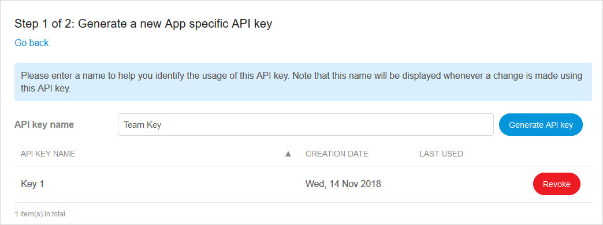
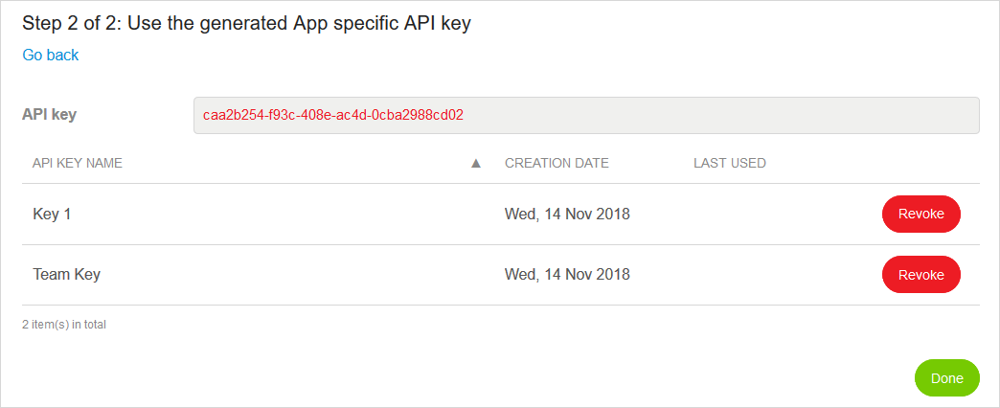

## 1 Introduction

In **API Keys**, there is an overview of the API keys created for your app with the following information:

*   **API Key Name**
*   Date of **Creation**
*   Date **Last Used**

{}
{}

Click **Revoke** to delete an API key.

## 2 Creating an API Key

To create a new API key, click **Create API Key**  and follow these steps:

1.  Fill in the **API key name**:

	
	
2.  Click **Generate API Key** to be able to use the API key:

	

	{}
	For security reasons, the API key will only be displayed once, during **Step 2 of 2**. It will not be displayed again.
	{}

## 3 Related Content

* [API Documentation](/apidocs-mxsdk/apidocs)
* [Mendix Profile](../mendix-profile/index)
