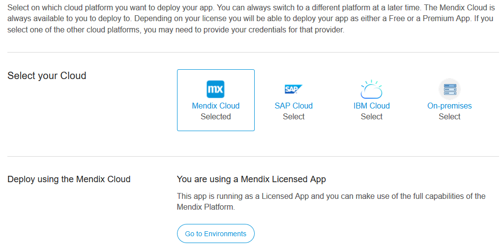

## 1 Introduction

In **Cloud Settings**, you can select the cloud platform on which to deploy your app. You can switch to different cloud platforms later. The selection of cloud platforms available will depend on the features of your Mendix account.

To select a different cloud platform, your project role must have edit rights on **App settings**. If you have the default roles only the **SCRUM Master** has these rights.

## 2 Switching the Cloud Platform

If you select a non-Mendix cloud platform like SAP you will be redirected to a page to complete the setup. If you select Mendix Cloud no additional setup is needed.

The specific steps for setting up on different cloud platforms:

* [Deploy on premises](/deployment/on-premises)
* [SAP Cloud Platform](/developerportal/deploy/sap-cloud-platform)

## 3 Related Content

* [How to Manage Company Roles and App Roles](/developerportal/howto/change-roles)
* [Roles Within the Company and Apps](/developerportal/general/company-app-roles)
* [Technical Contact](/developerportal/general/technical-contact)

