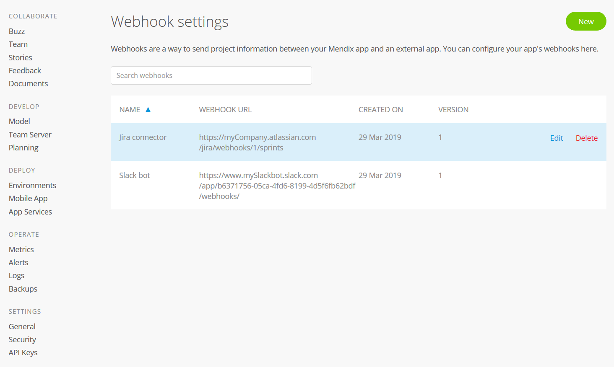

## 1 Introduction

The **General** settings page presents an overview of your app project with the following details:

* A **Description** of the app
* The [App Contact](../company-app-roles/manage-roles#change-app-contact) and [Technical Contact](../company-app-roles/technical-contact) for the app
* Whether the app is enabled for Mendix **Studio** (for details, see the [Mendix Studio](#web) section below)

* The **App ID**

{}
{}

The sections below describe the actions you can perform on this page.

## 2 Mendix Studio {#web}

In the **Studio** section, you can see whether Studio is enabled for the app. You can also do the following:

*  Enable Studio if it has not been enabled yet by clicking **Enable Studio**

	

*  Enable collaborative development with Studio for apps using Mendix version [7.23.3](/releasenotes/desktop-modeler/7.23#7233) and above by clicking **Enable Now** (for more information on the collaborative development process, see [Collaborative Development](/refguide/collaborative-development))

	

## 3 Editing Cloud Settings

Click **Cloud Settings** to select the cloud platform on which to deploy your app. The selection of cloud platforms available will depend on the features of your Mendix account.

{}
Only users with the **App Settings** permission can change cloud platforms. For default roles, only the **SCRUM Master** has this permission. For more details, see the [App Team Roles](../company-app-roles/index#app-team-roles) section of *Company & App Roles*.
{}

If you select a non-Mendix cloud platform like SAP, you will be redirected to a page to complete the setup. If you select Mendix Cloud, no additional setup is needed.

Specific steps for configuring different cloud platforms are provided here:

* [Mendix Cloud](../deploy/mendix-cloud-deploy)
* [SAP Cloud Platform](../deploy/sap-cloud-platform)
* [IBM Cloud](../deploy/ibm-cloud)
* [On-Premises](../deploy/on-premises-design)

## 4 Editing App Info

{}
Only users with the **App Settings** permission can edit the application information.
{}

Click **Edit App Info** to edit the following details:

* The name and logo of the app
* The **Description** of the app
* The **App Contact**

{}
{}

## 5 Managing Webhooks {#webhooks}

Click **Manage Webhooks** to manage your app's webhooks. A webhook enables the Developer Portal to talk to another website and post updated Developer Portal content (for example, sprint updates and new stories) to that website. For example, if [Mansystems](https://developer.mendixcloud.com/link/partnerprofile/1068) wants to follow the changes in their app project, they will create a service with a certain URL (see the required [URL](#url) below) that keeps track of the data. Changes in the app project in the Developer Portal are then sent to that URL.

{}
Only [Company Admins](../company-app-roles/companyadmin-settings) or users with the **App Settings** permission can manage webhooks.
{}

On the **Webhooks settings** page, you can add a new webhook and edit or delete existing webhooks:

{}
{}

After clicking **New** to create a new webhook, fill in the following details:

* **Name** – the name of the webhook
* **URL** – the URL to which the webhook will connect 
* **Secret** – the secret used by the Developer Portal to sign the data payload in order to identify the source of the data to the receiving URL (this appears when creating and editing a webhook, but it will not be displayed on the **Webhooks settings** page)
* **Version** – the version of the webhooks feature to be used
* **Events** – what types of data will be sent via the webhook (you must select at least one; this appears when creating and editing a webhook, but it will not be displayed on the **Webhooks settings** page)
  * [Sprints](../collaborate/stories#sprint)
  * [Stories](../collaborate/stories)

To edit the above details for an existing webhook, click **Edit**.

To delete an existing webhook, click **Delete**.

{}
For details on the technical configuration of webhooks, see [Webhooks](/apidocs-mxsdk/apidocs/webhooks-sprints) in the *API Documentation*.
{}

## 6 Leaving the App

To leave the app, click **Leave App**. For details on leaving, deleting, and deactivating an app, see [How to Leave & Delete an App](leave-delete-app).

## 7 Read More

* [Leave & Delete an App](leave-delete-app)
* [Manage Deep Links](manage-deeplinks)
