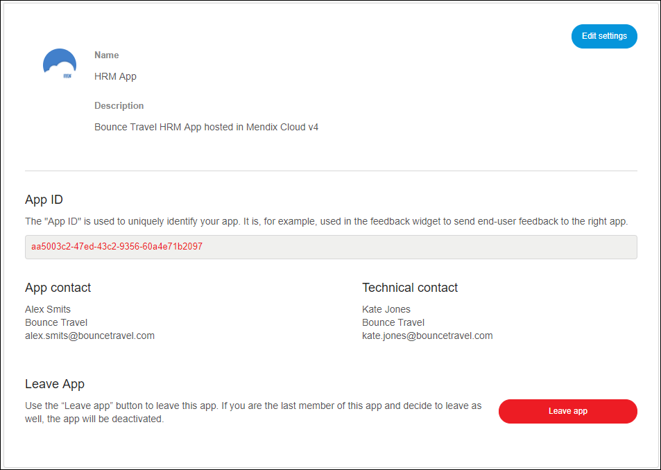
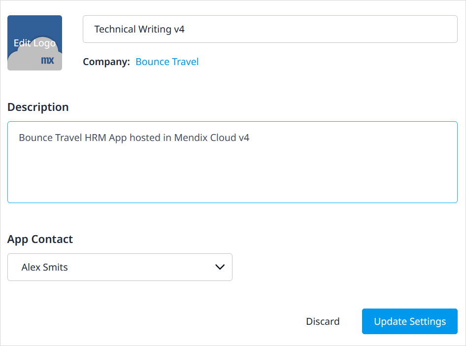

## 1 Introduction

In **General**, there is an overview of the app:

* Name of the app
* **Description** of the app
* **App Contact** for the app
* **Technical Contact** for the app
* Whether the app is enabled for the **Web Modeler**
* * **App ID**

    {}
    {}

{}

Note that only the Technical Contact can grant other members with the Technical Contact role in [Security - Node Permissions](/developerportal/settings/node-permissions) in **Security**.

{}

There are three actions here you can perform:

* Click **Cloud Settings** to select the cloud platform on which you want to deploy your app (for details, see [Cloud Settings](cloud-settings))
* Click **Edit App Info** to edit the app settings (you can only see this button when you have the **App Settings** permission; for more details, see [Company & App Roles Overview](/developerportal/general/company-app-roles))
* Click **Leave app** to leave the app (for details, see [How to Leave & Delete an App](leave-delete-app))

## 2 Editing App Info

When you click **Edit App Info**, you can edit the following things:

* The name of the app
* The app logo
* The **Description** of the app
* The **App Contact**

{}

## 3 Leaving the App

For details, see [How to Leave & Delete an App](leave-delete-app).

## 4 Web Modeler

If your app is supported by the Web Modeler, you can enable it by clicking **Enable Web Modeler**. For details on getting the full Web Modeler experience, see [How to Migrate Existing Projects to Atlas UI](/howto/atlasui/migrate-existing-projects-to-atlasui).

## 5 Related Content

* [How to Manage Company & App Roles](/developerportal/general/manage-roles)
* [Company & App Roles Overview](/developerportal/general/company-app-roles)
* [Technical Contact](/developerportal/general/technical-contact)

