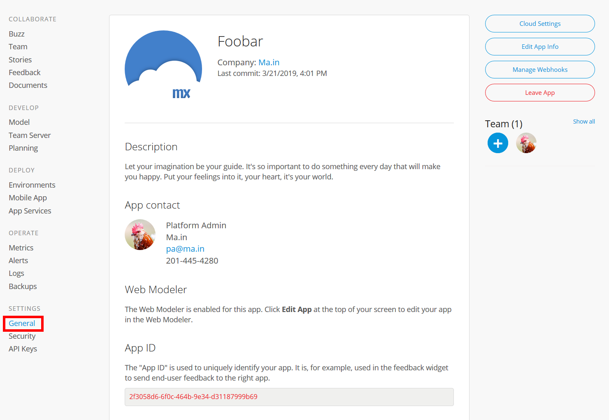
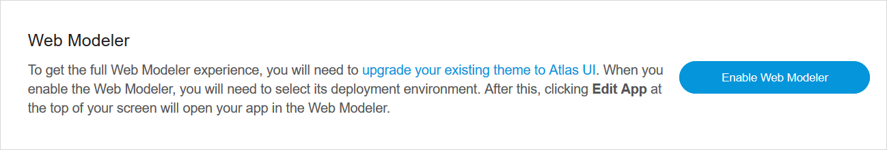
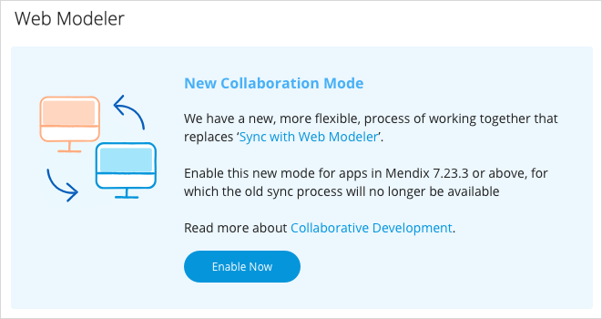

## 1 Introduction

The **General** settings page presents an overview of your app project with the following details:

* A **Description** of the app
* The [App Contact](../company-app-roles/manage-roles#change-app-contact) and [Technical Contact](../company-app-roles/technical-contact) for the app
* Whether the app is enabled for the **Web Modeler** (for details, see the [Web Modeler](#web) section below)

* The **App ID**

{}
{}

The sections below describe the actions you can perform on this page.

## 2 Web Modeler {#web}

In the **Web Modeler** section, you can see whether the Web Modeler is enabled for the app. You can also do the following:

*  Enable the Web Modeler if it has not been enabled yet by clicking **Enable Web Modeler**

	

*  Enable collaborative development with the Web Modeler for apps using Mendix version [7.23.3](/releasenotes/desktop-modeler/7.23#7233) and above by clicking **Enable Now** (for more information on the collaborative development process, see [Collaborative Development](/refguide/collaborative-development))

	

## 3 Editing Cloud Settings

Click **Cloud Settings** to select the cloud platform on which to deploy your app. The selection of cloud platforms available will depend on the features of your Mendix account.

{}
Only users with the **App Settings** permission can change cloud platforms. For default roles, only the **SCRUM Master** has this permission. For more details, see the [App Team Roles](../company-app-roles/index#app-team-roles) section of *Company & App Roles*.
{}

If you select a non-Mendix cloud platform like SAP, you will be redirected to a page to complete the setup. If you select Mendix Cloud, no additional setup is needed.

Specific steps for configuring different cloud platforms are provided here:

* [Mendix Cloud](../deploy/mendix-cloud-deploy)
* [SAP Cloud Platform](../deploy/sap-cloud-platform)
* [IBM Cloud](../deploy/ibm-cloud)
* [On-Premises](../deploy/on-premises-design)

## 4 Editing App Info

{}
Only users with the **App Settings** permission can edit the application information.
{}

Click **Edit App Info** to edit the following details:

* The name and logo of the app
* The **Description** of the app
* The **App Contact**

{}
{}

## 5 Leaving the App

To leave the app, click **Leave App**. For details on leaving, deleting, and deactivating an app, see [How to Leave & Delete an App](leave-delete-app).

## 6 Read More

* [How to Leave & Delete an App](leave-delete-app)
* [How to Manage Deep Links](manage-deeplinks)
