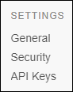

## 1 Introduction

The **Settings** category focuses on managing your app settings. Here you can see the basic app information and edit it. You can also manage the app team and node permissions and create API keys.

Follow these steps to find the **Settings** category:

1.  Go to the [Developer Portal](http://home.mendix.com).
2.  Click **Apps** in the top navigation panel.
4.  Select the app you want to manage.
5.  Click **Security** in the left navigation panel.

  

## 2 General

The **General** tab displays an overview of the app's information: the name and description of the app, the **App Contact**, the **Technical Contact** (if the app has a node), whether the **Web Modeler** is enabled for the app, the **App ID**.

For more information, see [General Settings](general-settings).

## 3 Security

In **Security** there are two tabs with app and node permissions described below:

### 3.1 App Team

{}
Note that to view the **App Team**, you must have the **App Settings** permission or a default **Scrum Master** role.
{}

The **App Team** tab lets you view and delete the team members that are currently working on the app. Each member has a **Role**. You can change the role of each team member to the following:

* Application Operator
* Business Engineer
* End-User
* Performance Engineer
* Product Owner
* Scrum Master

There are two actions you can take:

*   Change the **Role Settings**
*   View the **Change log**

### 3.2 Node Permissions

{}

**Node Permissions** are only available for Licensed Apps.

{}

The **Node Permissions** tab lets you view the team members that have the **App Team** permission to **View Deploy and Monitor** the node. A **Technical Contact** can grant those team members the following permissions:

* Transport rights
* Access to backup
* Receive Alerts
* API rights
* Access to monitoring

For more information, see [Security-Node](/developerportal/settings/node-permissions).

## 4 API Keys

The **API Keys** page lists the existing API keys and lets you create new keys by clicking **Create API key**.

For more information, see [API Keys](/developerportal/settings/api-key).

## 5 Related Content

* [Company Admin Settings](/developerportal/general/companyadmin-settings)
* [How to Configure Maintenance Windows](../howto/maintenance-windows)
* [How to Leave & Delete an App](../general/deactivate-activate-app)
* [How to Manage Company & App Roles](../general/manage-roles)
* [How to Receive Environment Status Alerts](../howto/receive-alerts)
* [Mendix Profile](../mendix-profile/index)
* [Company & App Roles Overview](../general/company-app-roles)
* [Technical Contact](../general/technical-contact)
