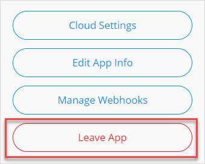
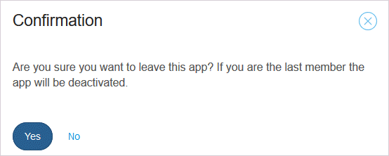
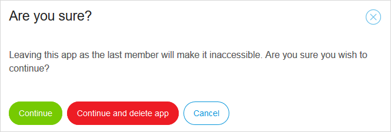

## 1 Introduction

You can create a new app project in one click and leave the app project just as easily when you are not using it anymore. However, if you are thinking about leaving an app, consider carefully whether you may want to use that app later for any reason.

Your ability to delete and deactivate an app depends on your App Team role:

* A **SCRUM Master** is allowed to deactivate and delete an app (even when there are still App Team members for the app)
* A custom role with the **App Settings** permission is also allowed to deactivate and delete an app (even when there are still App Team members for the app)
* A **Company Admin** is allowed to delete, deactivate, and activate all the company's apps (with or without App Team members for the app)

For more information on roles, see [Company & App Roles](/developerportal/company-app-roles/index).

**This how-to will teach you how to do the following as a SCRUM Master:**

* Leave an app
* Delete an app
* Deactivate an app

## 2 Prerequisites

Before starting this how-to, make sure you have completed the following prerequisites:

* To leave, delete, or deactivate an app, have the **SCRUM Master** role on your App Team (or a custom role with the **App Settings** permission)

## 3 Leaving & Deleting (or Deactivating) an App

There are some important points to understand when you want to leave and/or delete an app:

* You cannot delete or deactivate an app if you are the **Technical Contact** of the app
* Only Free Apps can be deleted
* App deletion cannot be undone, which means that ALL DATA WILL BE LOST, including all files on the [Team Server](/refguide/team-server) and all data in the Free App [node](../general/nodes) (if applicable)

If you want to leave and delete your app, follow these steps:

1. Go to the [Developer Portal](http://home.mendix.com), click **Apps** in the top menu bar, and select the app that you want to leave.

2. In the app's sidebar menu, select **Settings** > **General**.

3.  In the upper-right corner of that page, click **Leave app**:

	 

4.  Confirm leaving the app by clicking **Yes** (the pop-up window states the app will be deactivated if you are the only/last member of the App Team):

	 

	* If you leave an app project that still has App Team members, the app will still exist in the company and it will be available for other team members. If you want to return to the App Team, other team members can invite you again to the app.

5.  If the app will be made inaccessible upon your leaving, a final confirmation is necessary:

	* Click **Continue** to just leave your app 
		* If you are the only App Team member of the app project, clicking **Continue** allows you to leave the app project and deactivates the app
		* Note that because a deactivated app will still exist in the company, only a Company Admin can re-activate the app and invite members to it – for details, see [How to Deactivate & Activate an App](../general/deactivate-activate-app))
	* Click **Continue and delete app** to leave and fully delete the app from your company

	 

## 4 Related Content

* [Apps](../general/apps)
* [How to Deactivate & Activate an App](../general/deactivate-activate-app))
* [Company Admin Settings](../general/companyadmin-settings)
* [General](general-settings)
* [How to Manage Company & App Roles](../general/manage-roles)
* [Company & App Roles](../company-app-roles/index)
