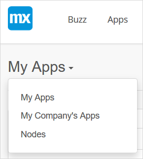
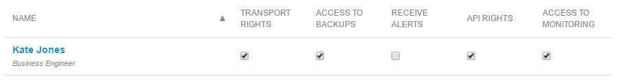

## 1 Introduction

Fine-grained access management for your Mendix Cloud environments is handled in the **Node Security** tab of the [Settings](/developerportal/settings) page under **Security**. Each team member can subscribe or unsubscribe to the alerts, and the [Technical Contact](/developerportal/general/technical-contact) can manage various permissions of each team member per environment.

Learn more about [Roles Within the Company and Apps](/developerportal/general/roles).

{}

Note that you need to have an **MxID** to get access to the [Developer Portal](http://home.mendix.com). To create an MxID, click [here](http://www.mendix.com/try-now/?utm_source=documentation&utm_medium=community&utm_campaign=signup).

{}

## 2 Node Settings

In this section you will learn about configuring the user roles and permissions of the cloud node. Follow these steps to access the node permissions:

1.  Go to the [Developer Portal](http://home.mendix.com).
2.  Click **Apps** in the top navigation panel.
3.  Click **My Apps** and select **Nodes**.

    

4.  Select the node.
5.  Click **Security** in the left navigation panel.
6.  Go to the **Node Permissions** tab.

## 3 User Roles

Users with the Technical Contact role can manage all the settings in the cloud node, other members are restricted in what they can manage.

A cloud node always has:
* only one Technical Contact
* any number of app team members with **View Deploy and Monitor** permissions

{}

Note that only app team members with the **View Deploy and Monitor** permissions show up in the list of **Node Permissions**. These permissions are available in **App Team**. A SCRUM Master of the app can assign the **View Deploy and Monitor** permissions in the **App Team permissions** to any team member by selecting one of the following app team user roles: **Application Operator**, **Business Engineer**, **Performance Engineer/Tester**, **SCRUM Master**.

{}

### 4 Technical Contact

The Technical Contact manages the cloud node and can edit the privileges of regular team members with the **View Deploy and Monitor** permissions. Only the Technical Contact can give his user role to another team member by clicking **Change to Technical Contact**. After this, the new user has the Technical Contact role, the old user does not.

{}

The Technical Contact of the app is the first point of contact for [Mendix Support](https://support.mendix.com/hc/en-us), and will receive alerts regarding the cloud node.

{}

### 4.1 Alerts

The Technical Contact will receive the following alerts from the cloud node:

*   Notifications for maintenance from **Mendix Support**
*   Alerts from the node when problems arise (CPU load is high, running out of disk space, etc.). The Technical Contact cannot turn these off

To learn more about **Alerts**, read paragraph **2 Alerting Categories and Thresholds** of the [Alerts](/developerportal/operate/monitoring-application-health) documentation.

### 4.2 Mendix Support

The Technical Contact is the first point of contact for the app for [Mendix Support](https://support.mendix.com/hc/en-us). The Technical Contact can submit requests for the cloud node with the following request types:

*   Incidents: If incidents arise (for example, when the app is down)
*   Standard changes: **Add Cloud Resources**, **Change Mendix URL**, **New App**, **(Re)new license**, **Reset Google authenticator**

{}

Note that any change that are affects the license must first be discussed with the **Customer Success Manager (CSM)** before contacting Mendix Support. For example: expanding the existing license or requesting a new license for a node, additional file storage, or upgrading the app container.

{}

## 5 Node Permissions

The node permissions can be:

* Managed only by the Technical Contact
* Accessed by regular team members who have the permission to **View Deploy and Monitor**

### 5.1 Transport Rights

With transport rights you can deploy new versions of the application to the node. You can create new deployment packages, stop and start the environment, and change configuration settings such as constants and scheduled events.

For more information about deployment, see [How to Deploy to the Mendix Cloud](/developerportal/howto/deploying-to-the-cloud).

### 5.2 Access to Backups

This permission grants access to the backups of the environment. You can view, [create](/developerportal/howto/how-to-create-backup), [download](/developerportal/howto/how-to-download-a-backup), and [restore a backup](/developerportal/howto/how-to-restore-a-backup).

For more information, see [Backups](/developerportal/operate/backups).

### 5.3 Receive Alerts

When **Receives Alerts** is checked, this person will receive an email when an alert is triggered. Alerts are triggered when the app went offline unexpectedly, the application logged a message on level **Critical**, the health check failed, or various infrastructure problems occurred.

### 5.4 API Rights

With the API rights you can use the [Deploy API](/apidocs-mxsdk/apidocs/deploy-api) to get programmatic access to the environment. Naturally, the API does not require two-factor authentication, so API access is disabled for the production environment by default. The Technical Contact can assign API access for each user. Note that the **API Rights** are needed in addition to the other permissions, so in order to access backups via the API you will need both **Access to Backups** as well as **API Rights**.

### 5.5 Access to Monitoring

With this permission you can view the application metrics, logs, and alerts under the **Operate** category in the [Developer Portal](http://home.mendix.com). This allows you to successfully operate your Mendix Cloud environments.

For more information, see [Metrics](/developerportal/operate/metrics).

## 6 Related Content

* [Application Trends in Mendix Cloud v3](/developerportal/operate/trends)
* [Application Trends in Mendix Cloud v4](/developerportal/operate/trends-v4)
* [How to Manage Company Roles and App Roles](/developerportal/howto/change-roles)
* [How to Receive Environment Status Alerts](/developerportal/howto/receive-alerts)
* [Metrics](/developerportal/operate/metrics)
* [Logs](/developerportal/operate/logs)
