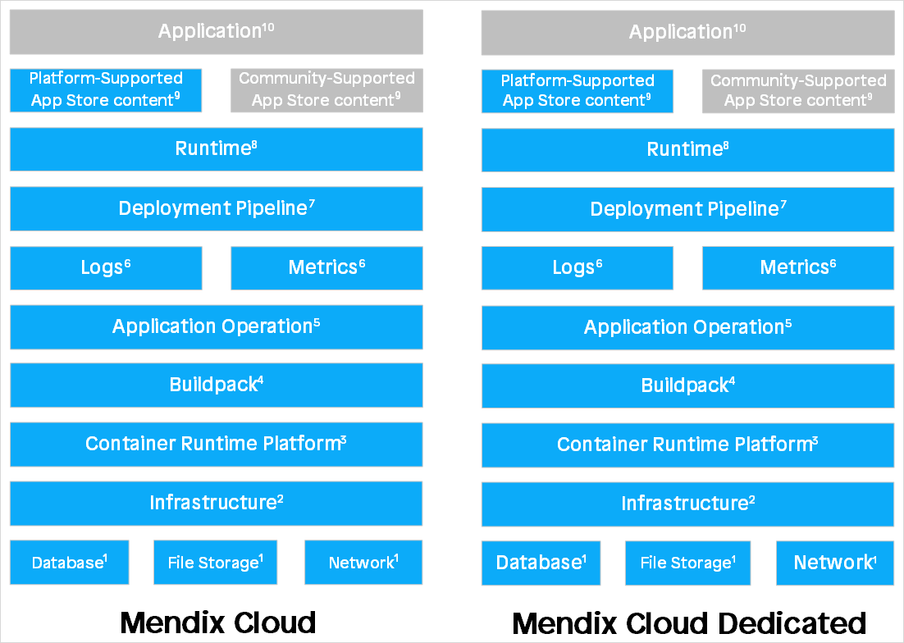
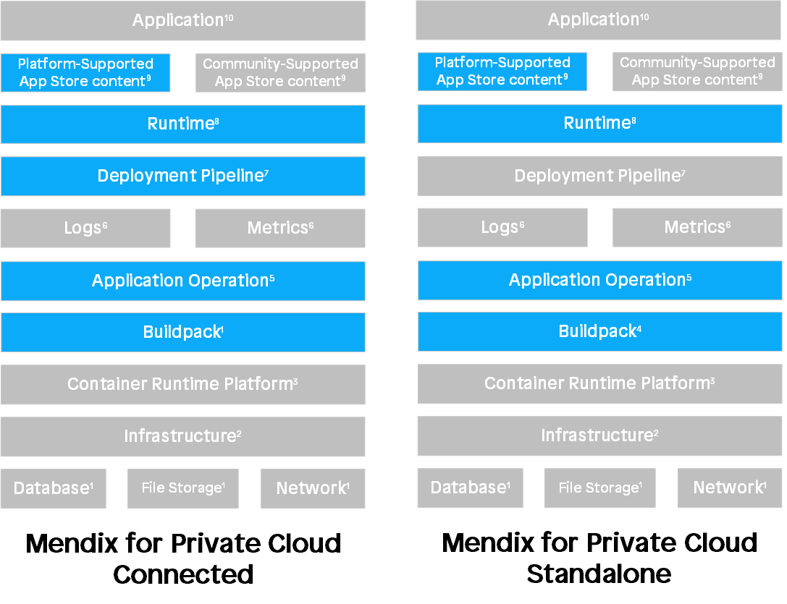
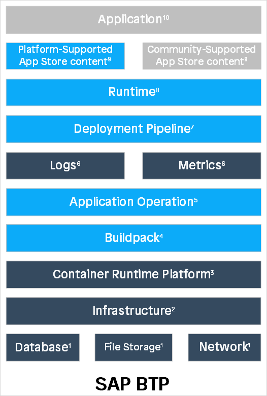
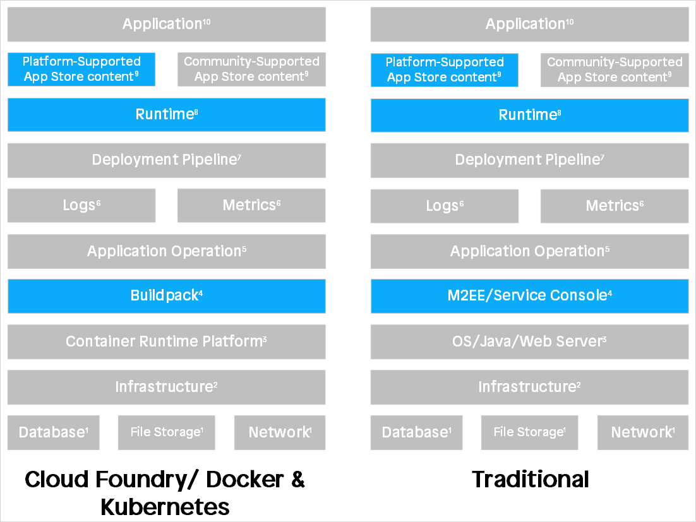

# Mendix Support

## 1 What You Can Expect from Mendix Support

Mendix Support is here to answer any questions and solve any issues that you might have. We try to make your journey as frictionless as possible.

**1.1 Service Level Agreements**
We are available for all users of the Mendix Platform, and we are bound by service-level agreements (SLA) with our licensed customers. Licensed customers can select their SLA level: **Gold** or **Platinum**. The SLA level determines the specific agreement in the following areas:

- Support availability
- Platform availability
- Maintenance
- Incident response time
- Incident resolution time
- Recovery time objective (RTO)
- Recovery point objective (RPO)

The SLA for your company is available upon request. Please contact [Mendix Support](https://support.mendix.com/) or your Customer Success Manager if you want to check the details.

**1.2 Premier Support** 
In addition to our Platinum SLA, Mendix offers **Premier Support**, with elevated support levels, specifically for customers with business critical apps.  
The Premier Support package contains the following for customers on the Mendix Public or Dedicated Cloud: 

- 24/7 support availability for critical and high tickets 
- 24/5 support availability for medium and low tickets 
- Direct access to senior designated team (Support and R&D) 
- Escalation hotline for Production down issues  
- Proactive app monitoring on critical issues 
- Quarterly ticket review meetings with senior designated team 

Please contact [Mendix Support](https://support.mendix.com/) or your Customer Success Manager if you want to know more. 

## 2 Finding Your Answers

We expect that many questions and issues can be solved by reading the Mendix [documentation](https://docs.mendix.com/) and by exploring the [forum](https://forum.mendix.com/). If you can’t find the answer to your question in one of these locations, you can submit a question, incident, or change request to Mendix Support. We will act as the focal point for issues on Mendix Studio and Studio Pro, your applications, and the [Developer Portal](https://home.mendix.com/). We will forward the issue to the second and third line if necessary.

## 3 Feature Requests

We would like to invite you to an important channel where you can provide feature requests to Mendix: the [Mendix Idea Forum](https://forum.mendix.com/link/ideas/). Any customer can post a feature request that can be reviewed, expanded on, and voted on by other members of the Mendix Community. Based on this feedback, every quarter we will determine which features have the most value according to our customers, and we will implement them.
For more details about the idea forum, see [The Mendix Forum](https://docs.mendix.com/developerportal/community-tools/mendix-forum).

## 4 Accessing Mendix Support

You can access the Mendix Support team through the [Mendix Support Portal](https://support.mendix.com/), via email (support@mendix.com), or by phone (phone numbers are listed in the Support Portal). Please note that critical tickets always need to be accompanied by a phone call to speed up the triage of the issue. In the Support Portal, you can check the status of your personal tickets, check all the submitted tickets for your applications, and provide updates on them.

## 5 What We Expect from You

Mendix supports the Mendix Platform, and we expect you to support the applications that you build on the platform. The following points are not supported through the standard SLA:

- Developing code on your behalf
- Debugging or troubleshooting your applications
- Analyzing and troubleshooting the health and performance of your applications or your infrastructure, except when we suspect an underlying issue exists in the Mendix Platform
- Troubleshooting Mendix Community-developed components from the Mendix App Store

During the start phase and through part of the scale phase of your digital transformation journey, it might be best to let your development team (DevOps) handle the support of the applications. As the number of applications grows, it is best to let an expert service desk handle the support of your applications. You can involve your existing service desk team or outsource support to one of our support partners, which you can find listed on the [Mendix Partners](https://developer.mendixcloud.com/openid/login?immediate=true&continuation=link/partneroverview) page.

**5.1 Company Admins**
To manage your company account and the users, projects, and licensed cloud nodes of your company, you can appoint company admins in the [Developer Portal](https://home.mendix.com/).
Please read more about this in [Company Admin Settings](https://docs.mendix.com/developerportal/company-app-roles/companyadmin-settings).

**5.2 Technical Contacts**
You need to appoint a [technical contact](https://docs.mendix.com/developerportal/company-app-roles/technical-contact) for each of your applications running in the Mendix Public Cloud and Cloud Dedicated. The technical contact checks the performance of the applications in the Developer Portal and receives alerts from the Mendix Developer Portal based on errors and warnings in the application. It is possible to have other team members receive these alerts as well.
Reading these alerts carefully and acting upon them is important, as they can affect the performance of your app. For more information on alerts, see [Alerts](https://docs.mendix.com/developerportal/operate/monitoring-application-health).

**5.3 Training**
We expect your support team to be trained and certified on Studio Pro and the Developer Portal so that they can interpret and analyze alerts, graphs, and logs in the Developer Portal. For more information, please check our available [classroom courses](https://gettingstarted.mendixcloud.com/link/classroom) and [expert webinars](https://gettingstarted.mendixcloud.com/link/webinar) or contact the Mendix Academy ([academy@mendix.com](mailto:academy@mendix.com)).

## 6 Platform Status

If there is an issue with the Mendix Platform that affects multiple customers or if there is planned maintenance, we will communicate this through our [status page](https://status.mendix.com/) and send updates on the progress through email if you have subscribed to this service. Having your service desk team subscribe to updates from this page is recommended.

## 7 Reach Out to Mendix Support

If, after your analysis, you suspect there is an issue with the Mendix Platform (or if you have questions about your analysis), you can reach out to Mendix Support. We will provide pointers on how to solve the issues yourself or redirect you to Expert Services for further assistance. If we suspect a platform issue, we will involve second and third line support for confirmation, and if it is a platform issue, we will fix it. If the issue is commercial (for example, because your app requires a larger app container or more file storage), we might refer you to your Customer Success Manager directly.

## 8 Product Support Period

Mendix supports the current major release and the two prior major releases (and we support each major release for a minimum of 24 months). Because of this, we recommend that you upgrade your projects to the latest version of Studio Pro at least once a year. We will reach out to you in time if you are running on a version that will become unsupported so that you have ample time to perform an upgrade.

## 9 Support for different deployment strategies 

With our Multi-Cloud strategy, Mendix allows the apps that you build to be deployed in any Cloud. This can be in the [Mendix Public Cloud](https://docs.mendix.com/developerportal/deploy/mendix-cloud-deploy), Mendix Dedicated Cloud, [Mendix Private Cloud](https://docs.mendix.com/developerportal/deploy/private-cloud), [SAP Cloud Platform](https://docs.mendix.com/developerportal/deploy/sap-cloud-platform) and also in other on-premises and Cloud architectures. 

The full stack is depicted below where components can be Mendix supported, not supported by Mendix (customer’s component) or supported by a Mendix Partner/3rd party. 

|                                             | **Public** **Cloud** | **Cloud Dedicated** | **Private Cloud - Connected** | **Private Cloud - Standalone** | **SAP Cloud Platform** | **Cloud Foundry / Docker & Kubernetes** | **Traditional** |
| ------------------------------------------- | -------------------- | ------------------- | ----------------------------- | ------------------------------ | ---------------------- | --------------------------------------- | --------------- |
| **Application**                             |                      |                     |                               |                                |                        |                                         |                 |
| **Platform-Supported App Store content**    | Mendix               | Mendix              | Mendix                        | Mendix                         | Mendix                 | Mendix                                  | Mendix          |
| **Community-Supported App Store content**   |                      |                     |                               |                                |                        |                                         |                 |
| **Runtime**                                 | Mendix               | Mendix              | Mendix                        | Mendix                         | Mendix                 | Mendix                                  | Mendix          |
| **Deployment Pipeline**                     | Mendix               | Mendix              | Mendix                        |                                |                        |                                         |                 |
| **Logs/Metrics**                            | Mendix               | Mendix              |                               |                                | Mendix Partner         |                                         |                 |
| **Application Operation**                   | Mendix               | Mendix              | Mendix                        | Mendix                         | Mendix                 |                                         |                 |
| **Buildpack**                               | Mendix               | Mendix              | Mendix                        | Mendix                         | Mendix                 | Mendix                                  | Mendix          |
| **Container Platform / OS/Java/Web Server** | Mendix               | Mendix              |                               |                                | Mendix Partner         |                                         |                 |
| **Infrastructure**                          | Mendix               | Mendix              |                               |                                | Mendix Partner         |                                         |                 |
| **Database/File Storage/Network**           | Mendix               | Mendix              |                               |                                | Mendix Partner         |                                         |                 |
| te                                          |                      |                     |                               |                                |                        |                                         |                 |

**9****.1 Mendix Public and Dedicated Cloud** 
The Mendix Public and Dedicated Cloud are an integrated part of the Mendix Platform and are therefore fully supported as described in the SLA. 
Mendix Support has access to app health, logs, graphs and monitoring. 

**9****.2** **Mendix for** **Private Cloud** 
Mendix for Private Cloud is based on the Kubernetes-Native Operator Framework. You can check the supported Kubernetes platforms [here](https://docs.mendix.com/developerportal/deploy/private-cloud). Check our [System Requirements](https://docs.mendix.com/refguide/system-requirements) for other supported components like Database and Storage. The Mendix Gateway Agent and Mendix Operator are supported by Mendix.
Mendix Support does not have access to app health, logs, graphs and monitoring.  In case you run into issues or want to ask a question on these supported components, please always provide relevant logs, data and your own analysis that explains why you suspect the issue is caused by one of our supported components

**9****.3 SAP Cloud Platform** 
Mendix provides an integration with the SAP Cloud Foundry environment of SAP Cloud Platform. Mendix applications are built to run on SAP Cloud Platform using the Mendix Cloud Foundry buildpack. Please check out the supported components [here](https://docs.mendix.com/developerportal/deploy/sap-cloud-platform). 
Mendix Support does not have access to app health, logs, graphs and monitoring.  In case you run into issues or want to ask a question on these supported components, please always provide relevant logs, data and your own analysis that explains why you suspect the issue is caused by one of our supported components

**9****.4**  **Cloud Foundry / Docker & Kubernetes** **/** **traditional** **architectures** 
Mendix is compatible with all the well-known cloud providers: IBM Cloud, Microsoft Azure, Amazon Web Services (AWS), Redhat Openshift, and Google Cloud Platform. 
Depending on the Cloud architecture a Mendix application is built using [the Mendix Cloud Foundry buildpack](https://github.com/mendix/cf-mendix-buildpack), the [Mendix Docker](https://github.com/mendix/docker-mendix-buildpack) [Buildpack](https://github.com/mendix/docker-mendix-buildpack) or to a Unix-like or Windows server.
Check our [System Requirements](https://docs.mendix.com/refguide/system-requirements) for the supported components of any Cloud Foundry / Docker & Kubernetes / traditional architecture. 
Mendix Support does not have access to app health, logs, graphs and monitoring.  In case you run into issues or want to ask a question on these supported components, please always provide relevant logs, data and your own analysis that explains why you suspect the issue is caused by one of our supported components.

## 

## 10 Components of the Mendix stack 

 Please read an extensive description of the Mendix architecture [here](https://www.mendix.com/evaluation-guide/enterprise-capabilities/architecture-intro). 
 

1. Database, Filestorage and Network

The database component includes the database service and creating, storing, downloading, uploading and restoring of backups.
The file storage compoment refers to the file storage service and creating, storing, downloading, uploading and restoring of backups. 
The network component consists of the connection from front-facing web server to application and back, and from application to external end point and back. 

Only when running on the Mendix Public Cloud or Cloud Dedicated, Mendix Support can diagnose these components.

2. Infrastructure 

The infrastructure component includes all web servers, runtime servers and database servers, with their OSs and configurations. 

Only when running on the Mendix Public Cloud or Cloud Dedicated, Mendix Support can diagnose this component.

3.  Container runtime platform 

The container runtime platform refers to the platform for managing, creating, destroying and scaling of runtime containers. In the Mendix Public Cloud and Cloud Dedicated Cloud Foundry is used. 

Only when running on the Mendix Public Cloud or Cloud Dedicated, Mendix Support can diagnose this component. When running on SAP Cloud Platform or IBM Cloud, the selected third party can diagnose this component.

4. Buildpack, m2ee and service console 

The Mendix buildpacks for [Cloud Foundry](https://github.com/mendix/cf-mendix-buildpack) and [Docker](https://github.com/mendix/docker-mendix-buildpack) are available in GitHub repositories. The documentation for the buildpacks and m2ee tools is contained within these Github repositories and, because they are released under an Open Source license, the code can be inspected and the functionality and options can be understood by customers who wish to use these buildpacks.

If you want to run Mendix apps on a Unix-like server you will need the [m2ee tools](https://github.com/mendix/m2ee-tools), available on Github. Read more about installing on systems running Unix-like operating systems [here](https://docs.mendix.com/developerportal/deploy/unix-like). 

Only when running on the Mendix Public Cloud or Cloud Dedicated, Mendix Support can diagnose these components. Because Mendix has no control over the context in which the buildpack or m2ee tools are run outside of the Mendix Public Cloud and Cloud Dedicated, you will have to demonstrate that the bug is in the supported component by showing the behaviour independently from the context in which you are using it.

If you want additional features or some other change in a buildpack or m2ee tools, you can make a Pull Request , create an Issue in the GitHub repository or contact [Mendix Support](https://support.mendix.com/hc/en-us). 

If you wan to run Mendix apps on Windows server you will need the [Windows Service](https://docs.mendix.com/releasenotes/studio-pro/windows-service); release notes and installation manual can be found [here](https://docs.mendix.com/releasenotes/studio-pro/windows-service). Read more about installing on systems running Windows operating systems [here](https://docs.mendix.com/developerportal/deploy/deploy-mendix-on-microsoft-windows). 

If you want additional features or some other change in the Windows Service, you can contact [Mendix Support](https://support.mendix.com/hc/en-us). 

5. Application Operation 

The application operation component is used for stopping and starting environments, and configuring constants, scheduled events and runtime settings. 

Only when running on the Mendix Public Cloud, Cloud Dedicated, Private Cloud Connected or SAP Cloud Platform, Mendix Support can diagnose this components, if the Developer Portal is used.

6. Logs and metrics 

The logs component takes care of viewing and downloading application log files.
The metrics component refers to viewing application metrics.

Only when running on the Mendix Public Cloud or Cloud Dedicated, Mendix Support can diagnose these components.

7. Deployment pipeline 

The deployment pipeline takes care of creating and deploying deployment packages
Please read all about the Deployment options [here](https://docs.mendix.com/developerportal/deploy/). 

Only when running on the Mendix Public Cloud, Cloud Dedicated, Private Cloud Connected or SAP Cloud Platform, Mendix Support can diagnose this component, if the Developer Portal is used.

8. Runtime 

The runtime component includes the Mendix Runtime, and all of its supported features
Please read all about the Mendix Runtime [here](https://docs.mendix.com/refguide/runtime). 

Mendix Support needs application logs to diagnose this component. Because Mendix has no control over the context in which the runtime is run outside of the Mendix Public Cloud and Cloud Dedicated, you will have to demonstrate that the bug is in the supported component by showing the behavior independently from the context in which you are using it.

9. App Store components 

Platform-supported App Store content refers to all App Store content marked as platform-supported in the Mendix App Store, community-supported App Store content includes all App Store content not marked as platform-supported in the Mendix App Store

Read more about the levels of Support for App Store components [here](https://docs.mendix.com/appstore/general/app-store-content-support). 

Mendix Support needs application logs to diagnose these component. Because Mendix has no control over the context in which the App Store content is run outside of the Mendix Public Cloud and Cloud Dedicated, you will have to demonstrate that the bug is in the supported component by showing the behavior independently from the context in which you are using it.

10.  Application 

This includes the implementation and configuration of features, and the data and files in the Mendix app itself.
These components are not accessible for Mendix Support and issues in the application are out of the scope of Mendix Support, although we will gladly assist in case of questions. 
 

## 11 Main Documents in This Category
- [Prepare Your App Project for Support](https://docs.mendix.com/developerportal/support/prepare-your-project) – shows you how to configure project authorization to select the affected app(s) in the Mendix Support Portal
- [Submit a Support Request](https://docs.mendix.com/developerportal/support/submit-support-request) – presents the details necessary for Mendix Support to process your request
- [Make a New App Node Request](https://docs.mendix.com/developerportal/support/new-app-node-request-template) – describes how to deploy a new licensed node in the Mendix Cloud or on-premises/virtual private cloud
- [Support Ticket Priority](https://docs.mendix.com/developerportal/support/ticket-priority) – describes how priority levels are determined for Mendix Support
- [Support Escalation Process](https://docs.mendix.com/developerportal/support/escalation-management-process) – describes how a support request can be escalated to bring your issue to closure

