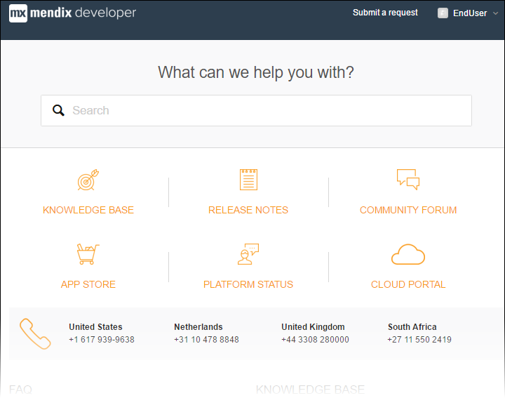
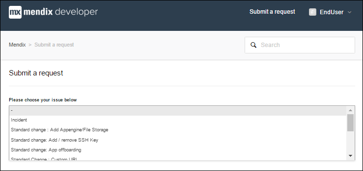
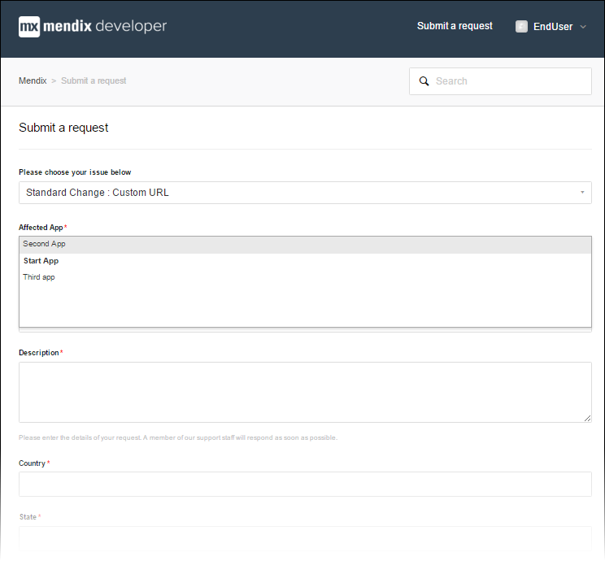
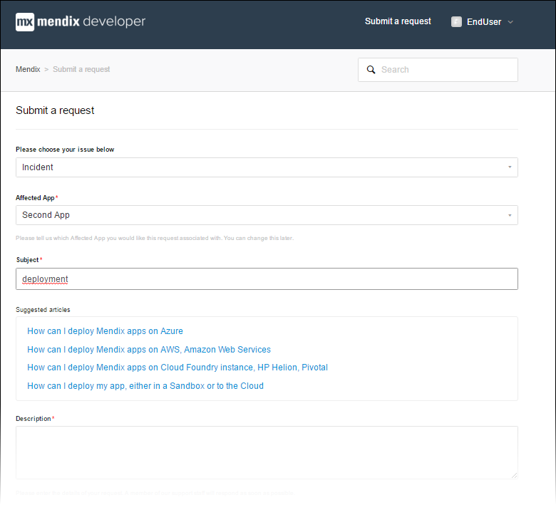
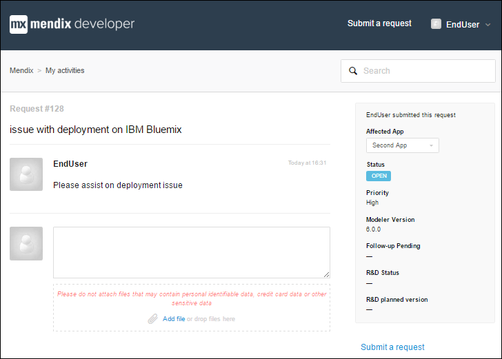
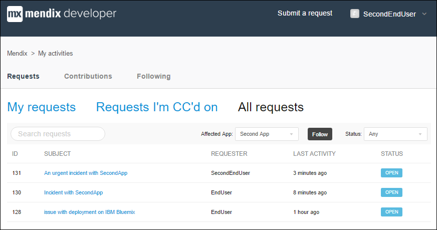
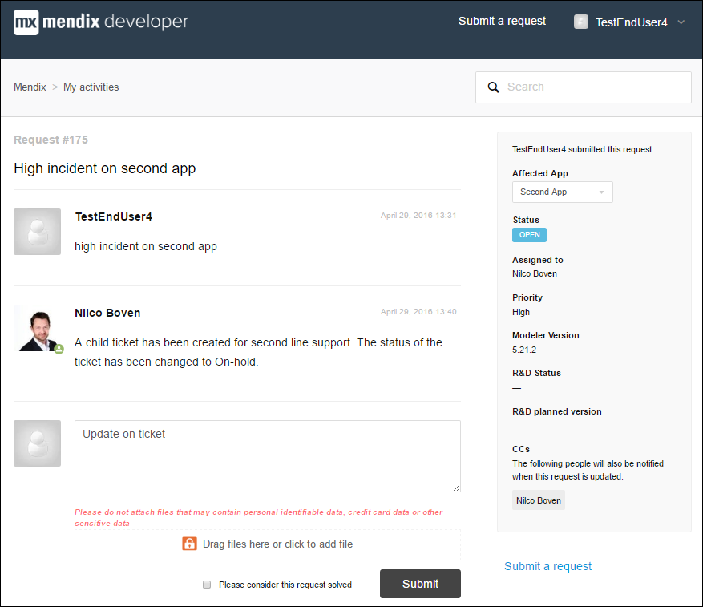

## 1 Introduction

In order for Mendix Support to pick up and process your support request it's important to provide the right information. This will speed up the processing of your request and minimizes back-and-forth communication between Mendix Support and the submitter. Here is a list of items that the Support staff needs and uses to process an incident ticket.

{}
For critial production incidents, please contact Mendix Support by phone. Find the phone number for your region on the [Support Portal home page](https://support.mendix.com).
{}

## 2 Useful Links To Check Before Submitting a Request

Before submitting a new Support request, check these Mendix resources to make sure your question has not already been answered:

*   [Mendix Forum](https://forum.mendix.com)
*   [Mendix Documentation](https://docs.mendix.com/)

## 3 General Information

This is the basic information that is required for a ticket:

*   A detailed description of the exact error
*   A detailed description of the action that was performed when the error was received
*   A description of the desired goal (optional)

Alo select the affecteda app in the request. For more information, read [How to Change the Affected Apps for Which You Can Submit Requests](how-to-change-the-affected-apps-for-which-you-can-submit-requests).

## 4 Specifications

Depending on the type of request it is helpful to provide additional information. The scenarios below list what additional information should be provided. 

### 4.1 Cloud Problem – Deployment Issues

*   Attach a log file (.txt) 
*   The date and time of the incident

### 4.2 Team Server Problem – Project Issues

*   The Project ID

### 4.3 Modeler Problem – Modeler Issues

*   Modeler type (Desktop Modeler or Web Modeler)
*   Modeler version
*   Test project - read [How To Export A Mendix Project Package (.mpk)](how-to-export-a-project-package) for more information
*   Reproducible steps

### 4.4 App Store Content Problem – Module, Widget, Theme Issues

*   Name of the content
*   Modeler version
*   Test project - read [How To Export A Mendix Project Package (.mpk)](how-to-export-a-project-package) for more information
*   Reproducible steps

{}
Not all App Store content is compatible with every Mendix Modeler version and not all App Store content is supported by Mendix. For more information, see [App Store Content Support](/developerportal/app-store/app-store-content-support).
{}

### 4.5 Mobile Problem

*   Operating System and the version _(Andriod x.x / iOS x.x)_. For example: Android 6.1.

{}
For Windows Phone, please ask Mendix Support about the current support conditions.
{}

### 4.6 Browser Problem

*   Operating System _(Windows x / iOS x)_. For example: Windows 10.
*   Browser name and the version _(Chrome x.x/ Safari x.x / Firefox x.x / IE x.x)_ for example: Chrome 54.0.2840.99

## 5 Support Portal Home Page

You can access the Mendix Support Portal at [support.mendix.com](https://support.mendix.com).

This home page enables accessing various Mendix sites that provide important information and tools:

* [Mendix documentation](https://docs.mendix.com)
* [Mendix release notes](/releasenotes/)
* [Mendix Forum](https://forum.mendix.com)
* [Mendix App Store](https://appstore.mendix.com)
* [Mendix Platform status](https://status.mendix.com)
* [Mendix Developer Portal](https://home.mendix.com)

The search box lets you search through the Mendix Documentation for relevant information.

## 6 Submitting a New Request

If you cannot find the answer to a question on the Mendix Forum or in the Mendix documentation, you can submit a support request. The Mendix Support Portal will walk you through the ticket creation by asking for relevant information based on the type of request. 

To submit a request with Mendix Support, follow these steps:

1. Click **Submit a request**.
2.  Select an issue from the drop-down menu:

    

    You can select from the following issues: 
    * **Incident** 
    * **Request for Information** 
    * **Standard change: New App** 
    * **Standard change: Add App Resources/File Storage** 
    * **Standard change: Change Mendix URL** 
    * **Standard change: (Re)new license** 
    * **Standard change: Assign Company Admin** 
    * **Standard change: Request ATS license** 
    * **Standard change: Reset Google authenticator** 
    * **Key Change request (on-premises)** 
    * **Standard change** 
    * **Non-Standard change** 
    
3.  Fill in the fields for the issue type you selected.

There are certain fields that are obligatory. The most important field is the **Affected App**. You can choose any app to which you have access. You access level is determined by your project role in the Developer Portal. There is always a default company account that you can use to submit general tickets. 

Other fields only appear for certain issues, like in this example:

When you enter the subject of the request, the Mendix Support Portal will suggest relevant documentation for you to read before before submitting the request:

 

If that does not help you solve your issue, you can submit the request.

## 7 Request Priority

You can select the priority that you feel the request should have. Please note the SLA regulations for this priority (which can be checked online as well).

The priority is based on the combination of impact and urgency.

These are the possible impacts:

* **High** – a high priority production issue with a high impact on the customer’s business, impacting (almost) all users
* **Medium** – a production issue with intermediate impact on the customer’s business that impacts a group of users
* **Low** – a trivial production issue with no impact on the customer’s business

These are the possible urgency levels:

* **High** – the operational functionality is severely disrupted
* **Medium** – the operational functionality is limited disrupted
* **Low** – the operational functionality is hardly disrupted

You can set the priority to the following levels:

* **Critical**
* **High**
* **Medium**
* **Low**

The request priority is based on this matrix:

You can add large attachments such as project files to the ticket. Please note that Mendix recommends not attaching any files that contain personal identifiable data, credit card information, or other sensitive data.

Click **Submit a request** when you're ready to submit the request:

 

## 8 Overview Of Requests

By clicking your name in the top-right side of  the screen, you can select **My activities** and see all the requests that you have submitted as well as all the requests that have been submitted on the apps to which you have access:

When you click **Follow** for an app, you will be informed of all the changes on requests on that specific app.

## 9 Viewing and Updating Tickets

From the overview, you can easily open a specific ticket, or you can search for a ticket by using the **Search** requests option. Once you have opened a ticket, you can add comments to the ticket assignee or add new attachments.

The ticket can have the following statuses:

* **Open** – the ticket is in the Mendix Support department
* **Pending** – the ticket is awaiting your reply
    * You will receive one reminder email before the Mendix Support Portal automatically closes the ticket
    * If you reply, the ticket will be automatically set to **Open** again
* **On-hold** – the ticket has been forwarded to the Mendix second-line support
    * You will be informed on the R&D status and the planned version once a response has been received from the second-line
* **Solved** – the ticket has been solved
    * If you reply, the ticket will be automatically opened again
    * You can close the ticket yourself by checking the box **Please consider this request solved**
    * The ticket will be closed for comments automatically after a set number of days, after which you can a follow-up ticket

 
