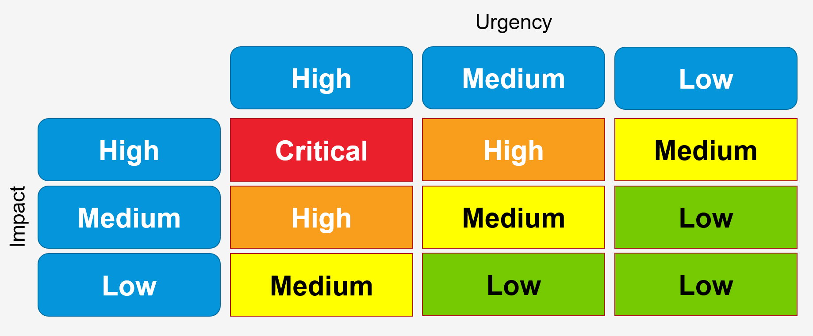

## 1 Introduction

In order for Mendix Support to pick up and process your support request, it is important to provide the right information. This will speed up the processing of your request and minimize back-and-forth communication between you and Mendix Support. The details below are what Mendix Support needs and uses to process an incident ticket.

{}
For critical production incidents, please contact Mendix Support by [phone](https://support.mendix.com).
{}

## 2 Checking Useful Links Before Submitting a Request

Before submitting a new Menix Support request, check these resources to make sure your question has not already been answered:

* [Mendix Forum](https://forum.mendix.com)
* [Mendix Documentation](https://docs.mendix.com/)
* [Mendix Platform status](https://status.mendix.com)

If you cannot find the answer to your question on the Mendix Forum or in the Mendix documentation, you can submit a support request. The Mendix Support Portal will walk you through the ticket creation by asking for relevant information based on the type of request. 

## 3 Submitting a New Request

You can access the Mendix Support Portal at [support.mendix.com](https://support.mendix.com).

This is the basic information required for a ticket:

* A detailed description of the exact error
* A detailed description of the action that was performed when the error was received
* A description of the desired goal (optional)
* The affected app (for more information, see [How to Prepare Your App Project for Support](prepare-your-project))

To submit a request with Mendix Support, follow these steps:

1. Click **Submit a request** in the top-right corner of the portal.
2.  Select an issue from the drop-down menu:

	

	You can select from the following issues:

	* **Request for Information** – general questions about Mendix
	* **Incident** – if your app is down, or you are experiencing another platform issue
	* **Standard Change: Request New Licensed Node** – please use the [Request New App Node](https://newnode.mendix.com) app unless you are requesting an SAP Subscription Secret
	* **Standard Change: Change On-Prem Licensed Node** – request a new license key for an *existing* app (for example, if you have new hardware configuration)
	* **Standard Change: Off-Board Licensed Node** – remove a licensed node or app that you no longer need (applies to all platforms) by creating a request [here](https://offboard.mendix.com/index.html)
	* **Standard Change: Change Mendix Cloud Container Size** – all vertical scaling changes for a container that require downtime (for example, changing memory or database size) can be requested [here](https://resize.mendix.com/index.html)
	* **Standard Change: Change Mendix Cloud File Storage** – increase or decrease the file storage size
	* **Standard Change: Change Mendix Cloud URL** – change a *non-custom* Mendix URL (for example, *something.mendixcloud.com*)
	* **Standard Change: Assign Company Admin** – make an existing Mendix user the [Company Admin](../company-app-roles/companyadmin-settings)
	* **Standard Change: Request ATS License** – obtain a license to use ATS (for more information on this product, see [ATS](/addons/ats-addon/index))
	* **Standard Change: Request APD License** – obtain a license to use APD (for more information on this product, see [APD](/addons/apd-addon/index))
	* **Standard Change: Reset Google authenticator** – reset the Google authenticator if you are using it for [2FA](/developerportal/deploy/two-factor-authentication) (for example, when you get a new phone)
	* **Standard Change** – other changes which can be made on the platform, but for which you do not have access
	* **Non-Standard Change** – any other changes not covered by other issues above
  
3. Fill in the fields for the issue type you selected.
4.  When you select **Request for Information** or **Incident**, you then have to select the related **Component** for the issue. The correct component will allow Mendix Support to help you more effectively. In some cases, you can also select the related **Subcomponent** for your issue. Selecting the related sub-component is not required, but it will allow Mendix Support to help you more quickly and accurately. There are two main options for the related component:
 	* **App** – select this component and one of the sub-components below when you have issues with designing, developing, building, deploying, or operating one of your own apps built on the Mendix Platform
		* **App - Development** – issues/questions regarding developing your app (for example, with your [domain model](/refguide/domain-model), [widgets](/refguide/data-widgets), or [logic](/refguide/application-logic))
		* **App - Deployment** – issues/questions regarding deploying your app (for example, when the app cannot be [deployed](/developerportal/deploy/) or will not start)
		* **App - Operations** – issues/questions regarding running a deployed app (for example, when the app crashes or shows errors in the [log](/developerportal/operate/logs))
		* **App - Add-on** – issues/questions regarding one of the Mendix add-ons (such as [ATS](/addons/ats-addon/), [APD](/addons/apd-addon/), or [AQM](/addons/aqm-addon/))
		* **App - Managed Service** - issues/questions regarding one of the Mendix Managed Services
		* **App - Other** – any other issue/question regarding your own app that you are developing on the Mendix platform
 	* **Developer Platform** – Select one of the Developer Platform components when you have issues with the Mendix platform itself
		* **Developer Platform - Account** – issues/questions regarding your Mendix account, for example when you have difficulties creating an account or signing in
		* **Developer Platform - Sprintr** – issues/questions regarding Sprintr, for example when you can’t create a story, or start a sprint
		* **Developer Platform - Academy** – issues/questions regarding the Mendix Academy, for example when you a learning path can’t be opened, or you can’t find the attachments required for a module
		* **Developer Platform - Forum** – issues/questions regarding the Mendix Forum, for example when you can’t create a new question, or add an answer 
		* **Developer Platform - Cloud Portal** – issues/questions regarding the Cloud Portal, for example when you can’t view your log files, or scale your environment
		* **Developer Platform - Other** – any other issues or questions regarding the Mendix platform itself
5. Please make sure all your attachments finished uploading before clicking **Next**.
6.  After clicking **Next**, the Mendix Support Portal will suggest relevant documentation for you to read before you submit the request. Based on a complexity check, recommendations might be skipped to improve your experience. This complexity check takes your ticket priority and other factors into consideration.

	

If investigating the documentation and searching the [Mendix Forum](https://forum.mendixcloud.com/index4.html) does not help you solve your issue, you can submit the Mendix Support request.	

## 4 Request Priority {#request-priority}

You can select the priority that you feel the request should have. Please note the [SLA regulations](index#sla) for this priority.

The priority is based on the combination of impact and urgency: 

| Impact  | Description |
| ------- | ------- |
| High    | A high-priority production issue with a high impact on the customer’s business, impacting (almost) all users. |
| Medium  | A production issue with intermediate impact on the customer’s business, impacting a group of users. |
| Low     | A trivial production issue with no impact on the customer’s business. |

| Urgency | Description |
| ------- | ------- |
| High    | The operational functionality is severely disrupted. |
| Medium  | The operational functionality is fairly disrupted. |
| Low     | The operational functionality is hardly disrupted. |

You can set the priority to the following levels:

* **Critical**
* **High**
* **Medium**
* **Low**

The [ticket priority](ticket-priority) that Mendix Support validates is based on this matrix:

## 5 Providing Attachments & Additional Information

Depending on the type of request, providing attachments and additional information may be helpful. The scenarios below list what additional information should be provided.

### 5.1 Attachments

You can add large attachments such as project files to the request. Please note that Mendix recommends not attaching any files that contain personal identifiable data, credit card information, or other sensitive data.

### 5.2 Cloud Problems & Deployment Issues

* Log file (*.txt*)
* Date and time of the incident

### 5.3 Team Server Problems & Project Issues

* [App ID](../settings/general-settings)

### 5.4 Studio & Studio Pro Problems

* Mendix Studio type (Studio or Studio Pro)
* Mendix version
* Test project (for details, see [How To Export A Mendix Project Package](/refguide/export-project-package-dialog))
* Reproducible steps

### 5.5 App Store Content Problems & Module, Widget & Theme Issues

* Name of the App Store component
* Mendix version
* Test project (for details, see [How To Export A Mendix Project Package](/refguide/export-project-package-dialog))
* Reproducible steps

{}
Not all App Store content is compatible with every version of Studio Pro, and not all App Store content is supported by Mendix. For more information, see [App Store Content Support](/appstore/general/app-store-content-support).
{}

### 5.6 Mobile Problems

* Operating system and version (Android x.x or iOS x.x; for example, Android 6.1)

{}
For Windows Phone, please contact Mendix Support for the current support conditions.
{}

### 5.7 Browser Problems

* Operating System (Windows x or iOS x; for example, Windows 10)
* Browser name and version (Chrome x.x, Firefox x.x, IE x.x, or Safari x.x; for example, Chrome 54.0.2840.99)

## 6 Overview of Requests

By clicking your name in the top-right side of  the screen, you can select **My activities** and see all the requests that you have submitted (**My requests**) as well as all the requests that have been submitted on the apps to which you have access:

On the **All requests** tab, you can click **Follow** for an app to be informed of all the changes on requests on that specific app:

## 7 Viewing & Updating Tickets

From the overview, you can easily open a specific request, or you can search for a request by using the **Search** option. Once you have opened a ticket, you can add comments to the ticket assignee or add new attachments.

The ticket can have the following statuses:

* **Open** – the ticket is in the Mendix Support department
*  **Pending** – the ticket is awaiting your reply
	* You will receive one reminder email before the Mendix Support Portal automatically closes the ticket
	* If you reply, the ticket will be automatically set to **Open** again
* **On-hold** – the ticket has been forwarded to the Mendix second-line support
	* You will be informed on the R&D status and the planned version once a response has been received from the second-line
* **Solved** – the ticket has been solved
	* If you reply, the ticket will be automatically opened again
	* You can close the ticket yourself by checking the box **Please consider this request solved**
	* The ticket will be closed for comments automatically after a set number of days, after which you can create a follow-up ticket

## 8 Submitting a Feature Request

On the [Mendix Idea Forum](https://forum.mendix.com/ideaforum/), Mendix captures ideas and requests from customers and developers in the Mendix community. Each quarter, the Mendix Idea Forum is treated as a short-list of the top features that the Mendix community supports via topics with the most upvotes.

## 9 Read More

* [Ticket Priority](ticket-priority)
* [Escalation Management Process](escalation-management-process)
