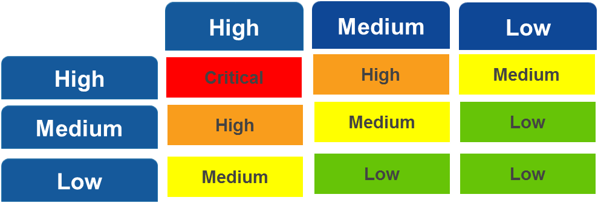

## 1 Introduction

The priority levels are determined based on the impact and urgency of the request

## 2 Prioritization

| Impact  | Description |
| ------- | ------- |
| High    | A high-priority production issue with a high impact on the customer’s business, impacting (almost) all users. |
| Medium  | A production issue with intermediate impact on the customer’s business, impacting a group of users. |
| Low     | A trivial production issue with no impact on the customer’s business. |

| Urgency | Description |
| ------- | ------- |
| High    | The operational functionality is **severely disrupted**. |
| Medium  | The operational functionality is **fairly disrupted**. |
| Low     | The operational functionality is **hardly disrupted**. |

## 3 Priority Matrix

If Mendix provides a workaround, the impact can never be higher than **Medium**.

## 4 Related Content

* [How to Submit a Support Request](submit-support-request)
* [Escalation Management Process](escalation-management-process)
