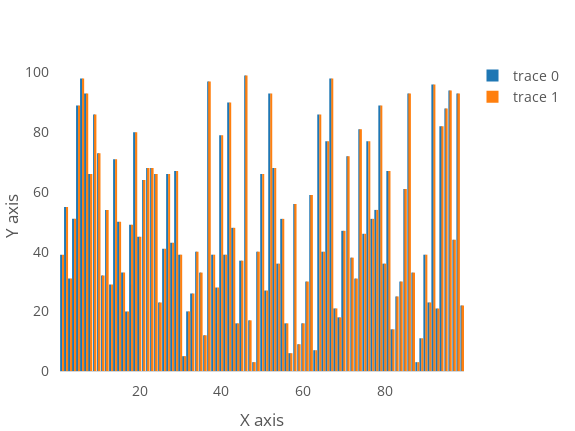
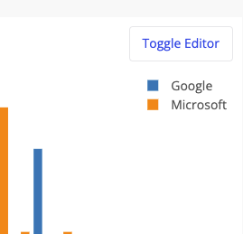
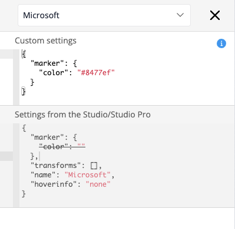
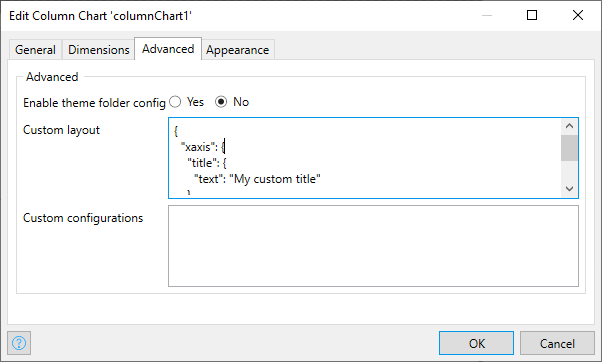
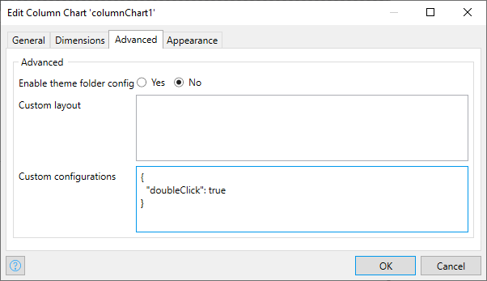
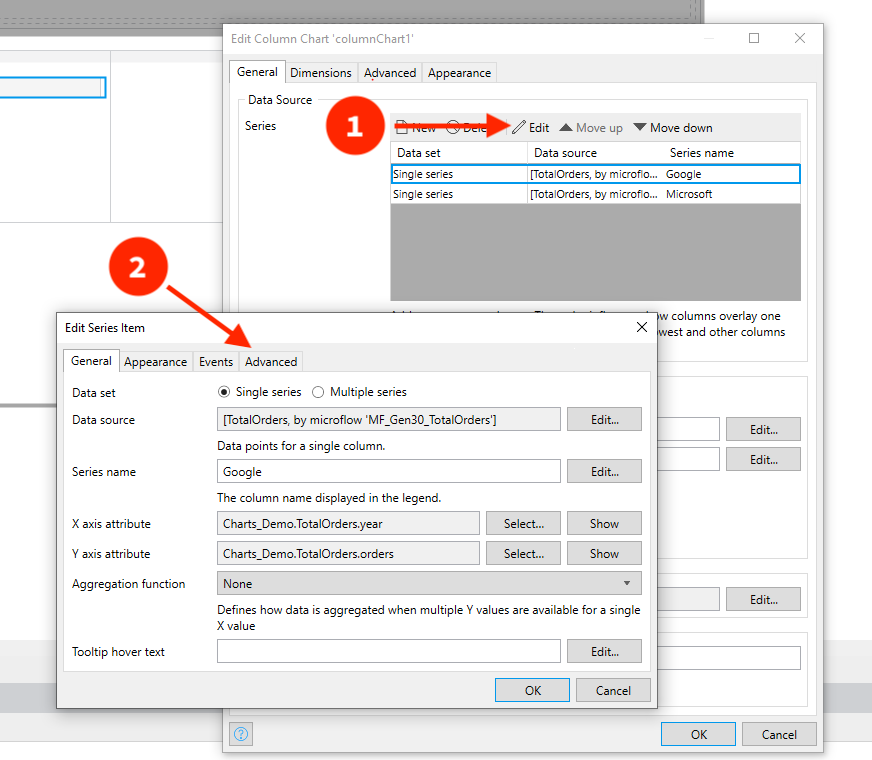
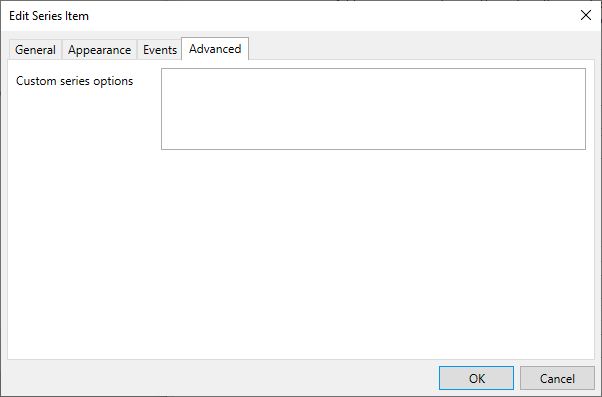
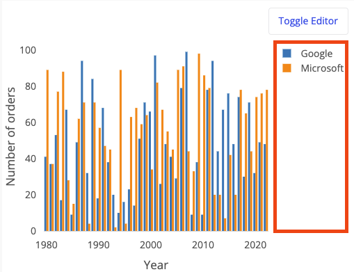

# Column chart

## Data Source

Now you have enough…

## General

### Enable developer mode

This property when set to "yes" enable *Developer mode* for selected chart. After enabling Developer mode you will see "Toggle Editor" button which when clicked should open chart settings panel. 

This dev mode panel is "live" settings editor which means that all your changes will be instantly applied to the current chart.

At the top of the panel you should see dropdown which controls which settings group is currently selected. By default each chart has **Layout** group and **Configuration** group — this groups control chart and layout settings. Also, in this dropdown you will find named groups that allow you to configure chart settings per series.

*Override bar color settings for Microsoft series in column chart*

To get in deep docs on available options and many useful examples you can visit [Figure Reference](https://plotly.com/javascript/reference/index/) guide on plotly website.

TODO: Wrap this paragraph with "warning" box.

**IMPORTANT**: it's up to you to make this settings changes persistent. That means that you should copy this new settings that you typed in the editor to chart settings and copy them to widget settings in Studio Pro.

#### Custom layout settings

To save your custom settings that related to Layout group you need go to "Advanced" tab and paste you JSON in "Custom layout" text area:

This layout settings will be passed to underlying plotly javascript library. To see available options and their description. Visit [layout seciton in plotly reference guide](https://plotly.com/javascript/reference/#layout)

#### Custom configurations

This object will be merged with default settings and passed to underlying [plotly javascript](https://plotly.com/javascript/) library. To see available settings and examples check [Configuration Options in JavaScript](https://plotly.com/javascript/configuration-options/) section on plotly docs website.

#### Custom series settings

Our underlying graphics library has really flexible API which allow you configure each *series* in char individually.

To navigate to series custom settings perform next simple steps:

1. Go to chart settings, Data Source, Series. Select series you want to configure. Click Edit.
2. Open "Advanced" tab and paste your custom series settings object (in JSON format).

### Show legend

This settings controls visibility of charts legend block (highlighted with red square). If set to "no" then legend block is hidden.
