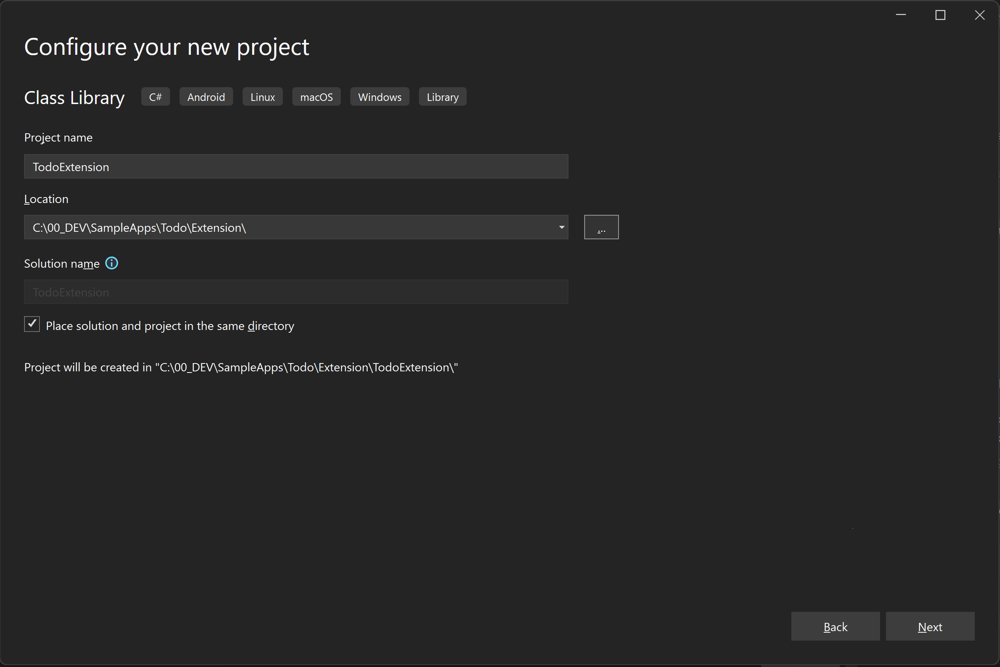
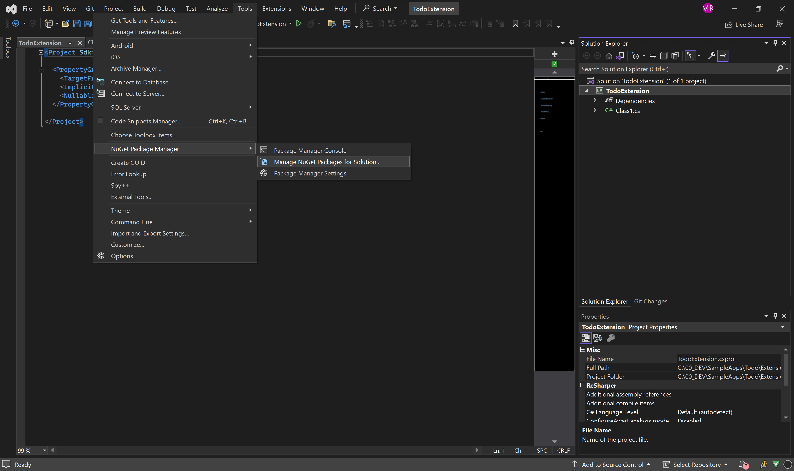
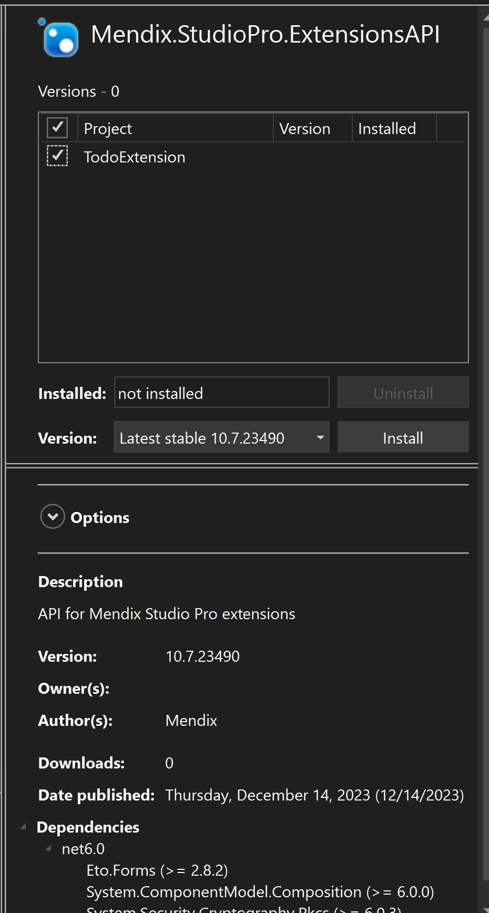

# Todo Extension Sample

## Introduction

This sample extension adds a simple todo list extension to Studio Pro. You should be able to add new todo items to a list. The extension will be added to the studio pro main menu and we will be adding a user interface for the extension by using a dockable pane and some web content. During this guide you will cover the following topics:

- How to create an extension project and configure it for use as an extension in Studio Pro
- How to create a web based user interface for studio pro
- How to store information in a local storage json file
- How to interact with the Mendix metamodel
- How to host your user interface within the Studio Pro IDE

In order to use this guide you will need the following tools installed on your local development environment:

- Microsoft Visual Studio 2022 or another equivalent development environment such as visual studio code or Jetbrains Rider. This sample will assume that you are using Microsoft Visual Studio 2022.
- Mendix Studio Pro 10.6 or higher

## Creating the Project and configuring it as an extension

### Creating the Project

In order for your extension to be loaded correctly as an extension in Studio Pro you will first need to create a project. From within Visual Studio create a new project. Select the Class library project template.


---

After selecting class library you will have to pick a location where you would like to store your extension. Name the project Mendix.ToDoExtension



---

Next we set the framework version to .NET 6.0 (Long Term Support)


---

### Installing Extensions API NuGet package

You should now have an empty project. We now need to configure the project so that it can be used as an extension in Studio Pro.
To be usable as an extension your project needs to add the following:

- reference the extensions API nuget package
- add a manifest.json file to the solution.

To reference the nuget package you will need to open the nuget package manager

 NuGet Package Manager > Manage NuGet Packages for Solution..." style="width: 900px"/>

---

From the browse tab search for Mendix ExtensionsAPI.


---

Select the nuget package and click install.



---

### Adding a manifest.json file

You should now have a class library that can be loaded as an extension by Studio Pro.
However Studio Pro still needs some help in determining how to load the assemblies of your class library.
Studio Pro reads a special file called manifest.json instructs studio pro on which assemblies to load into each execution context.

From the solution explorer add a new file called manifest.json. Ensure that you set the "Copy to Output Directory" property to Copy always to ensure that this file is included in your extensions output files.

Now replace the contents of your manifest.json file with the following:

```json
{
  "mx_extensions": [ "ToDoExtension.dll" ],
  "mx_build_extensions": [ ]
}
```
Within the manifest.json file you specify which assemblies studio pro needs to load for the different execution contexts your extension needs to provide. If your extension only needs access to design time features and requires a user interface then you can add it to the mx_extensions option. However if your extension needs access to runtime information or perhaps needs to translate design time concepts into runtime concepts then you will add it to mx_build_extensions. Note that there are some restrictions here. Build extensions specified in mx_build_extensions will not have access to any user interfaces and attempting to link to user interface libraries will fail. Similarly, extensions loaded from mx_extensions cannot access any runtime features and are strictly design time only.
This will instruct Studio Pro to load Mendix.ToDoExtension.dll whenever it loads Studio Pro extensions for your app. Please adjust your local project names as needed.

As a last step you can remove the Class1.cs file as you will not be needing this file.

## Adding a Dockable Pane to host our user interface

The next step in our Guide is to host a Dockable Pane within Studio Pro. This will provide us with a window wherein we can render the User Interface of our extension.
Add a new file to the solution called ```ToDoListDockablePaneExtension.cs```

Replace the contents of the file with the following code:

```csharp
using System.ComponentModel.Composition;
using Mendix.StudioPro.ExtensionsAPI.Services;
using Mendix.StudioPro.ExtensionsAPI.UI.DockablePane;

namespace Mendix.ToDoExtension;

[Export(typeof(DockablePaneExtension))]
public class ToDoListDockablePaneExtension : DockablePaneExtension
{
    private readonly ILogService _logService;
    public const string PaneId = "ToDoList";

    [ImportingConstructor]
    public ToDoListDockablePaneExtension(ILogService logService)
    {
        _logService = logService;
    }

    public override string Id => PaneId;

    public override DockablePaneViewModelBase Open()
    {
        return new ToDoListDockablePaneViewModel(WebServerBaseUrl, () => CurrentApp, _logService) { Title = "To Do List" };
    }
}
```

Note that you are expected to get an error at this point around the ToDoListDockablePaneViewModel.

### What is going on?

There are a few notable features of this class that you might have noticed. The first is that the top of the class is decorated with an ```Export``` attribute:

```csharp
[Export(typeof(DockablePaneExtension))]
```

Studio Pro uses this attribute to identify which extension type to inject this class into. If you do not specify this attribute Studio Pro will not load your extension type. Additionally, our extension descends from ```DockablePaneExtension``` Studio Pro uses abstract classes to enforce behavior for your extensions.

```csharp
public class ToDoListDockablePaneExtension : DockablePaneExtension
```

In order for your type to be loaded you will need to add a ```ImportingConstructor``` attribute to the preferred constructor. Studio Pro will use this constructor when instantiating your extension class. 

When instantiating your class Studio Pro will attempt to perform dependency injection for any of the types that you define in the constructor.
If you wish to inject your own custom types they will also need to be decorated with the ```Export``` attribute.

```csharp
    [ImportingConstructor]
    public ToDoListDockablePaneExtension(ILogService logService)
    {
        _logService = logService;
    }
```

In this constructor you will note that we request an instance of the ILogService and then save the instance in a private field.

```csharp
    public override string Id => PaneId;

    public override DockablePaneViewModelBase Open()
    {
        return new ToDoListDockablePaneViewModel(WebServerBaseUrl, () => CurrentApp, _logService) { Title = "To Do List" };
    }
```

In the final portion of the class we provide some necessary information to Studio Pro. The first is that we override the Id property. This property provides Studio Pro with a way to uniquely identify your dockable pane extension. Next we override the Open method. Within this method we need to return a valid implementation of DockablePaneViewModelBase which studio Pro will use to render your pane's contents.

In closing, in this section we performed the following:

- Create a new class that descends from DockablePaneExtension
- Decorate your class with the Export Attribute
- Decorate your preferred constructor with the ImportingConstructor Attribute.
- Inject the ILogService
- Return a valid view model from the open method.

## Create a view model that we will use to host our view data

After adding our dockable pane extension, the next step will be adding a view model where we will be storing our view data.
Add a new file to the solution named ```ToDoListDockablePaneViewModel.cs```

Replace the contents of the file with the following code: 

```csharp
using Mendix.StudioPro.ExtensionsAPI.Model;
using Mendix.StudioPro.ExtensionsAPI.Services;
using Mendix.StudioPro.ExtensionsAPI.UI.DockablePane;
using Mendix.StudioPro.ExtensionsAPI.UI.WebView;

namespace Mendix.ToDoExtension;
{
    public class ToDoListDockablePaneViewModel : WebViewDockablePaneViewModel

    private readonly Uri _baseUri;
    private readonly Func<IModel?> _getCurrentApp;
    private readonly ILogService _logService;

    public ToDoListDockablePaneViewModel(Uri baseUri, Func<IModel?> getCurrentApp, ILogService logService)
    {
        _baseUri = baseUri;
        _getCurrentApp = getCurrentApp;
        _logService = logService;
    }

    public override void InitWebView(IWebView webView)
    {
        webView.Address = new Uri(_baseUri, "index");

        webView.MessageReceived += (_, args) =>
        {
            var currentApp = _getCurrentApp();
            if (currentApp == null) return;

            if (args.Message == "AddToDo")
            {
                var toDoText = args.Data["toDoText"]?.GetValue<string>() ?? "New To Do";
                AddToDo(currentApp, toDoText);
                webView.PostMessage("RefreshToDos");
            }

            if (args.Message == "ChangeToDoStatus")
            {
                var toDoId = args.Data["id"]!.GetValue<string>();
                var newIsDone = args.Data["isDone"]!.GetValue<bool>();

                ChangeToDoStatus(currentApp, toDoId, newIsDone);
                webView.PostMessage("RefreshToDos");
            }

            if (args.Message == "ClearDone")
            {
                ClearDone(currentApp);
                webView.PostMessage("RefreshToDos");
            }
        };
    }

    private void AddToDo(IModel currentApp, string toDoText)
    {
        var toDoStorage = new ToDoStorage(currentApp, _logService);
        var toDoList = toDoStorage.LoadToDoList();
        toDoList.ToDos.Add(new ToDoModel(toDoText, false));
        toDoStorage.SaveToDoList(toDoList);
    }

    private void ChangeToDoStatus(IModel currentApp, string toDoId, bool newIsDone)
    {
        var toDoStorage = new ToDoStorage(currentApp, _logService);
        var toDoList = toDoStorage.LoadToDoList();
        var toDo = toDoList.ToDos.FirstOrDefault(x => x.Id == toDoId);
        if (toDo != null)
        {
            toDo.IsDone = newIsDone;
            toDoStorage.SaveToDoList(toDoList);
        }
    }

    private void ClearDone(IModel currentApp)
    {
        var toDoStorage = new ToDoStorage(currentApp, _logService);
        var toDoList = toDoStorage.LoadToDoList();
        toDoList.ToDos.RemoveAll(x => x.IsDone);
        toDoStorage.SaveToDoList(toDoList);
    }
}
```

### What is going on?

The first important thing to note about this viewmodel class is that we do not decorate this class with the export attribute. This means that our extension will be responsible for instantiating this type within our extension. This also means that we can specify any type we like within the constructor. We already setup the instantiation of this class in the previous section of the guide. the important bit here is that we pass in our baseUri, getCurrentApp lambda expression and an instance of the logging class.

```csharp
    public ToDoListDockablePaneViewModel(Uri baseUri, Func<IModel?> getCurrentApp, ILogService logService)
    {
        _baseUri = baseUri;
        _getCurrentApp = getCurrentApp;
        _logService = logService;
    }
```

In order to host a web interface inside Studio Pro, your viewmodel must implement InitWebView. Within this method you are passed an instance of IWebView. This is your application's isolated webview. We now need to provide the webview some information so that it will render its data correctly.

```csharp
    public override void InitWebView(IWebView webView)
    {
        webView.Address = new Uri(_baseUri, "index");

        webView.MessageReceived += (_, args) =>
        {
            var currentApp = _getCurrentApp();
            if (currentApp == null) return;

            if (args.Message == "AddToDo")
            {
                var toDoText = args.Data["toDoText"]?.GetValue<string>() ?? "New To Do";
                AddToDo(currentApp, toDoText);
                webView.PostMessage("RefreshToDos");
            }

            if (args.Message == "ChangeToDoStatus")
            {
                var toDoId = args.Data["id"]!.GetValue<string>();
                var newIsDone = args.Data["isDone"]!.GetValue<bool>();

                ChangeToDoStatus(currentApp, toDoId, newIsDone);
                webView.PostMessage("RefreshToDos");
            }

            if (args.Message == "ClearDone")
            {
                ClearDone(currentApp);
                webView.PostMessage("RefreshToDos");
            }
        };
    }
```

Firstly we set the default address to ```new Uri(_baseUri, "index");``` we will delve a bit deeper into where this index comes from later in the guide. If you want to skip ahead, check out the heading 'Setting up communication between our user interface and extension'

Secondly we add an event handler for the ```MessageReceived``` event. We will be using this method send and respond to messages from the webview. Within Studio Pro we use a two-way message bus as the primary communication method between your web based user interface and your extension logic.

Inside our message received event handler we add some code to handle the tasks we need to perform
- AddToDo will add a Todo Item to the list.
- ChangeToDoStatus will change the status of a Todo item.
- ClearDone will remove all items flagged as done.

```csharp
    var currentApp = _getCurrentApp();
    if (currentApp == null) return;

    if (args.Message == "AddToDo")
    {
        var toDoText = args.Data["toDoText"]?.GetValue<string>() ?? "New To Do";
        AddToDo(currentApp, toDoText);
        webView.PostMessage("RefreshToDos");
    }

    if (args.Message == "ChangeToDoStatus")
    {
        var toDoId = args.Data["id"]!.GetValue<string>();
        var newIsDone = args.Data["isDone"]!.GetValue<bool>();

        ChangeToDoStatus(currentApp, toDoId, newIsDone);
        webView.PostMessage("RefreshToDos");
    }

    if (args.Message == "ClearDone")
    {
        ClearDone(currentApp);
        webView.PostMessage("RefreshToDos");
    }
```

Let's also create the methods responsible for performing the logic

```csharp
    private void AddToDo(IModel currentApp, string toDoText)
    {
        var toDoStorage = new ToDoStorage(currentApp, _logService);
        var toDoList = toDoStorage.LoadToDoList();
        toDoList.ToDos.Add(new ToDoModel(toDoText, false));
        toDoStorage.SaveToDoList(toDoList);
    }

    private void ChangeToDoStatus(IModel currentApp, string toDoId, bool newIsDone)
    {
        var toDoStorage = new ToDoStorage(currentApp, _logService);
        var toDoList = toDoStorage.LoadToDoList();
        var toDo = toDoList.ToDos.FirstOrDefault(x => x.Id == toDoId);
        if (toDo != null)
        {
            toDo.IsDone = newIsDone;
            toDoStorage.SaveToDoList(toDoList);
        }
    }

    private void ClearDone(IModel currentApp)
    {
        var toDoStorage = new ToDoStorage(currentApp, _logService);
        var toDoList = toDoStorage.LoadToDoList();
        toDoList.ToDos.RemoveAll(x => x.IsDone);
        toDoStorage.SaveToDoList(toDoList);
    }
```

## Creating a model to store our todo information

In order to store our information to disk we will have to add some model classes that will be able to store our To do information.
First lets add a new class that will host the To do information itself. We will call the file ```ToDoModel.cs```

Now replace the contents of the file with the following code:

```csharp
using System.Text.Json.Serialization;

namespace Mendix.ToDoExtension;

public record ToDoModel
{
    [JsonConstructor]
    public ToDoModel(string id, string text, bool isDone)
    {
        Id = id;
        Text = text;
        IsDone = isDone;
    }
    
    public ToDoModel(string text, bool isDone)
        : this(Guid.NewGuid().ToString(), text, isDone)
    {
    }

    public string Id { get; set; }
    public string Text { get; set; }
    public bool IsDone { get; set; }
}
```

We will also need a model class that will store a list of all the todos that we have available. Let's add another class and this time name it ```ToDoListModel.cs```
Now replace the contents of this file with the following code:

```csharp
using System.Text.Json.Serialization;

namespace Mendix.ToDoExtension;

public record ToDoListModel
{
    [JsonConstructor]
    public ToDoListModel(List<ToDoModel> toDos)
    {
        ToDos = toDos;
    }
    
    public List<ToDoModel> ToDos { get; }
}
```

## Creating a storage handler to store our todo information

With our models created we can now create a storage handler that will manage storing these models to disk. As before we will add a new class file. This time we will call it ```ToDoStorage.cs```

Now replace the contents of the file with the following code: 

```csharp
using System.Text;
using System.Text.Json;
using Mendix.StudioPro.ExtensionsAPI.Model;
using Mendix.StudioPro.ExtensionsAPI.Services;

namespace Mendix.ToDoExtension;

public class ToDoStorage
{
    private readonly ILogService _logService;
    private readonly string _toDoFilePath;

    public ToDoStorage(IModel currentApp, ILogService logService)
    {
        _logService = logService;
        _toDoFilePath = Path.Join(currentApp.Root.DirectoryPath, "to-do-list.json");
    }

    public ToDoListModel LoadToDoList()
    {
        ToDoListModel? toDoList = null;

        try
        {
            toDoList = JsonSerializer.Deserialize<ToDoListModel>(File.ReadAllText(_toDoFilePath, Encoding.UTF8));
        }
        catch (Exception exception)
        {
            _logService.Error($"Error while loading To Dos from {_toDoFilePath}", exception);
        }

        return toDoList ?? new ToDoListModel(new[]
        {
            new ToDoModel("Buy milk", false),
            new ToDoModel("Fix house", false),
            new ToDoModel("Shave yak", true)
        }.ToList());
    }

    public void SaveToDoList(ToDoListModel toDoList)
    {
        var jsonText = JsonSerializer.Serialize(toDoList, new JsonSerializerOptions() { WriteIndented = true });
        File.WriteAllText(_toDoFilePath, jsonText, Encoding.UTF8);
    }
}
```

### What is going on?

The ToDoStorage class will be responsible for storing our todo information to disk. In order to store our file in the correct path we need to request the path from the CurrentApp instance. 

```csharp
    public ToDoStorage(IModel currentApp, ILogService logService)
    {
        _logService = logService;
        _toDoFilePath = Path.Join(currentApp.Root.DirectoryPath, "to-do-list.json");
    }
```

We also need to handle loading and saving of our todo data.

```csharp
    public ToDoListModel LoadToDoList()
    {
        ToDoListModel? toDoList = null;

        try
        {
            toDoList = JsonSerializer.Deserialize<ToDoListModel>(File.ReadAllText(_toDoFilePath, Encoding.UTF8));
        }
        catch (Exception exception)
        {
            _logService.Error($"Error while loading To Dos from {_toDoFilePath}", exception);
        }

        return toDoList ?? new ToDoListModel(new[]
        {
            new ToDoModel("Buy milk", false),
            new ToDoModel("Fix house", false),
            new ToDoModel("Shave yak", true)
        }.ToList());
    }

    public void SaveToDoList(ToDoListModel toDoList)
    {
        var jsonText = JsonSerializer.Serialize(toDoList, new JsonSerializerOptions() { WriteIndented = true });
        File.WriteAllText(_toDoFilePath, jsonText, Encoding.UTF8);
    }
```

## Adding a Menu item so that we can open our extension from the main menu

Next we will add a menu item to the toolbar that will allow us to select the ToDo list from a menu item. In order to do this we will be creating a MenuBarExtension. Let's add another class and call it ```ToDoListMenuBarExtension.cs```

Now within the file lets replace the contents of the file with the following code:

```csharp
using System.ComponentModel.Composition;
using Mendix.StudioPro.ExtensionsAPI.UI.Menu;
using Mendix.StudioPro.ExtensionsAPI.UI.Services;

namespace Mendix.ToDoExtension;

[Export(typeof(MenuBarExtension))]
public class ToDoListMenuBarExtension : MenuBarExtension
{
    private readonly IDockingWindowService _dockingWindowService;

    [ImportingConstructor]
    public ToDoListMenuBarExtension(IDockingWindowService dockingWindowService)
    {
        _dockingWindowService = dockingWindowService;
    }

    public override IEnumerable<MenuViewModelBase> GetMenus()
    {
        yield return new MenuItemViewModel("To Do List", new[] { "View" }, "Stories")
            { Action = () => _dockingWindowService.OpenPane(ToDoListDockablePaneExtension.PaneId) };
    }
}
```

## Adding a Web based user interface

Up to now we have been adding all the logic that will allow your extension to run inside Studio Pro. Within the next step we need to add a user interface for our extension. In Studio Pro you need to load your user interface elements as web content. This web content is then rendered from within an isolated webview in studio pro.


First we need to add a new folder to the solution. We need to call it ```wwwroot```
Within the folder we will add two files:

-The First is a html page that will contain the layout of our user interface. Let's call it ```index.html```
-Next we need to add a js file that will contain the client side logic for our user interface. Let's call it ```main.js```

Okay now let's add some code. Let's start with ```index.html``` open the file and replace its contents with the following:

```html
<html lang="en">
  <head>
    <title>To Do List</title>
    <script src="https://cdn.tailwindcss.com"></script>
    <style type="text/tailwindcss">
      @tailwind base;
      @tailwind components;
      @tailwind utilities;

      @layer base {
        body {
          @apply m-6;
        }
        h1 {
          @apply text-2xl mt-6;
        }
        h2 {
          @apply text-xl mt-6;
        }
        input[type=checkbox] + label {
          @apply ml-2;
        }
        input[type=checkbox]:checked + label {
          text-decoration: line-through;
        }
        button {
          @apply text-blue-600 italic
        }
      }
    </style>
  </head>
  <body>
    <div><label for="addToDoInput">Add to do:</label> <input id="addToDoInput" type="text" placeholder="To do text" /> <button id="addToDoButton">Add</button></div>
    <h1>To Do</h1>
    <div id="todo"></div>
    <h1>Done</h1>
    <div id="done"></div>
    <button id="clearDoneButton">Clear</button>
    <script type="module" src="./main.js"></script>
  </body>
</html>
```

Now we need to add our js logic. Let's open ```main.js```.
Now replace the contents of the file with the following:

```js
function postMessage(message, data) {
  window.chrome.webview.postMessage({ message, data });
}

// Register message handler.
window.chrome.webview.addEventListener("message", handleMessage);
// Indicate that we're ready to receive messages.
postMessage("MessageListenerRegistered");

async function handleMessage(event) {
  const { message, data } = event.data;
  if (message === "RefreshToDos") {
      await refreshToDos();
  }
}

async function refreshToDos() {
    let todosResponse = await fetch("./todos");
    let todos = await todosResponse.json();

    let todoDiv = document.getElementById("todo");
    let doneDiv = document.getElementById("done");

    let todoItems = [];
    let doneItems = [];

    for (const todo of todos.ToDos) {
        let item = document.createElement("div");
        
        let checkbox = document.createElement("input");
        checkbox.type = "checkbox";
        checkbox.id = `todo-${todo.Id}`;
        checkbox.checked = todo.IsDone;
        checkbox.addEventListener("click", () => {
           postMessage("ChangeToDoStatus", { id: todo.Id, isDone: !todo.IsDone });
        });
        
        let label = document.createElement("label");
        label.htmlFor = checkbox.id;
        label.innerText = todo.Text;
        
        item.replaceChildren(checkbox, label);

        if (todo.IsDone) {
            doneItems.push(item);
        } else {
            todoItems.push(item);
        }
    }

    todoDiv.replaceChildren(...todoItems);
    doneDiv.replaceChildren(...doneItems);
}

async function addToDo(){
    let addToDoInput = document.getElementById("addToDoInput");
    const toDoText = addToDoInput.value;
    postMessage("AddToDo", { toDoText });
    addToDoInput.value = "";
}

document.getElementById("addToDoButton").addEventListener("click", addToDo);
document.getElementById("clearDoneButton").addEventListener("click", () => {
    postMessage("ClearDone");
});

await refreshToDos();
```

### What is going on?

Our html page is pretty self-explanatory as we are providing a very simple interface with some added css styling provided by Tailwind css.
Within our Js file we need to add some logic so that our webview will be able to communicate with your extension logic correctly.

We add a small helper function to simplify our call to the browser api:

```javascript
function postMessage(message, data) {
  window.chrome.webview.postMessage({ message, data });
}
```

We also need to perform some initialization to ensure that we can respond to messages send to javascript and 

```javascript
// Register message handler.
window.chrome.webview.addEventListener("message", handleMessage);
// Indicate that we're ready to receive messages.
postMessage("MessageListenerRegistered");

async function handleMessage(event) {
  const { message, data } = event.data;
  if (message === "RefreshToDos") {
      await refreshToDos();
  }
}
```

It is important to set these two `index.html` and `main.js` files to "Copy always" or "Copy if newer" in their "Copy to Output Directory" property or they will not be present in the build output folder when we are ready to start using our extension.

## Setting up communication between our user interface and extension

So far we have configured our extension to be usable in studio pro. We added support for storing our to do items. We also added a user interface that users can interact with. The last step in this process is to link the extension c# logic with the web based javascript logic.

Let's start with adding a utility class to help simplify the way we interact with web responses. Let's call the file ```HttpListenerResponseUtils.cs```.
Now let's replace the contents of the file with the following:

```csharp
using System.Net;
using System.Text;

namespace Mendix.ToDoExtension;

public static class HttpListenerResponseUtils
{
    public static async Task SendFileAndClose(this HttpListenerResponse response, string contentType, string filePath, CancellationToken ct)
    {
        response.AddDefaultHeaders(200);

        var fileContents = await File.ReadAllBytesAsync(filePath, ct);

        response.ContentType = contentType;
        response.ContentLength64 = fileContents.Length;

        await response.OutputStream.WriteAsync(fileContents, ct);

        response.Close();
    }

    public static void SendJsonAndClose(this HttpListenerResponse response, MemoryStream jsonStream)
    {
        response.AddDefaultHeaders(200);

        response.ContentType = "application/json";
        response.ContentEncoding = Encoding.UTF8;
        response.ContentLength64 = jsonStream.Length;

        jsonStream.WriteTo(response.OutputStream);

        response.Close();
    }

    public static void SendNoBodyAndClose(this HttpListenerResponse response, int statusCode)
    {
        response.AddDefaultHeaders(statusCode);

        response.Close();
    }

    static void AddDefaultHeaders(this HttpListenerResponse response, int statusCode)
    {
        response.StatusCode = statusCode;

        // Makes sure the web-code can receive responses
        response.AddHeader("Access-Control-Allow-Origin", "*");
    }
}
```

### What is going on?

Your web based user interface is hosted inside studio pro in an isolated web container. As such to communicate with it we are adding some utility functionality to help us improve our code.

The first method we add is SendFileAndClose. This function will allow us to send the contents of a file located on your hard drive to the webpage where your user interface is hosted.

Next we add SendJsonAndClose. This method functions similarly to SendFileAndClose but will accept a json stream instead of a file path.

After that we add SendNoBodyAndClose. This sends an empty response with just a status code to the webpage.

The final method AddDefaultHeaders is a utility method that adds some default http headers to our requests.

### Next Steps

Now we will add a web server extension. This extension type allows you to serve web content easily within extensions.
Let's add a new file called: ```ToDoListWebServerExtension.cs```.

Now replace the contents of the file with the following: 

```csharp
using System.ComponentModel.Composition;
using System.Net;
using System.Text.Json;
using Mendix.StudioPro.ExtensionsAPI.Services;
using Mendix.StudioPro.ExtensionsAPI.UI.WebServer;

namespace Mendix.ToDoExtension;

[Export(typeof(WebServerExtension))]
public class ToDoListWebServerExtension : WebServerExtension
{
    private readonly IExtensionFileService _extensionFileService;
    private readonly ILogService _logService;

    [ImportingConstructor]
    public ToDoListWebServerExtension(IExtensionFileService extensionFileService, ILogService logService)
    {
        _extensionFileService = extensionFileService;
        _logService = logService;
    }

    public override void InitializeWebServer(IWebServer webServer)
    {
        webServer.AddRoute("index", ServeIndex);
        webServer.AddRoute("main.js", ServeMainJs);
        webServer.AddRoute("todos", ServeToDos);
    }

    private async Task ServeIndex(HttpListenerRequest request, HttpListenerResponse response, CancellationToken ct)
    {
        var indexFilePath = _extensionFileService.ResolvePath("wwwroot", "index.html");
        await response.SendFileAndClose("text/html", indexFilePath, ct);
    }

    private async Task ServeMainJs(HttpListenerRequest request, HttpListenerResponse response, CancellationToken ct)
    {
        var indexFilePath = _extensionFileService.ResolvePath("wwwroot", "main.js");
        await response.SendFileAndClose("text/javascript", indexFilePath, ct);
    }

    private async Task ServeToDos(HttpListenerRequest request, HttpListenerResponse response, CancellationToken ct)
    {
        if (CurrentApp == null)
        {
            response.SendNoBodyAndClose(404);
            return;
        }

        var toDoList = new ToDoStorage(CurrentApp, _logService).LoadToDoList();
        var jsonStream = new MemoryStream();
        await JsonSerializer.SerializeAsync(jsonStream, toDoList, cancellationToken: ct);

        response.SendJsonAndClose(jsonStream);
    }
}
```

### What is going on?

This class is the web container that allows Studio Pro to interact with your user interface. Within this class we will serve our web content to your extension logic.

Please note that we inherit from WebServerExtension. a WebServerExtension does exactly what is says: it serves web content to Studio Pro.

Additionally, we override the InitializeWebServer method. Studio Pro will call this method during startup, and you should place all your initialization logic in here. Our implementation adds three web routes. These web routes are the locations where your user interface can be accessed from.

ServeIndex, ServeMainJs, ServeToDos serves the contents of our 3 routes to your extension logic.


## Hosting the extension in Studio Pro

All the code you need should now be complete. The last step in the process is building your solution and adding your binary output as an extension inside your app.

To do this you will need to do the following:

- Build your solution in Visual Studio by selecting the Build -> Build Solution.
- Navigate to the Mendix app where you wish to have your extension hosted. Create a new folder called extensions also add a subfolder called TodoExtension. You should now have a folder with a path similar to this (Mendix App)/extensions/MyTodoExtension
- Copy the files from your visual studio extension projects bin/debug subfolder into your mendix app extension folder: (Mendix App)/extensions/MyTodoExtension
- When complete you should have something like this:

Now run Studio Pro. 
Note that while developing extensions you will need to also use command line flag to enable extensions.
To do this navigate to your Studio Pro Installation folder and from the command line call the following command: .\studiopro.exe --enable-extension-development

This should start an instance of Studio Pro and load your extension. You should now be able to view your new extension interface from the View -> Todo menu item.
