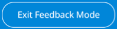

## 1 Introduction

The [Mendix Feedback](https://marketplace.mendix.com/link/component/199/) widget allows end-users of your application to directly submit feedback into your app. The feedback widget is fully integrated with the [Feedback](/developerportal/collaborate/feedback/) page in the Developer Portal, where you can review feedback and convert it into [user stories](/developerportal/collaborate/stories/) to improve your app.

The Mendix Feedback widget is easy to set up and automatically attaches additional information to each submitted issue such as the user’s name, role, active form, browser version, and screen resolution.
### 1.1 Typical Usage Scenario

* Gathers feedback from end-users in an acceptance or production environment
* Reduces the length of the feedback loop

### 1.2 Features

* Gathers detailed information about the client state

### 1.3 Limitations

* This widget can only be usable in combination with Mendix apps.
* In Native Mobile apps, some of the feedback metadata, such as username, email address, and document name, will be hard-coded, as they can't be retrieved dynamically. The [Native Feeback widget](https://docs.mendix.com/appstore/modules/native-mobile-resources/) can be found in [Native Mobile Resources](https://marketplace.mendix.com/link/component/109513).

## 2 Configuration
You can configure the widget for certain actions in your app. All the configuration properties are explained on the various tabs of the properties dialog box for the widget. The feedback feature requires the following properties to be set:

* **Project** tab
  
    *  **App ID** – the unique identifier of your app, which you can find in your app’s [General Settings](/developerportal/collaborate/general-settings/) in the Developer Portal
    
        {}The original value of **App ID** is 1, but this value should automatically change to your correct app ID. if it does not change automatically, see [Updating App ID](#update-app-id) in the Troubleshooting section.{}
        
        **Allow screenshots** – controls whether the app user can take a screenshot
        
    

* **Advanced** tab

  * **Feedback server location** – the URL of the Developer Portal server (usually `https://feedback-api.mendix.com`)
  * **Screenshot Foreign Rendering**

    * **No** (default)
    * **Yes** –  only used when necessary

* **Authentication** tab
  
    {}For the best user experience, your are strongly encouraged to apply Mendix SSO to your app and connect the Mendix SSO module to the Mendix Feedback widget version 8.2.1 or above. Choose only one of the authentication methods: either **MendixSSO** or **Custom Authentication**.{}
    
    * **MendixSSO** – If Mendix SSO is applied and the following settings are configured correctly, the end-user can leave feedback without having to enter their name and email address. 
        * **ID token microflow** – select the **DS_GetCurrentIdToken** microflow from the Mendix SSO module
        * **Decrypted Token Value** – select the **Value** attribute from it
    
    
    
    * **Custom Authentication** – If you are not using the Mendix SSO module and are using other SSO solutions instead, you should configure the following settings. With these settings, you can provide a microflow that should return a valid user name and email when the end-user is signed in with your authentication solution. If the end-user is not signed in (meaning, the User Object Provider microflow returns an empty user name or an invalid email address), the end-user will have to manually enter their name and email address when they leave feedback.
        * **User object microflow** – select the microflow that returns **User** entity from your module
        * **User object** – select the **User** entity
        * **User name attribute**– select the attribute of **name** from the User entity
        * **Email attribute** – select the attribute of **email** from the User entity
    
    

## 3 Usage

### 3.1 Adding the Widget to Your app

You should use the latest version of the Mendix Feedback widget, as it will provide the most up-to-date features for leaving feedback and communicating with the team. To ensure you have the latest version of the widget included in your app, follow these steps:

1. Download the latest version of the Mendix Feedback widget from the Marketplace. You are strongly encouraged to use version 8.6.0 or above of the widget.

2. When the widget is included in your app, ensure that it is added to the home page of the application:

   1. Open the home page, In the App Explorer, go to Navigation and click **Show** as shown in the screenshot:
      

   2. If the widget has not been added automatically, add it as follows:
      1. In the Toolbox, find Feedback widget in the Add-ons category.
      2. Drop it into a position in the page

You can place the widget on any form in your app, but it needs to be placed on only one form. When the end-user accesses that form, the widget will remain in the browser until the session is expired. This means you only need to place the widget on the home form. You can use this mechanism to limit the feedback to certain user roles as well. To do that, just place the widget on their home forms but not on the home form of other users.

### 3.2 Submitting Feedback on an App

When you click the **Feedback icon**, the Mendix Platform first checks if you are signed in. If you are not signed in, you will need to either **Sign in to Mendix** or **Continue as a guest** to enter feedback mode:

Once you are in feedback mode, you can click anywhere on the screen to **leave a comment**:

And voila! A screenshot of the current page is created, which you can choose to attach to your feedback. After clicking **Submit**, your feedback will go straight to the [Feedback](/developerportal/collaborate/feedback/) page of the app in the Developer Portal.

When you have left your feedback, you need to exit the feedback mode by clicking **Exit Feedback Mode**:

For details on how to see all the [Feedback](/developerportal/collaborate/feedback/) you have submitted, see the [Feedback](/developerportal/community-tools/mendix-profile/#feedback) section of Mendix Profile.

### 3.3 Upgrading the Widget 

If you are trying to upgrade your Mendix Feedback widget, Studio Pro will not recognize the current configuration of this widget. Add the Mendix Feedback widget into your page again and configure it accordingly. Then remove the old feedback widget (*SprintrFeedbackWidget.mpk*) from your widget folder.

## 4 Troubleshooting

### 4.1 Updating App ID on the Project Tab {#update-app-id}
The value of the **App ID** on the **Project** tab will be changed to your correct app ID automatically from the original value 1. 

If it did not change to your app ID because of an unexpected error, you can update the app ID manually. You can find the app ID in your app's [General Settings](/developerportal/collaborate/general-settings/) in the Developer Portal.
