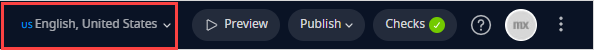

## 1 Introduction 

Delivering your Mendix app in multiple languages is an important capability for reaching a wide audience. Using the language features of Mendix, you can quickly make your app multilingual and translate the content to many other languages. This means that texts that are presented to end-users, such as button captions, screen titles, menu items, can be translated to other languages.  

{}

Translating your app to other languages is available in Mendix Studio if multiple languages were set up in your app in Mendix Studio Pro. For more information on language settings, see [Language Menu](/refguide/translatable-texts/) in *Studio Pro 9 Guide*.  

{}

## 2 Switching the Currently Selected Language

You can switch the selected language in the top menu bar:

## 3 Translating Texts

When multiple languages are set up in your app, one language is set as default language. All untranslated texts in other languages will be displayed in the default language when you run the app.

You can translate the following widgets and elements in your app:

* [Button captions](/studio/page-editor-widgets-buttons/#general)
* [Text widget](/studio/page-editor-widgets-text/#content)
* [Data grid columns](/studio/page-editor-data-grid/#grid-columns)
* [Menu items](/studio/navigation/#properties-of-menu-items)
* Messages that are sent from a microflow

When working in a language which is not the default, you can identify texts that have not been translated yet. They show the text in the default language between angle brackets. For example, `<Name>`. You can replace the text with the appropriate translation for the currently selected language. To replace the text, do the following:

1. Selected the element and navigate to its properties.

2. Depending on the element, find the **Content**, **Caption**, or **Template** property and click the **Translations** drop-down menu:

    

3. You will see a drop-down menu where you can scroll through languages available in your app and type in translations for the text. 

If you edit your app to add new widgets while not in the default language, any new translatable texts for those widgets will be added to the current language. The text in the default language will either be left blank or will have the placeholder text for the widget.

## 4 Read More

* [General Info](/studio/general/)
* [Language Menu](/refguide/translatable-texts/)
