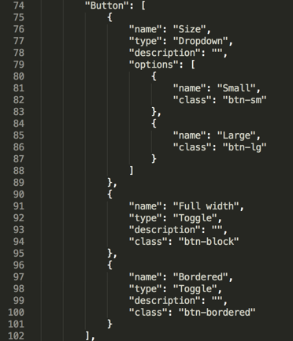

## Extend Your Design Properties to Customize your Web Modeler Experience

New in Mendix Atlas UI is the customizable file ```settings.json.``` This file can be found in the ```theme folder``` of your Mendix project. This file allows you to:

* Enable Page Templates for the Web Modeler & Atlas UI
* Configure design properties that can be used in the Web Modeler

By default, every Mendix Atlas UI app has this file in the ```theme folder``` folder.

### Enable Page Templates for Web Modeler & Atlas UI
The first line in ```settings.json``` enables the resources, page templates and building blocks that are integrated with Atlas UI, Mendix Web and Desktop Modeler. If this line is deleted, the old Mendix UI Framework resources will be loaded in the Mendix Web and Desktop Modeler. If you don’t want to use Atlas UI it is possible to delete the line.

 ```"pageTemplates" : "WebModeler"```

### Configure Design Properties For Use in the Mendix Web Modeler
Design properties are created to give your users and widgets more power in the Web Modeler. Atlas UI contains a design properties file that can be added extended with your own custom design properties.

The example below shows the design property of a “Button”. The detailed Sass information can be found in the file ```/theme/styles/sass/lib/components/_buttons.scss```.


* name: Name of the design property
* type: Type of the design property (ex. dropdown, toggle or input)
* description: Brief explanation of the design property
* options: Array of options that show the name and CSS class that is specified in the Sass files for Atlas UI



These design properties are used in the Web Modeler to give the user more power when they use widgets.


