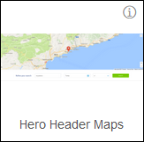
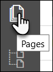
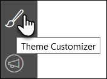

## 1 Introduction

The Mendix Web Modeler is a powerful collaborative tool that lets you build your application in the cloud together with your team. When you log into the Web Modeler for the first time, you get the option to choose a starter app that is fully Atlas-enabled.

**This how-to will teach you how to do the following:**

* Choose a starter app
* Edit your app in the Web Modeler
* Choose a page template
* Customize your theme

## 2 Prerequisite

Before starting this how-to, make sure you have completed the following prerequisites:

* Have a Mendix account (sign up [here](https://www.mendix.com/try))

## 2 Choosing Your Starter App

In the [Mendix Developer Portal](https://sprintr.home.mendix.com/index.html), click **Create App**. On the **Starter Apps** tab, there are a number of apps marked with **ATLAS UI** that are Atlas UI-ready. You can select one you're interested in to get started.

## 3 Editing Your App in the Web Modeler

You now have access to your app **Buzz** in the [Developer Portal](https://sprintr.home.mendix.com/index.html). From here, you can open the Mendix Web Modeler by clicking **Edit App** in the top-right of the screen:

Note that when you click **Edit App** for any app that is Atlas-ready, it will automatically open in the Web Modeler. If you need edit the app in the Desktop Modeler, click the drop-down arrow on the right side of the button and select **Edit in Desktop Modeler**.

## 4 Exploring the Mendix Web Modeler

Your app is ready to be built. In your toolbox, you will find all the building blocks and widgets you need to customize your app. 

All of these resources have been created with Atlas UI. Each building block has an information icon that directs you to the Atlas UI website for the relevant information:

## 5 Choosing a Page Template

Page templates are available by creating a new page, which is a good way to get started. First, click the **Pages** icon in the left navigation bar:

Click **NEW PAGE** at the bottom of the **Pages** panel, then choose a suitable page template:

You can customize this template however you want.

## 6 Customizing Your Theme

Click the **Theme Customizer** icon in the left navigation bar:

You can now style your app with custom branding, colors, and typography!

## 7 Related Content

* [How to Create Company Atlas UI Resources](create-company-atlas-ui-resources)
* [How to Create Custom Preview Images for Building Blocks and Page Templates](create-custom-preview-images-for-building-blocks-and-page-templates)
* [How to Extend Design Properties to Customize the Web Modeler Experience](extend-design-properties-to-customize-the-web-modeler-experience)
* [How to Migrate Existing Projects to Atlas UI](migrate-existing-projects-to-atlasui)
* [How to Share Company Atlas UI Resources](share-company-atlas-ui-resources)