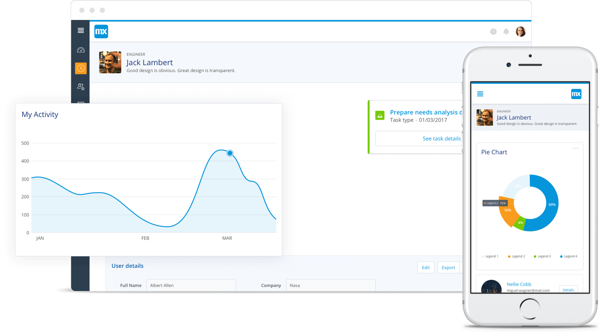
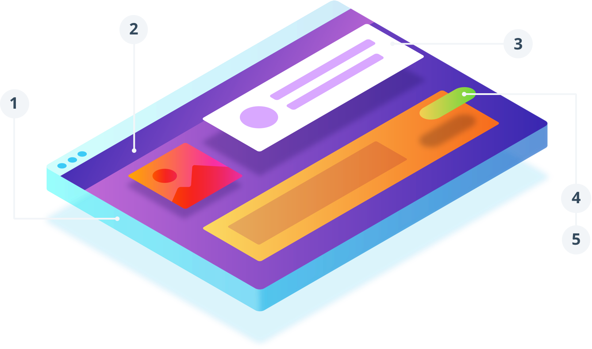

## 1 General

### 1.1 Introduction

Mendix Atlas UI is the design framework that makes building elegant user experiences a rapid process. It was built upon three design principles: simplicity, harmony, and flexibility. Simplicity helps you focus on what is important. We’ve simplified the design process with readymade page templates, building blocks, and widgets that can be arranged and customized to suit your app. Our design elements are harmonious, bringing a unified aesthetic to your app landscape. Atlas UI is built to be fully responsive, ensuring quality across scale without losing functionality. Visit the [Atlas UI site](https://atlas.mendix.com/) for detailed previews and descriptions of all Atlas UI elements.

### 1.2 Web Modeler

The Mendix Web Modeler brings the collaborative Mendix platform to the browser, making it easier than ever to share and collaborate on application models. Every app built in the Web Modeler is styled with the Atlas UI framework. 

After clicking **Create App** in the [Mendix Developer Portal](https://sprintr.home.mendix.com/index.html), you can select the Atlas UI **Blank App** on the **Starter Apps** tab and get running in minutes.

### 1.3 Design Principles

Atlas UI has a philosophy based on the core principles described below. These principles guide all our design decisions at Mendix, and we encourage every Mendix user to adopt them when building their own apps.

#### 1.3.1 Simplicity

Freedom from complexity: we strive for simplicity to help you focus on what is important.

#### 1.3.2 Harmony

Create familiarity and consistency throughout your apps landscape, regardless of the device you use.

#### 1.3.3 Flexibility

Design apps that look good and scale in all situations without losing an intuitive and consistent experience.

## 2 Design Elements

Our UI library is fully integrated into the Mendix Web Modeler. After choosing a navigation layout in the Web Modeler, you can find page templates, building blocks, and widgets directly in your **Toolbox**. These UI elements form the foundation of your app.

**1** **Navigation Layouts**

When building a Mendix app, the first thing you do is choose a navigation layout. These layouts are the frame within which your dynamic pages are housed, and they provide consistent structure throughout your app.

**2** **Page Templates**

Page templates are predesigned collections of building blocks that can be used as-is, or you can enhance them with custom building blocks and widgets.

**3** **Building Blocks**

Building blocks are single-purpose user interface elements and are comprised of multiple widgets. Multiple building blocks are usually used together on one page.

**4** **Widgets**

Widgets are small user interface elements (alerts, buttons, charts, etc.) used to enhance existing building blocks.

**5** **Design Properties**

You can further customize widgets by changing their design properties. Colors, text, and many other variables can be altered to make the widget what you need it to be.

## 3 Documents in This Category

* [How to Get Started with Atlas UI](get-started-with-atlasui)
* [How to Create Company Atlas UI Resources](create-company-atlas-ui-resources)
* [How to Create Custom Preview Images for Building Blocks and Page Templates](create-custom-preview-images-for-building-blocks-and-page-templates)
* [How to Extend Design Properties to Customize the Web Modeler Experience](extend-design-properties-to-customize-the-web-modeler-experience)
* [How to Migrate Existing Projects to Atlas UI](migrate-existing-projects-to-atlasui)
* [How to Share Company Atlas UI Resources](share-company-atlas-ui-resources)
