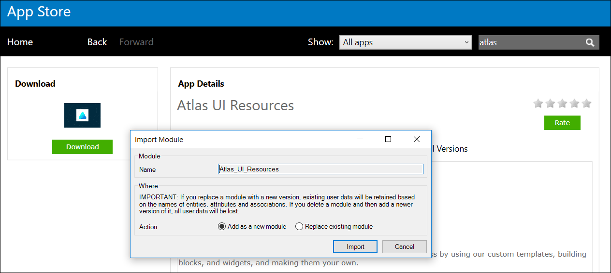
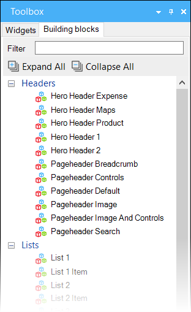
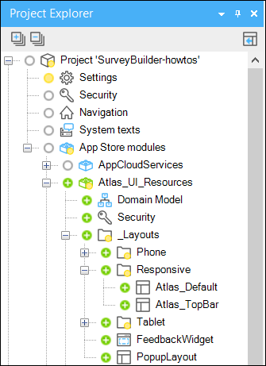
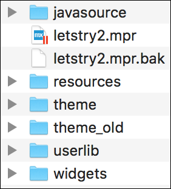

## Migrate Existing Projects to Atlas UI
This how-to describes how to upgrade existing Mendix projects to Atlas UI.

#### Prepare Your App for Atlas UI
Atlas UI and the Mendix Web Modeler bring a lot of new features to the app making process.
Already have a great looking and smoothly running Mendix app? No problem! To get an existing Mendix app to work with Atlas UI and the Mendix Web Modeler, there are a couple of steps to follow.

* Make sure the Mendix app is converted to Mendix 7.9.0 or higher
* Replace the UI Resources module with the Atlas UI Resources module
* Replace existing Navigation Layouts
* (Optional) Enable the Mendix Web Modeler
* (Optional) Reuse parts of your old theme

#### Replace the UI Framework Module
To get the full experience of Atlas UI, it’s necessary to import the Atlas UI Resources module. Since Mendix 7.9.0, every app includes a module called “UI_Resources” that can be found under App Store Modules in project within the Desktop Modeler. This module contains all the layouts, page templates, and building blocks. The “UI Framework” folder contains the old Mendix UI Framework content, which we will be upgrading to Atlas UI.

First delete the “UI_Resources” module. After this, import the Atlas UI module from the Mendix App Store.

[Mendix App Store](https://appstore.home.mendix.com/link/app/73033/Mendix/Atlas-UI-Navigation-Layouts) - Atlas UI Resource Module

When the Atlas UI Resources module is downloaded from the Mendix App Store, it can be found in App Store Modules.

After the import is complete, it could be that there are some errors in the error pane for navigation profiles or layouts that do not exist. Be sure to resolve all errors.

Once the Atlas UI Resources module is imported, all the new resources will be available in the Mendix Desktop Modeler and Mendix Web Modeler. When creating a new page, a new set of page templates for all devices will be available. In the toolbox, a new pane will be added called “building blocks”. You can drag and drop building blocks from this pane onto your pages.

#### Replacing Existing Navigation Layouts
The Atlas UI Resources module also comes with new Navigation Layouts. These are required in order to use the new page templates. If your existing navigation layouts are in a separate module, you will have to replace all layouts for your pages with the new Atlas UI layouts in order to make use of the new page templates. It is possible to keep using your old Navigation Layouts, however you will not be able to access the full capabilities of Atlas UI if you choose to do so.

#### (Optional) Enable the Mendix Web Modeler
When the previous steps are complete, all the new Atlas UI features will be available in your app while it is running in the Mendix Desktop Modeler. Before your app can run in the Mendix Web Modeler, it is necessary to enable the Mendix Web Modeler feature. This can be done through the Mendix App Platform in your Mendix App settings.

#### (Optional) Reuse Parts of Your Old Theme
A lot of Mendix projects have a custom theme. If this is the case for your project, your old theme can be found in the project explorer folder "theme_old". The Atlas UI Framework is similar to the Mendix UI Framework. It’s possible to reuse parts of your custom variables file.

