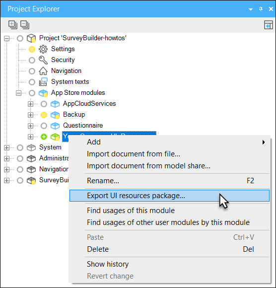
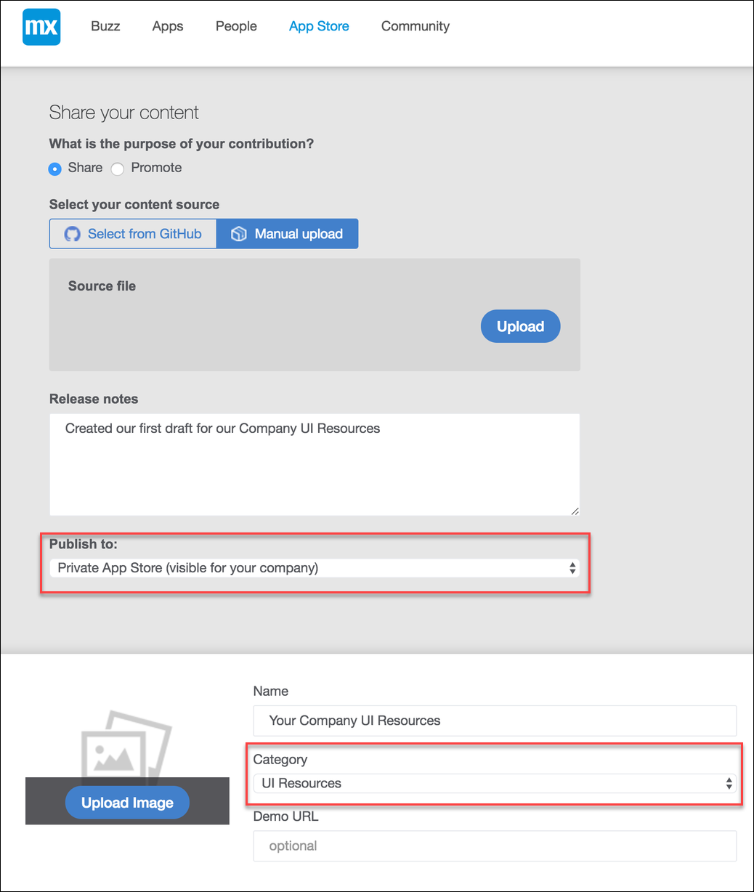
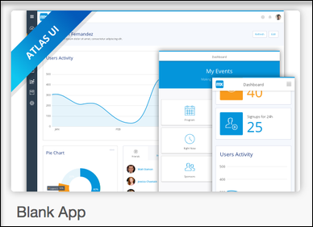
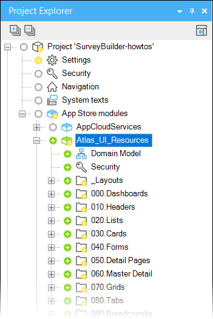
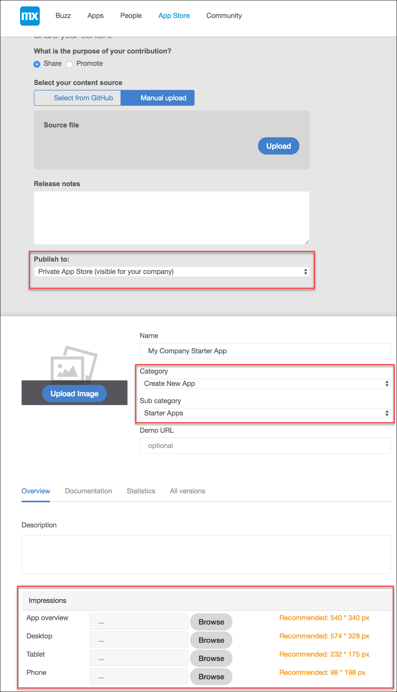
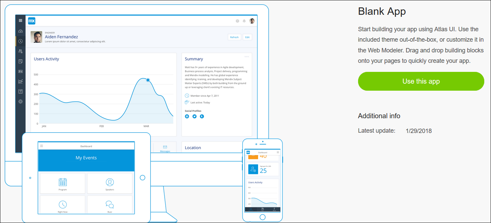
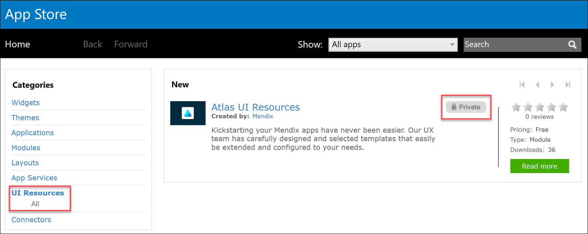
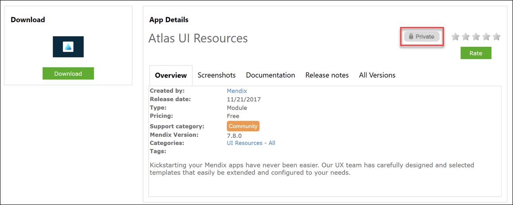

Creating company UI Resources is a great way to let Mendix developers quickly create new beautiful applications with out-of-the-box company branded themes, page templates, and building blocks. This is also a great way to align multiple apps with the same UI Resources, keeping the company brand and look & feel consistent. In this how-to, we explain how to share and maintain the UI Resources module.

#### Export Your Company Atlas UI Resources

When your custom resources are ready to be shared with multiple developers or apps, the module can be exported from the project explorer. You are free to change the name of module as long as it has been exported as a UI resource package. Right-click on the UI Resources module and save the module.

The module can now be imported in other apps or be uploaded to the Mendix App Store. There is an option to make the resource module available for private use only so everybody in the company can benefit from and extend this module. In the next step, the process of sharing UI Resources will be made clear.

#### Sharing and Maintaining Your Company Atlas UI Resources

The Mendix App Store is a great way to share UI Resources throughout your company. Not only can everybody in the company benefit from using the UI Resources, it also provides a great way to document and keep track on changes made to the UI Resources. Never worry about losing your UI Resources or making errors, everything is taken care of with the Mendix App Store version control system.

There are two important options to keep in mind when uploading a UI Resources module.

* Publish to
  The publish option lets you share the UI resources with a private (company only) or public (entire Mendix community) audience
* Category
  Choose the category “UI Resources” to make the module available as a UI Resources module

When the upload of your UI Resources to the Mendix App Store is completed, it may need to be reviewed by the Mendix App Store. When the UI Resources are published to the Private App Store, the UI Resources do not have to be reviewed and will be directly available in the company after publishing. Publishing to the Public App Store will need approval by Mendix.

#### Using Your Company Atlas UI Resources

How can Mendix developers in your company benefit from the UI Resources module? There are two best practises on how to share the UI Resource module.

1. Including the UI Resources module with a Company Starter App
2. Using the UI Resources module from the Mendix App Store

__Including the UI Resources Module With a Company Starter App__
A UI Resources module is a great way to keep all UI resources centralized in your application. It would be a lot of work to download the UI Resources module every time the Mendix developers start a new Mendix app. An easier way of sharing the UI Resources for new Mendix applications is to create a blankl Company Starter App with the UI Resources module already included. This blank application can also be extended with logic and data, depending on what your Mendix developers need to quickly create Mendix applications.

Let’s start with creating a new Mendix application in the Mendix Platform or directly in the Mendix Desktop Modeler. Select the “Blank App” for this how-to. Open the newly created Mendix app in the Mendix Desktop Modeler.

If we look at the App Store Modules inside the Mendix Project level, we notice the default Atlas UI module. Delete the Atlas UI Resources module by right clicking on the module.

!

Now it’s time to import your company UI Resources. If you have not created UI resources before, it’s possible to do this by following the previous step in this how-to.

Open the Mendix App Store in the Mendix Desktop Modeler and click on the menu item “UI Resources” in the left sidebar or use the search function at the top. Download the company UI Resources you have created.

When the download is complete, the UI Resources will be visible in the App Store modules under the project explorer in the Mendix Desktop Modeler. Be sure to check if all the errors are resolved before continuing.

Now that the Company UI Resources have been added to your company Starter App, you can share the company Starter App in the Mendix App Store just as you did with the company UI Resources. Now the company Starter App will be available for your Mendix developers to use whenever they want to create a new app, letting them save time and skip downloading the company UI Resources separately.

#### Sharing and Maintaining your Company Starter App

Now that we have created a company Starter App, the next step is to share it to the company. The easiest way to do this is by uploading it to your private App Store.

There are four important options to keep in mind when uploading the company Starter App.

1. Publish to:
2. Category: Create New App
3. Sub category: Starter Apps
4. Impressions

There are three important options to keep in mind when uploading the UI Resources module.

* Publish to
  The publish option has to be set for Private App Store content
* Category
  Choose the category “Create New App”
* Sub category
  Choose the sub-category “Starter Apps” to make the app available in the Create New App flow for the Mendix App Platform
* Impressions
  Impressions contain the images that are being shown when creating a new app in the Mendix App Platform. See the example below.

__Using the UI Resources Module from the Mendix App Store__
The UI Resources module can be easily downloaded through the Mendix App Store in the Mendix Desktop Modeler. By downloading the UI Resources module in existing Mendix apps, Mendix developers can benefit from all the new UI Resources.

Open the Mendix App Store in the Mendix Desktop Modeler. On the left side, the categories for the App Store content are available. Click on the UI Resources link to open the UI Resources or use the search function.

An overview of the UI Resources will appear in the middle of the Mendix App Store. The private label indicates that the UI Resources are only available for your company. Select the UI Resources that have been created by your company.

When opening the details page, it’s possible to Download the UI Resources inside the project. When downloading the UI Resources module, it will appear under App Store modules. The module can always be updated by downloading a new version from the Mendix App Store when new resources are added.
