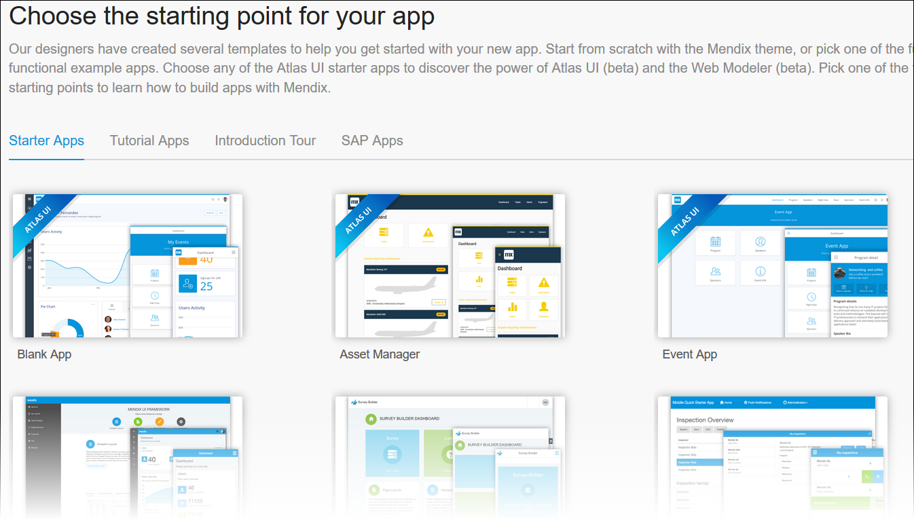
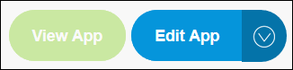
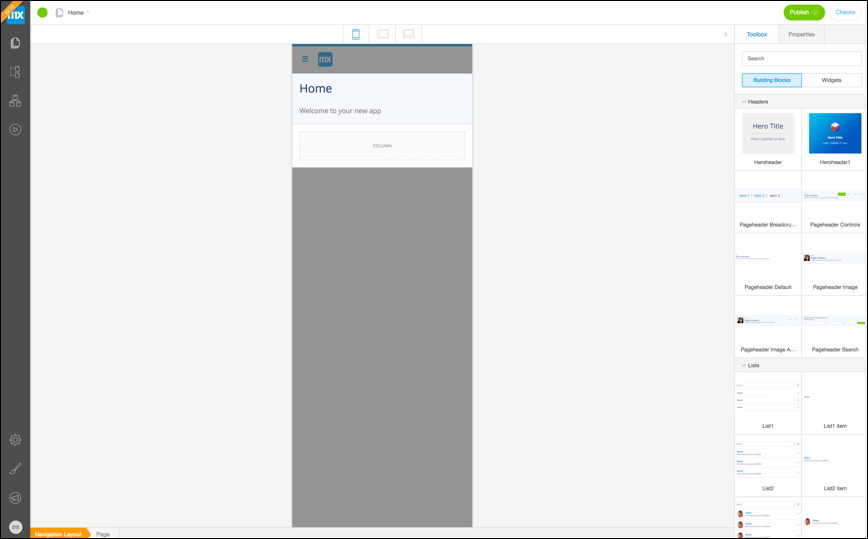
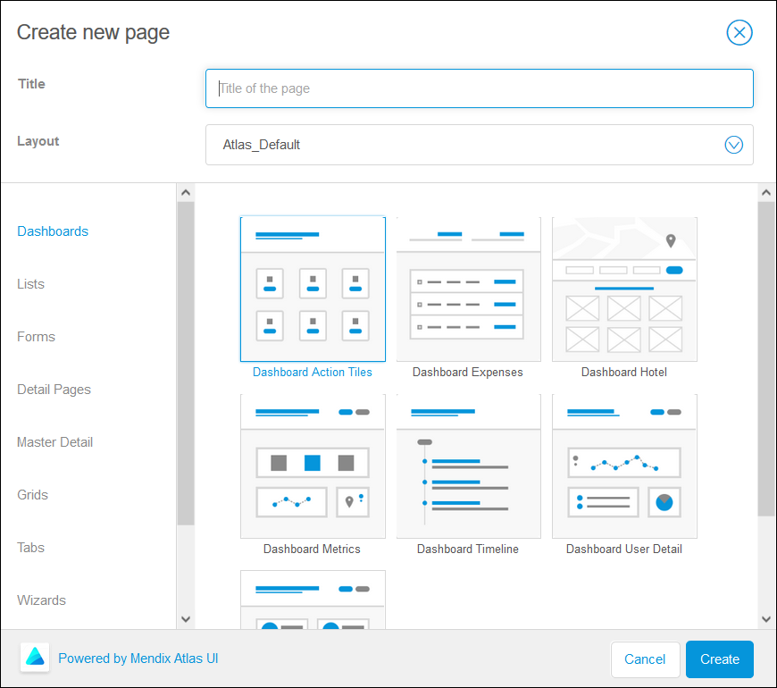
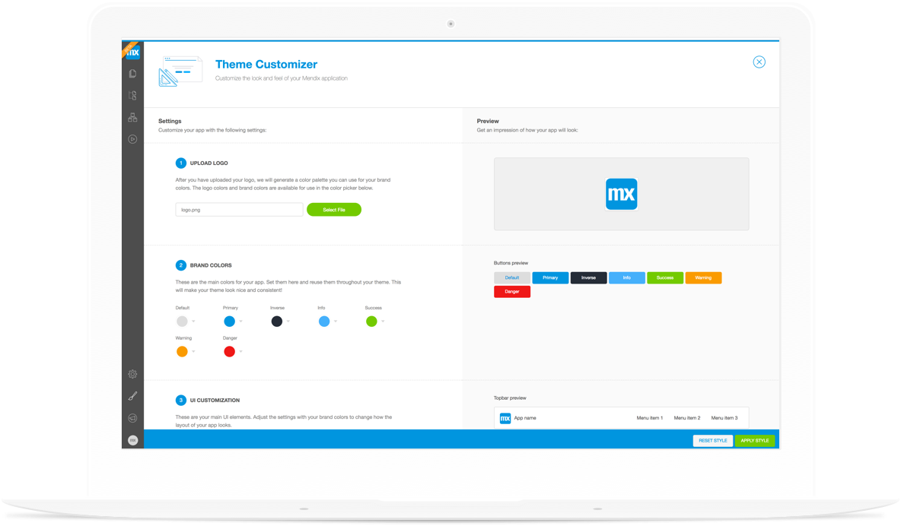

The Mendix Web Modeler is a powerful collaborative tool that lets you build your application in the cloud, together with your team. When you log into the Web Modeler for the first time, you get the option to choose a starter app that is fully Atlas-enabled.

*Don’t have a Mendix Account? Try it free! Find out about the [benefits of using Mendix](https://www.mendix.com) and [sign up for your account](https://www.mendix.com/try) today.*

### 1 Choose Your Starter Aapp
There are a number of apps that are Atlas UI ready - select your favorite to get started.

### 2 Edit Your App in the Mendix Web Modeler
You now have access to your App Buzz. From here you can open the Mendix Web Modeler by clicking "Edit App" in the top right of the App Buzz.

### 3 Explore the Mendix Web Modeler
Your app is ready to be built. In your toolbox, you will find all the building blocks and widgets you need to customize your app. All these resources have been created with Atlas UI. Every building block has an information icon that directs to the Atlas UI website with the relevant information. Page Templates are available by creating a new page, again there is an option to go to Atlas UI.

### 4 Choose a Page Template
A good way to get started is to create a new page. Click on the Pages icon in the left navigation bar, press the New Page button, and choose a suitable page template. You can customize this template however you want.

### 5 Customize Your Theme
Click on the Theme Customizer icon in the left navigation bar. Style your app with custom branding, colours, and typography.

