## 1 Introduction

This how-to will teach you to build Mendix applications for the first generation [Microsoft](https://docs.microsoft.com/en-us/windows/mixed-reality/hololens-hardware-details) [HoloLens](https://docs.microsoft.com/en-us/windows/mixed-reality/hololens-hardware-details). Specifically, you will learn to add the Mendix-provided ARModule to an app, configure your existing pages for your module, and install a Mendix app on your HoloLens. By the end of this how-to you will know how to configure an existing Mendix web application so it can be viewed in the HoloLens.

## 2 Prerequisites

* The Mendix HoloLens app (the *.msixbundle* file specifically)
* A Windows device running Windows 10 with the [Windows 10 SDK](https://developer.microsoft.com/en-us/windows/downloads/windows-10-sdk) installed
* Consult the Microsoft [Gestures](https://docs.microsoft.com/en-us/windows/mixed-reality/gestures) documentation to familiarize yourself with HoloLens gesture terms
* A Microsoft HoloLens (version 10.0.17763.502) connected to the same WiFi network as your Mendix project
* Ensure you have the correct credentials for your HoloLens account (lacking correct credentials can lock you out of your device, forcing a factory reset)
* Ensure your computer's Mendix project can be reached through IP on other devices on the same network

### 2.1 Current Limitations of This Technology

* The only input you can give the pages is through an Air tap (Dragging is not supported)
* Videos do not work

## 3 Putting the ARModule in Your Mendix Project

1. In your current Mendix project, right-click **Project (YourProjectName)** and select **Import Module Package**. This will open up a file selector:

	{}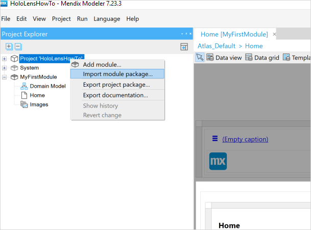{}

2. The folder provided by Mendix contains the file *ARConfiguration.mpk*. Select it and click **Open**:

	{}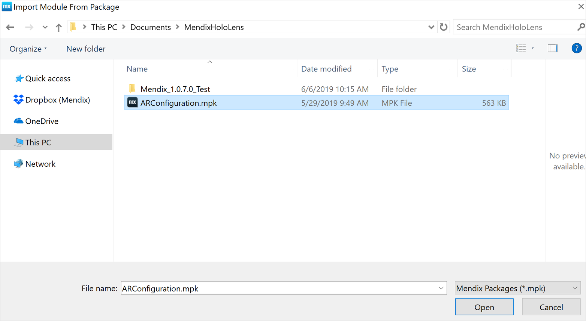{}

3. In the subsequent dialog window, select **Action** > **Add as a new module** and click **Import**:

	{}{}

## 4 Configuring Your Pages

###  4.1 Markers

First, you will configure your pages in the Mendix Module. To do this, your project needs to be running. You will begin by generating markers. While trackers are specifically used for mobile (for more information on trackers, see the [ARImageTracker section](get-started-ar#ar-tracker) of *How to Get Started with AR*), markers are slightly more defined in their requirements. Markers are specifically used for HoloLens, and appear more as QR codes. 

The markers determine the placement of the pages. The HoloLens scans the markers, and through this configuration will know which page goes with which marker. 

To create the markers, complete the following steps:

1. Click **Run Locally**, then click **View** to see your app in a browser.
2. Navigate to http://localhost:8080/p/ARConfig and click **Enter** to view the configuration page, and then go to **Entities** > **Markers**.
3. If there are no markers there already, click **Generate**:

	{}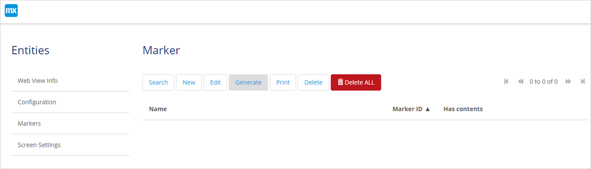{}

3. This should generate 51 markers:

	{}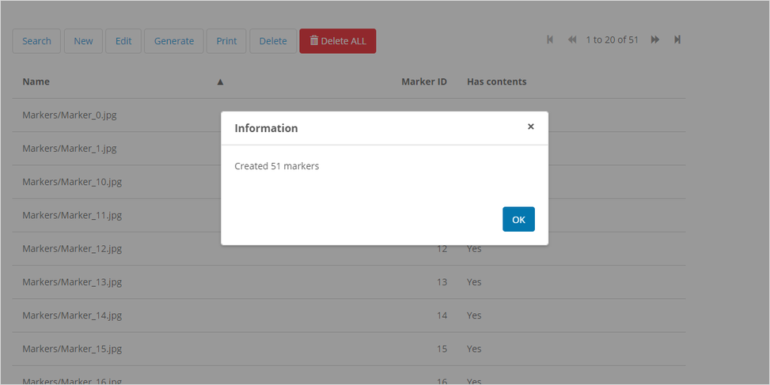{}

    Optionally, to print a PDF with all your markers, click **Print**:

	{}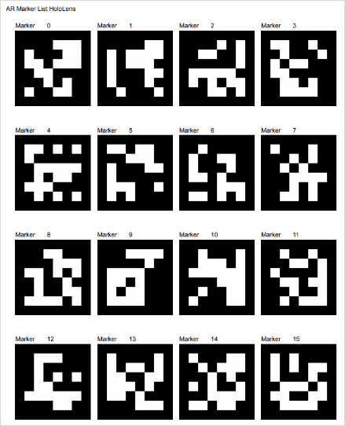{}

### 4.2 Configuration

To configure your markers, follow these steps:

1. Click **Entities** > **Configuration**.
1. Click **New**:

	{}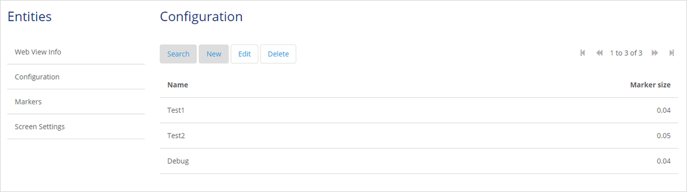{}

1. Fill in a new name for your configuration.
1. Fill in the **Marker size** in meters. Printing the standard PDF gives you markers of 0.04 meters. If your printed PDF does not match the configuration marker size, the webviews’ positioning will be unreliable:

	{}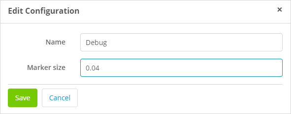{}

### 4.3 Screen Settings

To configure you screen settings, follow these instructions:

1. Click **Entities** > **Screen Settings**.
1. Click **New**:

	{}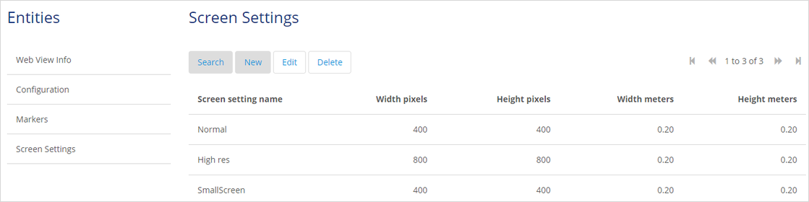{}

1. Fill in a new name for your screen settings.
1. Set **Width pixels** and **Height pixels** to *400*. Width and height pixels control the resolution of the webview itself. Remember that the HoloLens is a mobile device and not as graphically powerful as a desktop PC. Setting too high a resolution can slow HoloLens apps down.
1. Set **Width meters** and **Height meters** to *0.20*. Width and height meters control the size of your HoloLens app’s webview:

	{}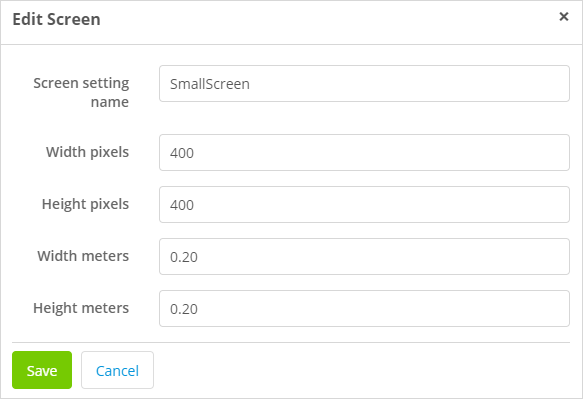{}

### 4.4 Web View Info

To configure your **Web View Info** settings, follow these instructions:

1. Click **Entities** > **Web View Info.**

	{}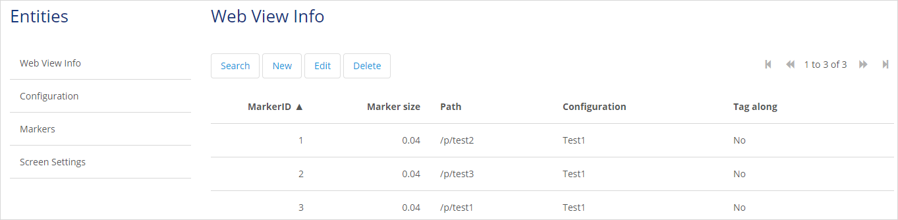{}

1. Click **New,** then configure the subsequent settings as you choose.
1. **Web view ID**: This setting is generated automatically. No action is required.
1. **Configuration/Marker Size**: This setting is the one you configured when editing **Marker size** in **Edit Configuration**. No action is required.
1. **Path**: Here you must enter a path to your local URL, or any other website you would like to show. If you want to show a page of your Mendix app project, set that page’s URL in its properties. For example, you could make your app project’s home page URL {/something} in properties, clicking **Run Local**, and navigating to it by navigating to http://localhost:8080/p/something.
1. **Screen**: Select the screen you made in section 5.3.
1. **Marker**: Select any marker from the ones you generated earlier.
1. **Marker offset**: This setting dictates the amount of meters the webview should be from the webview. **Marker offset x** controls the horizontal axis, **Marker offset y** controls the vertical axis, and **Marker offset z** controls depth. Configure these dimensions as you choose.
1. **Tag along**: Selecting **Yes** will keep this screen in your field of vision as you look around:

	{}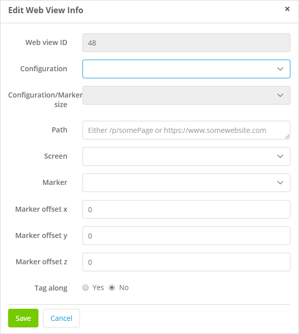{}

	This information will generate a REST interface when you run the app.

## 5 Running Your App on a HoloLens

To run your app on a HoloLens, follow these steps:

1. Connect your HoloLens to your computer.
1. Go to Microsoft’s [Using the Windows Device Portal](https://docs.microsoft.com/en-us/windows/mixed-reality/using-the-windows-device-portal) and set up your HoloLens by completing the following sections: <br />
	a. Setting up HoloLens to use Windows Device Portal. <br />
	b. Connecting over USB. <br />
	c. Creating a Username and Password. <br />
	d. Security Certificate.

1. Navigate to http://127.0.0.1:10080/ and log in when prompted:

	{}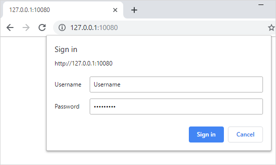{}

1. Click **Views** > **Apps**:

	{}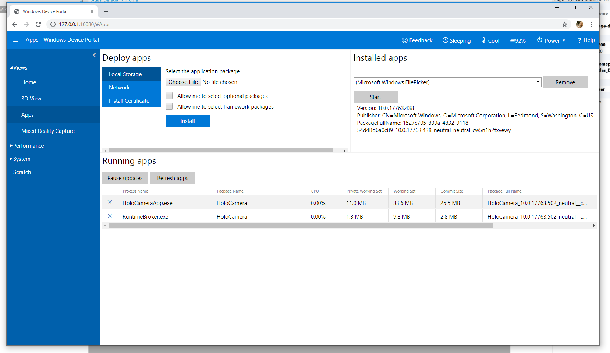{}

1. Click **Choose File,** navigate to your *.msixbundle* file, and click **Open**:

	{}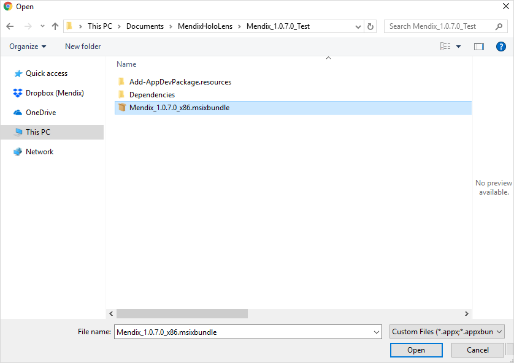{}

1. With your *.msixbundle* file selected, click **Install**:

	{}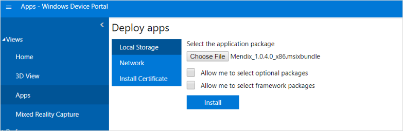{}

	Optionally, if you receive the following error, you will need to install some extra packages: 

	```	
	“Windows cannot install package HoloLensMendixApplication_1.0.7.0_x86__pzq3xp76mxafg because this package depends on a framework that could not be found. Provide the framework "Microsoft.NET.CoreRuntime.1.1" published by "CN=Microsoft Corporation, O=Microsoft Corporation, L=Redmond, S=Washington, C=US", with neutral or x86 processor architecture and minimum version 1.1.27004.0, along with this package to install. The frameworks with name "Microsoft.NET.CoreRuntime.1.1" currently installed are: {} Failure text: Package failed updates, dependency or conflict validation. (0x80073cf3)”
	```

To fix the error, follow these steps:

1. Select **Allow me to select framework packages** and then click **Next**:
	
	{}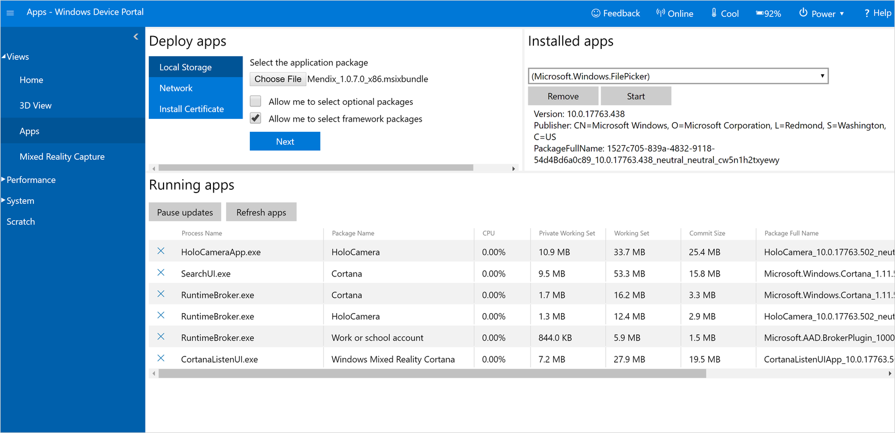{}
	
1. Select **Choose File**, and in the build folder, navigate to **Dependencies/x86**:
	
	{}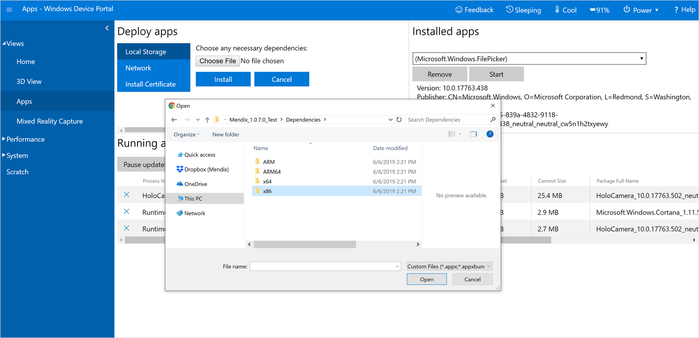{}
	
1. Add both *.appx* files to **Dependencies/x86**:
	
	{}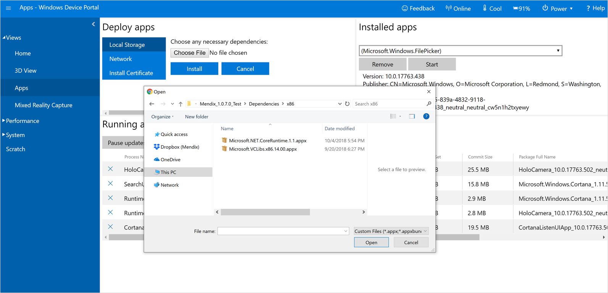{}
	
1. With both these dependencies and your *.msixbundle*  selected, click **Install**:
	
	{}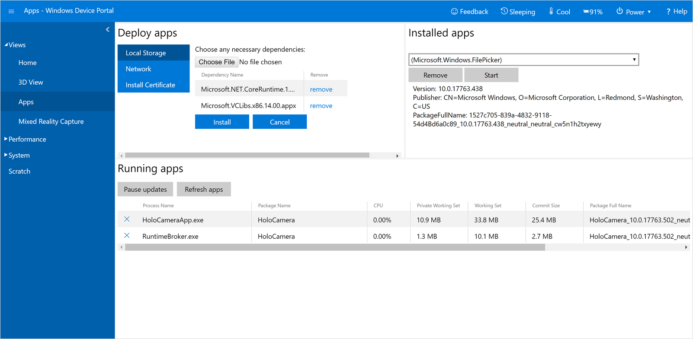{}

You can now check for your Mendix app and see the results of your installations:

1. Check that **Mendix (App)** is in **Installed apps**:

	{}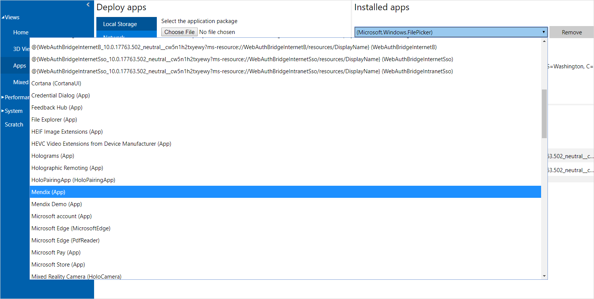{}

1. Put on your HoloLens, then open the app. Make sure your HoloLens is connected to the same WiFi network as the computer running your Mendix app. Enter either the URL of your Mendix server or its IP address by Air tapping each number field, and Air tap **Load configuration**:

	{}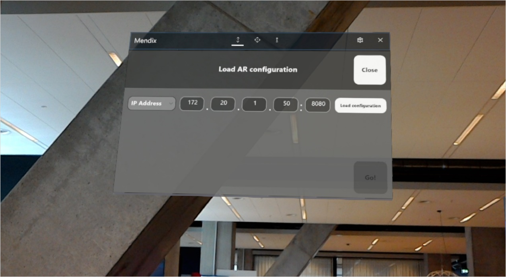{}

1. If the application can reach your Mendix server, it will fetch configurations that have webviews attached:

	{}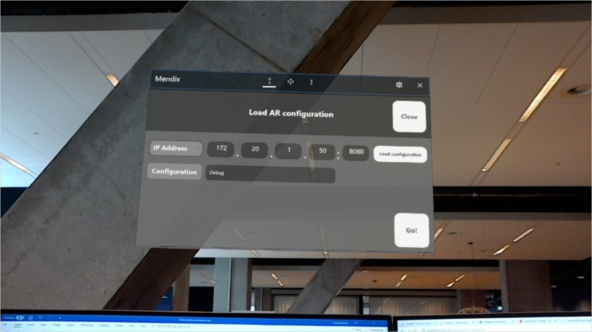{}

1. When you are ready to start the 3D environment, click **Go**. 
1. When the 3D environment is loaded after the Mendix logo splash screen, you will see a message: **Longpress to start scanning for webviews**. To start scanning for markers, look at the markers, and then Tap and hold them.
1. You should see a blue square with the text **Scanning** underneath:

	{}{}

1. As soon as you release your Tap and hold, the scanning will stop. Aiming this scanning rectangle at your marker sheet will show the configured pages at that location:

	{}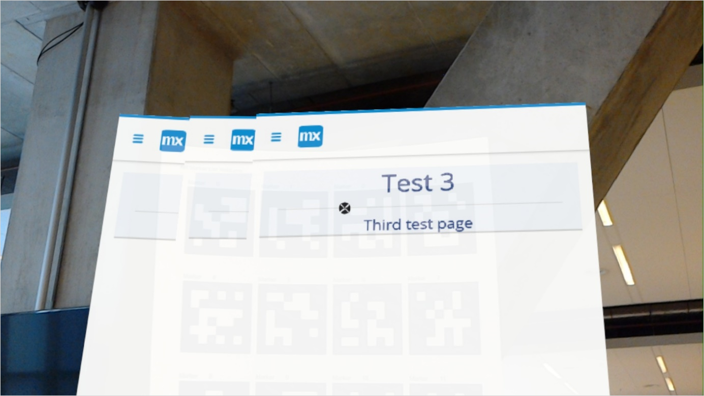{}

Congratulations! You have just added HoloLens functionality to a Mendix app, then ran that Mendix app in your HoloLens’ 3D environment.

## 6 Read More

* [Use Augmented Reality](ar-parent)
* [Get Started with AR](get-started-ar)
