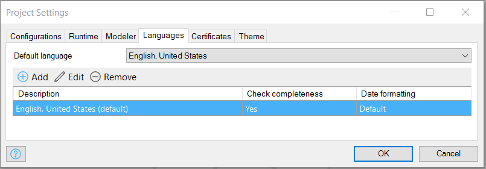
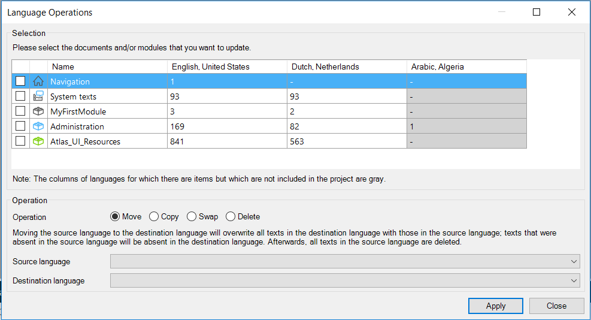
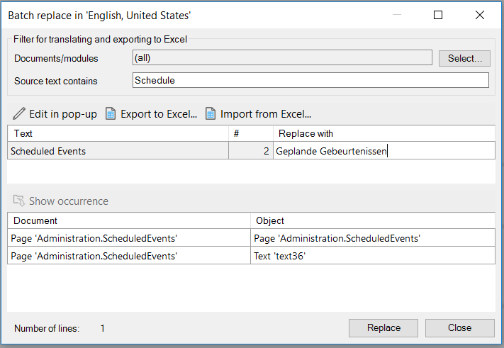
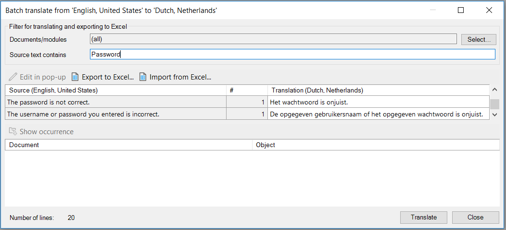

## 1 Introduction

Delivering your Mendix app in multiple languages is an important capability for reaching a wide audience. Using translatable texts (for example, labels, button names, menu items) that are tracked and stored in your project, you can quickly make your app multilingual and translate the content from English to many other languages.

**This how-to will teach you how to do the following:**

* Set the development language
* Import and export translations
* Configure language operations
* Perform batch replacement and batch translation

## 2 Adding Project Languages

The project language is the main language of the app when it is run. There must be a default project language, and **English, United States** is the project language set automatically by default. You can add as many languages as you like by following these steps:

1.  In the **Project Explorer**, open the project **Settings** and go to the **Languages** tab.

    

2.  Click **Add**, select the desired language, and click **OK**.

    

If you want to set a different language as the default, you can do that in the **Default language** drop-down menu on the **Languages** tab.

Any project language can be used as a development language in the Modeler (for details, see [4 Changing the Development Language](#changingthedevelopmentlanguage)).

## 3 Changing the Development Language

The development language is the language used to define translatable texts as you develop your app in the Modeler. For example, if you select **Dutch, Netherlands** as the development language, any labels that you type during the development of your app in the Modeler will be added to your project's Dutch dictionary. The Dutch translation of your app will be seen by users of your app who set Dutch as their preferred language in their profile (if they do not specify a preferred language, the project default language will be used).

You can change the language setting if desired in the Modeler by going to: **Language > Current Language**.

Mendix recommends setting your development language at the start of your project, because all the added text (for example, button labels) will be added to the selected language library (so that it can be reused in other projects).

After selecting your development language, the pages will display their labels and content in that language. Labels that haven’t yet been translated to the selected language will display the text of the default language (which was set in the project **Settings**) between angle brackets ("<>").

When your app is deployed with labels that don’t yet have a translation, these labels will also display the default language label (without the angle brackets). You can configure how strict the Modeler is in checking for a translation in the **Language Operations** settings of your project (see [3.1 Configuring Language Operations](#toconfigurelanguageoperations)).

### 3.1 Configuring Language Operations

To update the language settings in the Modeler, go to **Language > Language Operations**.

In the **Selection** section of the dialog window, you can select the documents and modules that you want to update. The columns of languages for which there are items but which are not included int he project are gray.

In the **Operation** section of the dialog box, there are four language operation options, which are described below.

* **Move** – moves the source language to the destination language, which ovewrites all the texts in the destination language with those in the source language
    * Select the **Source language** and the **Destination language** in their respective drop-down menus for the move language operation
    * Texts that are absent in the source language will be absent in the desination language
    * Following this operation, all the texts in the source language will be deleted
* **Copy** – copies the source language to the destination language, which ovewrites all the texts in the desination language with those in the source language
    * Select the **Source language** and the **Destination language** in their respective drop-down menus for the copy language operation
    * Texts that were absent in the source language will be absent in the desination language
* **Swap** – swaps the source lanauge and the destination language, which moves all the texts in the source lanauge to the destination language and vice versa
    * Select the **First language** and the **Second language** in their respective drop-down menus for the swap language operation
* **Delete** – deletes all the texts in the language selected in the **Language** drop-down menu

Click **Apply** to apply the selected language operation.

## 4 Translating Labels

### 4.1 Consolidating Labels and Perform Batch Replace

There may be some text in your app that occurs in more than one place, so before you translate, it is best to consolidate similar labels so that they stay the same after the translation. The language in your app will be more consistent if you have a high occurence/text ration, as that means you reuse existing text across your app, which will increase the user experience.

To search for phrases that look similar and replace them as a batch, follow these steps:

1. Go to **Language > Batch Replace**.
2. In the **Source text contains** field of the **Batch replace** dialog window, enter the word you want to search for.
3.  The results will appear in the table with the column headers **Text** and **Replace with** (as in the example image below, in which "Schedule" is being searched).

    

4. Enter the new replacement text under **Replace with**, and then click **Replace**.

### 4.2 Translating Labels

To translate a label, follow these steps:

1. Select the desired development language from the language drop-down menu in the Modeler toolbar (which displays "English, United States" by default). Words in your project will be automatically translated if they are in the library.
2. Words that have not been automatically translated (that is, those words that are in angle brackets) must be manually translated one-by-one or through batch translation (see below).

### 4.3 Performing Batch Translation

Instead of going through the pages and translating labels one-by-one, it's much more efficient to use the batch translate option.

You can also filter to specific modules and use the search to find specific labels.

To enable batch translation, follow these steps:

1. Go to **Language > Batch Translate**.
2. Select the **Source language** and **Destination language**.
3. In the **Source text contains** field of the **Batch translate** dialog box, enter the word you want to search for.
4.  The results will appear in the table with the column headers **Source** and **Translation** (as in the example image below, in which "Password" is being searched).

    

5. Enter the translated text for the various results under **Translation**, and then click **Translate**.

#### 4.3.1 Text Occurrence and Context

Because some labels and other texts are in the list multiple times, it’s important to know where in your app they’re being used. You can see this using the **Occurrence** window at the bottom of the **Batch translate** dialog box.

For example, there may be two English labels with the word "address." If you translate this to Dutch, it’s important to know if the word is used in the context of "someone's contact details" or in the context of "talking to a person in a certain way" (for example, in Dutch, the first meaning translates to “adres,” but the second meaning translates to "aanspreken").

## 5 Exporting and Importing Translations

If you want to translate a language outside the Modeler, you can export the translatable texts to the Excel (.xlsx) format by clicking **Export to Excel** on the **Batch translate** dialog box. This produces an Excel file with two columns, one for each language. When you’re done, simply import the Excel file into your project by clicking **Import from Excel** on the **Batch translate** dialog box.
