## 1 Prerequisites

Preliminary Git support in Mendix Studio Pro is limited to specific Git service providers and specific authentication mechanisms. We currently only support Git Private Server.

### 1.1 Supported Authentication Mechanisms

Currently, we only support HTTP Basic authentication for Git service providers. With most providers this means the use of Personal Access Tokens (PATs).

To use PAT (or equivalent), you need to specify it in the Password field when Studio Pro requests to enter credentials for the version control server:

See below for instructions on how to set up Personal Access Tokens or equivalent for the supported providers.

## 2 Supported Git Service Providers

### 2.1 Azure Repos and Azure DevOps Server 

We support both Microsoft’s [Azure Repos](https://azure.microsoft.com/en-us/services/devops/repos/) hosted Git service, as well as Azure DevOps Server(former Team Foundation Server) which is an on-premises solution for hosting your Git repos on the private infrastructure.

To get a PAT for your user account, see the [Use personal access tokens](https://docs.microsoft.com/en-us/azure/devops/organizations/accounts/use-personal-access-tokens-to-authenticate?view=azure-devops&tabs=preview-page) instructions in the Microsoft documentation.

You would need `Code (full)` permission for your token.

### 2.2 GitHub 

We support GitHub’s hosting solutions, including the free GitHub.com cloud-hosted service and GitHub Enterprise, both hosted (Enterprise Cloud) and on-premises (Enterprise Server).

To get a PAT for your user account, see the [Creating a personal access token](https://docs.github.com/en/free-pro-team@latest/github/authenticating-to-github/creating-a-personal-access-token) instructions in the GitHub documentation. 

You would need `repo` permissions for your token.

### 2.3 GitLab 

We support all tiers of GitLab’s service, including the free GitLab.com, GitLab Community Edition and GitLab Enterprise Edition.

To get a PAT for your user account , see the [Personal access tokens](https://docs.gitlab.com/ee/user/profile/personal_access_tokens.html) instructions in the GitLab documentation. 

You would need `write_repository` permission for the token.

### 2.4 BitBucket 

We support all tiers of Atlassian’s BitBucket service, including the free BitBucket.org, BitBucket Server and BitBucket Data Center on-premises solutions.

On BitBucket.org, the Personal Access Tokens are called App Passwords. 
To setup an App Password for your BitBucket.org account, see the [App passwords](https://support.atlassian.com/bitbucket-cloud/docs/app-passwords/) instructions.

BitBucket Server and BitBucket Data Center, on the other hand, still use the term Personal Access Tokens. To set up a personal access token, see [Personal access tokens](https://confluence.atlassian.com/bitbucketserver/personal-access-tokens-939515499.html) instructions.

In both cases you would need `repository write` permission.

### 2.5 AWS CodeCommit 

We have a known compatibility issue with AWS CodeCommit in Git Technology Preview for Studio Pro. We are working to resolve the issue in the next release.

## 3 Steps to Set Up Environment

This section describes all the initial steps that are necessary to use Studio Pro to manage a Git versioned app. To do so, you need a Git server and an initially unversioned Mendix app.

### 3.1 Preparing Your Repository

Studio Pro is able to use the following Git server providers:

* Azure DevOps Server
* Azure Repos
* GitHub.com
* GitHub Enterprise Edition
* GitLab.com
* GitLab EE
* GitLab CE
* BitBucket.org
* BitBucket Server
* BitBucket Data Center

You need to create a private repository in your provider of choice and create a Personal Access Token (PAT) in order to provide access to it. The PAT is used as the password to connect to it.
To interact with this private repository from Studio Pro, you need the link to the repository and a PAT.

For more information, see the [Supported Git Service Providers]() section above.

### 3.2 Preparing Studio Pro {#preparing-studio-pro}

To use Git, you need to start Studio Pro with a specific feature flag. Navigate to the directory where your installation of Studio Pro is located, specifically where the **studiopro.exe** file is. There are two ways to enable the feature flag. Do one of the following:
* Open the command line at that location (or navigate to it from the command line) and type the following command: `studiopro.exe --enable-git-support`
* Right-click the file, choose **Create shortcut**, and do the following:
    - If you are asked to save it on the Desktop, click **Yes**. 
    - Once the shortcut is created, right-click it and select **Properties**.
    - Put your cursor all the way to the end of the **Target** field and enter the feature flag `--enable-git-support`  after a space.
    - Click **OK**.
    - Start Studio Pro by double-clicking the shortcut. Make sure the **Target** option has Git enabled:
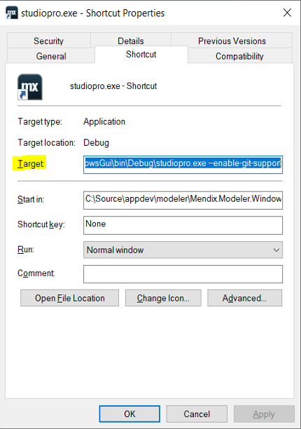
    - Once Studio Pro is opened, go to **Edit > Preferences > Version Control** and make sure to activate private version control for Git. The name and email values will be used to identify your commit:
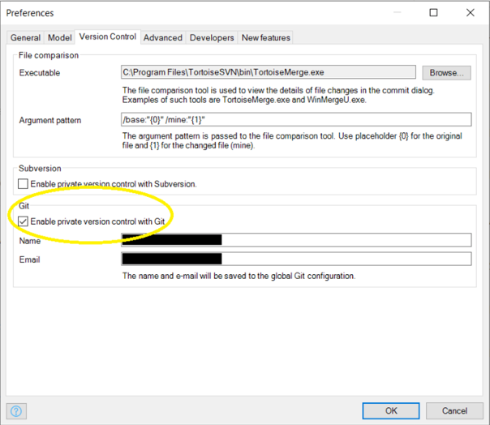
			  
Studio Pro now has the ability to support Git.

### 3.3 Creating an App

Create an unversioned app in Studio Pro.

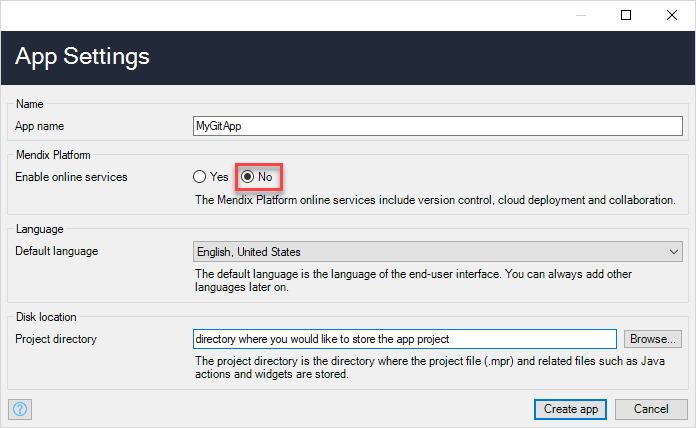

Once the app is created, you can now upload it to your private Git repository, using **Version Control > Upload to Version Control Server**. To upload it, see the steps in the [Uploading to the Private Git Server]({#uplod-to-private-git-server}) section below.

Once the app is uploaded, it will be a version-controlled app under Git.

### 3.4 Downloading from a Private Repository

Now that you have a Git app on your server, you can download it to another directory or one of your team members can download it on their machine. Follow the steps below:
1. Under **Version Control > Download from Version Control Server**, select the **Private server** option and enter the URL of your repository which contains the app you want to download. If you are not sure which URL this is, you can find this info in your Git server.
2. If you have both Subversion and Git enabled for private version control in your preferences in Studio Pro, specify which version control system your repository uses. For this case, check the **Git** radio button.

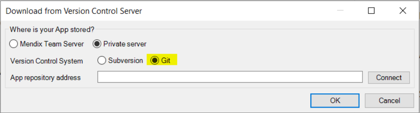

3. Enter the link to the repository in the **App repository address** and click **Connect**. Now you will have the option to change the directory where the app is downloaded into.

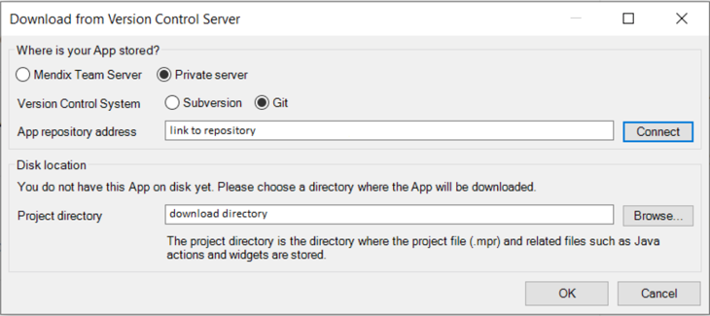

4.	Click **OK**. 
5.	In the **Sign In** dialog box, enter your credentials.

6.	Enter username (can be anything except empty) and use the PAT you saved earlier as the password. 

The app is downloaded and ready to be used with version control.

### 3.5 Opening the Existing Git App

There are a few ways to open a Git Mendix app, as long as you have Studio Pro started up with the git flag mentioned in the [Preparing Studio Pro](#preparing-studio-pro) section.

#### Recent Apps List

In your **Recent Apps** list, you can simply click the app name and it will open it.

#### Recent Projects Menu

Under **File > Recent Projects** you can select the app and open it.

#### Open App Form

The **Open App** form is accessible from two different places:
- **Open App** button on **My Apps** tab
- Under menu **File > Open Project**

In the form, there are two ways to open a Git app:

* Open from previous checkout and do the following:
    - Select the **Private server** radio button and enter the link to the repository. 
    - Click **Connect**. 
    - If you have already checked out the app at least once, you can then pick one of the existing locations on disk and the app on that location will open (shown here with two previous checkouts).
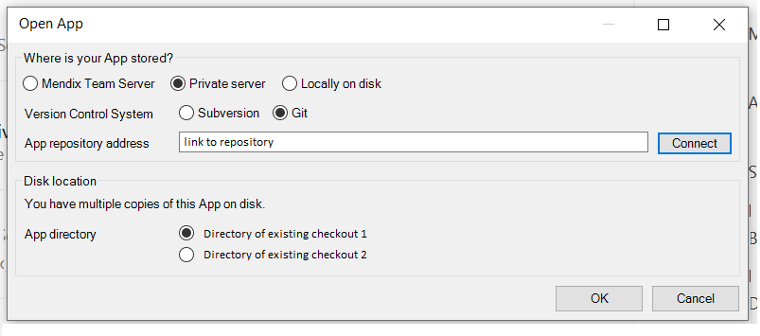
* You can open it locally on disk by doing the following:
    - Select the **Locally on disk** option.
    - In a file browser dialog box, browse to the directory containing your app and double-click the `.mpr` file (or select it and click **Open**). 
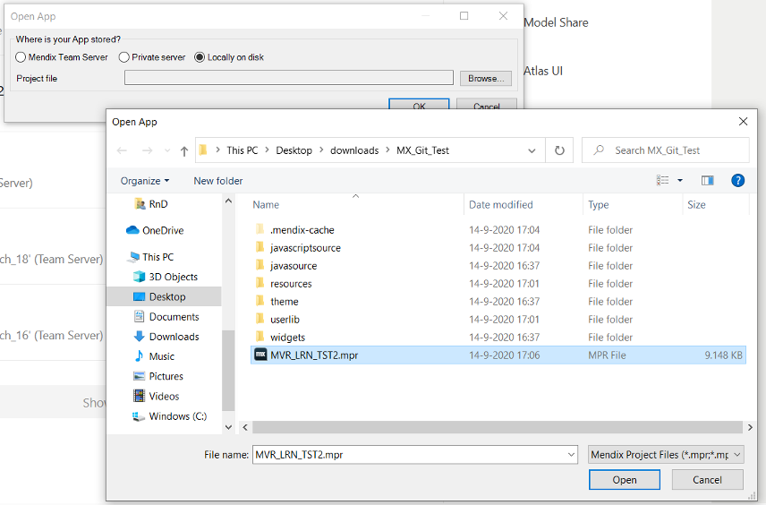
    - The app is now open in **Studio Pro**.

### 3.6 Uploading to the Private Git Server

Once you have an unversioned app, you can upload it to your private team server. 

{}
**Note**: The repository has to be completely empty (including README.md and. gitignore files), or the upload will fail.
{}

To upload your app, do the following:

1. Open the app in Studio Pro and go to **Version Control > Upload to Version Control Server**.
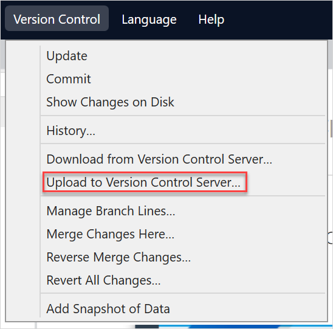
2.	In the **Upload to Version Control Server** dialog box, select **Private server**. 
3.	Select **Git** as the private server type (if you have both **Subversion** and **Git** enabled in the **Preferences Form**). 
4.	Enter the link to the repository you want to upload this app to and click **OK**.
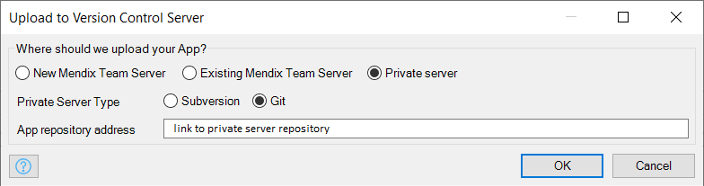
It might ask you to sign into the server, depending whether you have previously signed in and choose to stay logged in.
5.	You can see the upload process in the **Upload Project to Team Server** pop-up window:
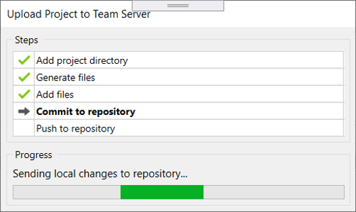
The project is uploaded successfully. You can check on your private server and see that the app is now on the desired repository.

### 3.6 “Converting” a Subversion App to Git

If you already have an existing versioned app (with Subversion) that you would like to upload to your Git private server instead, you can achieve so by exporting it, then re-importing it and uploading it to your server. Follow the steps below:
1. Once the app is opened, go to **File > Export Project Package**. 
2. In the **Export Project Package** dialog box, browse to the location you would like to save the `mpk` (Mendix Package) file, or accept the default location, a new **packages** folder in the root of the application folder. Take note of this location, as you will need it later. You can also rename the `mpk` file (e.g.`MyGitApp.mpk`) and the app will be named that way once you import it and upload it to the Git server.
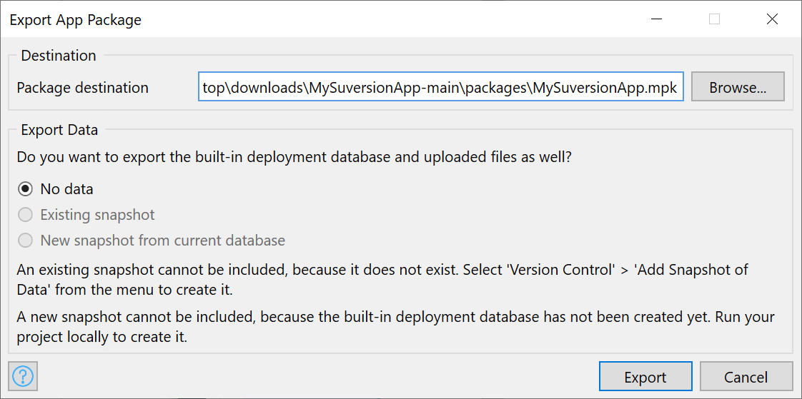
3. The **Progress** pop-up window appears, and once it is completed, you can close the project in **Studio Pro**.
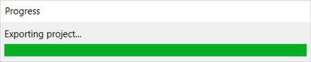
4. Now you can import the project package again, and from there you can choose to upload it to your Git private server. Go to **File > Import Project Package**. 
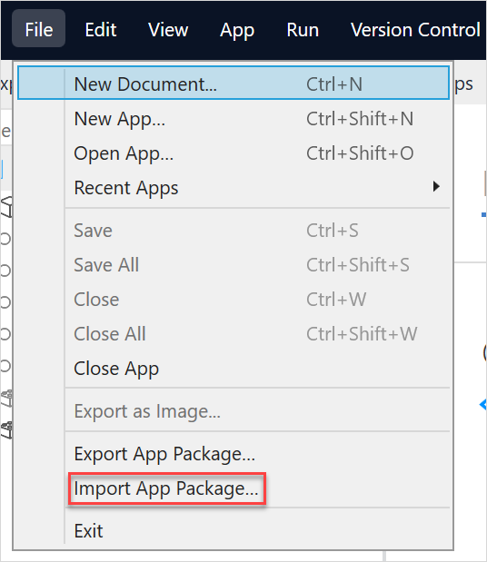
5. Once the file browser dialog open, navigate to the location you save the `mpk` file during the export process.
6. In the **Import Project Package** dialog box, select **Private server** option in the **Where should we store your App?** section. 
7. In the **Private Server Type** option, select **Git** (if you have both **Subversion** and **Git** enabled in the **Preferences** form). 
8. Enter the link to the private repository in the address textbox and click **OK**. Remember, the repository **must be completely empty**, or **Studio Pro** will not be able to upload a project to it.
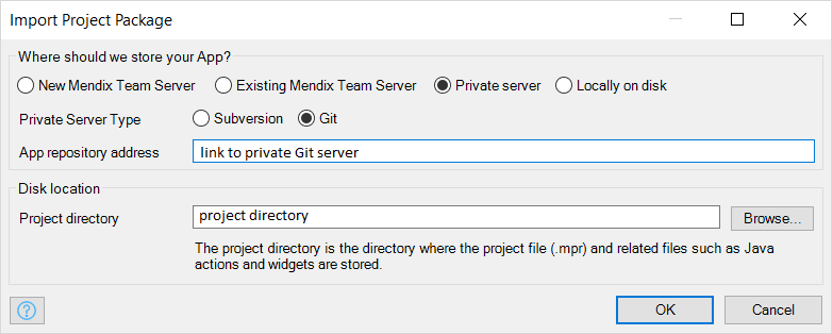
9. Click **OK**. 

After the import process is completed, your previous Subversion app will be now versioned using Git.

Note that your previous app still exists, **Studio Pro** will simply make an unversioned copy and upload it to your private Git server. So, in your **Recent Apps** list, you will still see both:

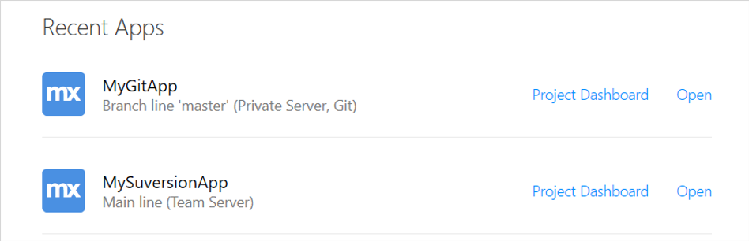