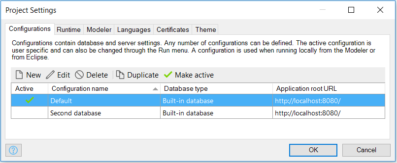
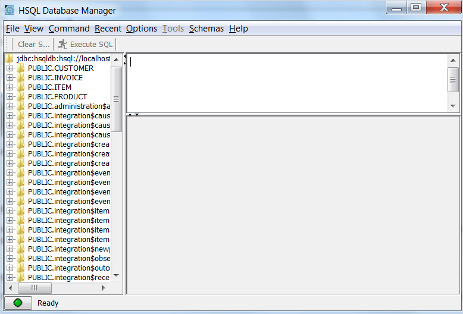
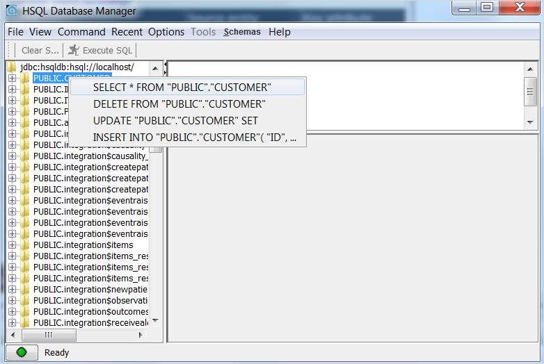
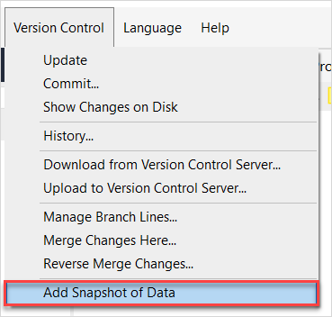
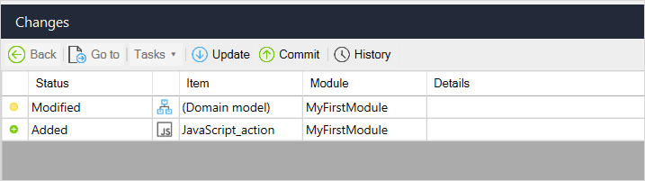

All Mendix applications need a database running in the background. While developing an application it is advised to use the standard built-in database that is supplied with the Mendix Modeler. This how-to will teach you how to open and manage the data stored inside the built-in database.

## 1\. Prerequisites

To get the most out of the built in database, the following prerequisites have to be in place:

1.  An internet connection (to commit the database)
2.  A team server enabled application (to share the database)
3.  A running application
4.  Some data in the database to commit SQL queries to

## 2\. Type of database

The built-in database is a flatfile database called HSQLDB (HyperSQL DataBase). This is the leading SQL relational database software written in Java. It offers a small, fast multithreaded and transactional database engine with in-memory and disk-based tables and supports embedded and server modes. It includes a powerful command line SQL tool and simple GUI query tools.

HSQLDB has been constantly developed over 12 years and is used as a database and persistence engine. It is known for its small size, ability to execute completely or partly in memory, its flexibility and speed.

Therefore this type of database is excellent to use while developing and running applications in the Mendix Modeler on a local machine. Thanks to this built in functionality, the developer doesn't have to run a local database engine and management tools.

## 3\. Select the preferred database

One application can make use of many different databases. Take the following steps to select the preferred database (if there is more than one configured)

1.  Double-click **Settings** in the **Project Explorer**.
2.  Select the preferred database configuration and click **Make active**.
  
    

## 4\. Start the database viewer

To start the built in database viewer, the following steps have to be applied:

1.  Run the application locally (If it is the first time, the Modeler will ask to create the new database. Press 'yes'.)

    

2.  When the application is running, open the built in database viewer

     

3.  This will result in the following screen (depending on the data model of the application)

    

This is the database manager. On the left pane all tables from all modules in the running application are showed. On the right top pane it is possible to enter SQL queries and on the right lower pane the results from the entered SQL query will be shown.

## 5\. Execute queries

Queries can be executed in two ways. It can be done directly from the command line (top right pane) in SQL script, or via the explorer on the left pane. For more information about SQL, visit the following page: [http://www.w3schools.com/sql/](http://www.w3schools.com/sql/). To execute queries from the database explorer (left pane), the following steps have to be applied:

1.  Right click on any table and select the preferred action

    

2.  To select all customers from the table CUSTOMER, click the first option. It will automatically fill the SQL command in the top right pane.

    

3.  Click on the 'Execute SQL' button to execute this query

    

On the bottom right pane, the results are shown and a total of 50 rows is retrieved from the database. From the standard actions it is also possible to delete, update and insert records. The standard actions can also be customized to retrieve, update or delete specific data. Advanced knowledge about the SQL language is needed to get the desired results.

## 6\. Commit a data snapshot

The built-in database can easily be shared with other members of the team. Like the business logic itself, it is possible to commit a snapshot of the database to the team server. To do this, take the following steps:

1.  Select **Project** > **More Versioning** > **Add Snapshot of Data**:

    

2.  Press 'Yes' to commit if one already exists, then add the informational message and press 'OK'
3.  The data is now committed to the team server and can be used by other team members

## 7\. Update a data snapshot

To import a data snapshot into the model, the app project has to be updated since the last database snapshot has been committed by another team member. To get the data from the committed database snapshot the following steps have to be applied:

1.  First the application has to be updated. Press update on the changes tab

    

2.  To implement the data snapshot, the database has to be extracted from a .zip file to the deployment directory

    

3.  Now copy the data directory to the data directory in the deployment directory

{}

Make sure the names of the databases aren't the same or make a copy of your own database first so it will not be overwritten.

{}

## 8\. Related content

*   [How to Manage Sprints and Stories](/developerportal/howto/managing-your-application-requirements-with-mendix)
*   [Contributing to a GitHub repository](contribute-to-a-github-repository)
*   [Starting your own repository](starting-your-own-repository)
*   [Using Team Server - Version Control](using-team-server-_-version-control)
*   [How to Use the Feedback Widget](/developerportal/howto/use-feedback-widget)
