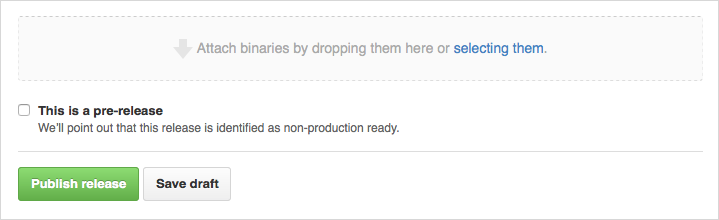

In this how-to you will learn how to set up a GitHub repository. The repository will contain your development content and can be shared with others, in order to contribute to the application.

## 1. Preparation

*   Make sure you have a [GitHub account](https://github.com/join)
*   Make sure you have a [Mendix account](https://developers.mendix.com/start-for-free/)
*   Read the [GitHub - Create a repo](https://help.github.com/articles/create-a-repo) guide

## 2. Creating your repo

First of all, your repo needs a name. We advise you use the same name that it is/will be published under in the App Store, and then using normal CamelCase to replace spaces. For example: "My first app" would be "Mendix/MyFirstApp" on GitHub.

Same as with the description. It should say what the App does, so it would be easiest to keep this in line with the App on the App Store.

(Add the Mendix .gitignore to make sure you keep your repo clean.)

## 3\. Folder Structure

When making a new widget, we suggest you use the [App Store Widget Boilerplate](https://github.com/mendix/AppStoreWidgetBoilerplate), available on GitHub.

It's a set-up with everything you need to get started developing a Mendix widget.

## 4\. Releases

If you want to make a new release for the App Store, we advise you start off with a new tag on the appropriate commit on the master or release branch. From these tags, you can create a [new Release in GitHub](https://help.github.com/articles/creating-releases). In this release you can set your release notes (which you can then use for the App Store release as well) and give it a more official name. If you add the .mpk as a binary file to the release tag (see image blow) the App Store will automatically sync the .mpk to your new draft. We suggest also linking this to the upcoming App Store release by mentioning that release number in the description.

## 5\. Related content

*   [How to Manage Sprints and Stories](/developerportal/howto/managing-your-application-requirements-with-mendix)
*   [Contributing to a GitHub repository](contribute-to-a-github-repository)
*   [Using Team Server - Version Control](using-team-server-_-version-control)
*   [How to Use the Feedback Widget](/developerportal/howto/gathering-user-feedback)
*   [Sharing the Development Database](sharing-the-development-database)

