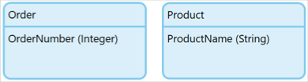
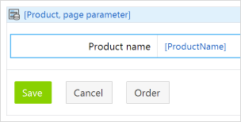
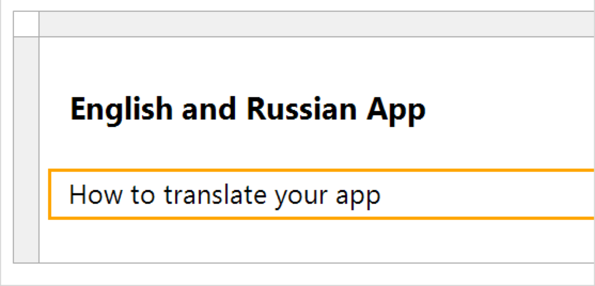
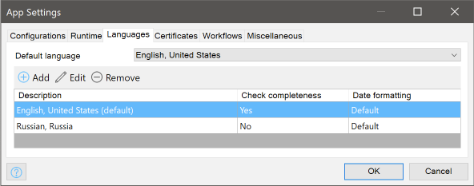
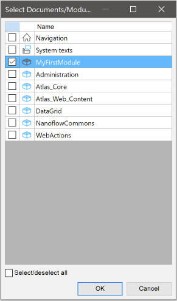
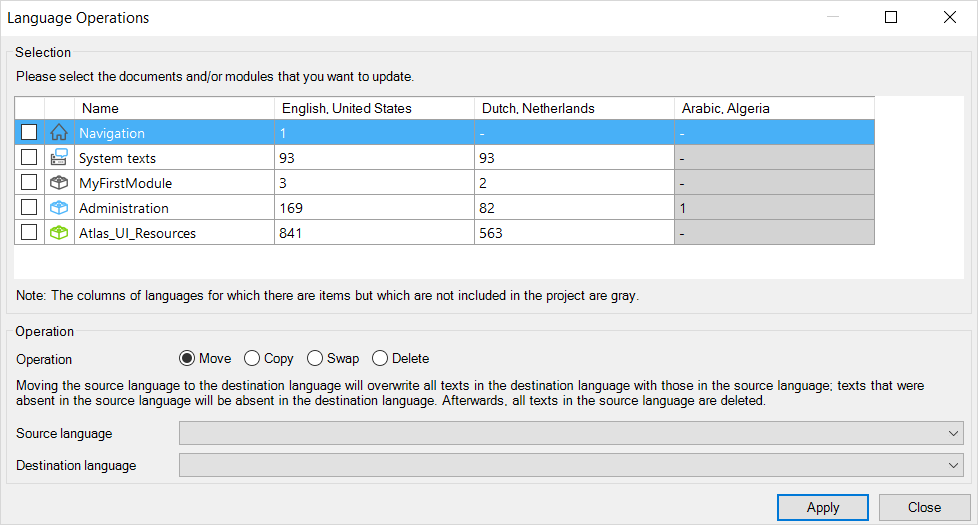

## 1 Introduction

Delivering your Mendix app in multiple languages is an important capability for reaching a wide audience. Most of the text that the end-user sees are stored as translatable texts (for example, labels, button names, menu items). Using the language features of Mendix, you can quickly make your app multilingual and translate the content to many other languages.

**This how-to will teach you how to do the following:**

* Add a new language to your app
* Change the working language
* Translate individual items of text
* Translate multiple items of text in one operation
* Change multiple items of text in one operation
* Copy a translation from one language to another

It is assumed that you know the basics of creating new apps and editing them.

## 2 Creating a Sample App

To demonstrate working with languages, you will create a new app from the blank app template. You will add some text to this app, as an example, but the app you create is to demonstrate the language features of Mendix and is not intended to be run.

When you work on an app there must be at least one language set, and one language must be set as the default app project language. This is the language which will be displayed when an end-user has no language selected, or when your app does not support their selected language.

When you create an app from a Mendix template, there is one language, **English, United States**, which is set to be the default language.

To create your app, do the following:

1. Create a new app using the **Blank App** template.
2. Open the app in Studio Pro (images here are from Studio Pro version 8.10)
3. Create a domain model in MyFirstModule with two entities:
	* **Order** with the integer attribute **OrderNumber**
	* **Product** with the string attribute **ProductName**
		
4. Right-click one of the entities and select **Generate overview pages…**
5. Ensure both entities are selected and click **OK**.
	This will generate some pages containing text for you to translate.
6. Open the page **Product_NewEdit** and add a new **Button** widget.
7. Label the new button **Order**. Ignore any warnings about the setup of this button.
	
8. Open the page **Home_Web** and put some text into the title and subtitle.
	

You now have an app with some translatable texts.

## 3 Adding App Project Languages

You can now add an additional language to your app. If you want to create the whole app in a language other than the current default, it is best to do this before you start creating the app. If you want to add alternative languages, it is best to do this when your app is nearing completion as it reduces the amount of work needed to do the translation from the default language, especially if there is already a translation for that language.

To add an additional language, do the following:

1. Select the menu item **Language > Language settings…**.
2. Click the **Add** button and select a second language. In this example we will be using *Russian, Russia*, but you can use any language you like.
	{}It is recommended that you **don't** choose *Dutch, Netherlands* as this already contains translations for many of the translatable texts.{}
3. Click **OK** to confirm.
	

You will see that the default language is still *English, United States* which is what you want the end-user to see if they do not choose Russian as their language.

## 3 Changing the Current Language

The current language is the language where any text you enter is stored. You can see which language is the current language at the status bar at the bottom right of the Studio Pro window.

To change your current language to Russian, do the following:

1. Click the language indicator in the status bar.
2. Click **Russian, Russia** to make that your current language.
	

If you do further development later on, you will need to remember to change back to your default language so that any new text is recorded there and not in a translated dictionary.

## 4 Translating an Individual Piece of Text

Now that your current language is Russian, you can translate some of the texts into that language

1. Open the **Home_Web** page in Studio Pro.
	You will see that untranslated texts appear in the default language (English, United States) between angle brackets `<>`.
2. Enter your translation for the two text items on the page
	

You have now added a translation for these two pieces of text.

## 5 Using Batch Translate

You could translate each piece of text individually. However, there are texts which appear multiple times, for example **Save**, **Edit**, and **New**.

Mendix offers you a way to add a translation for all occurrences of a text at once.

### 5.1 Translating Multiple Texts

To translate multiple occurrences and multiple texts from the default language, English, to Russian in a single operation, do the following.

1. Select the menu option **Language > Batch Translate…**.
2. Select *English, United States* as the **Source language** and *Russian, Russia* as the **Destination language**.
	
3. Click **OK**.
	You initially want to work just on your module, rather than everything.
4. Click **Select…** next to **Documents/modules**. This will currently be set to *(all).
5. Check only the module **MyFirstModule** to restrict batch translation to this module.
	
6. Click **OK**.
	You can now see all the translatable texts in your module. The individual translations you made in the previous section are shown in the *Russian, Russia* column. The **#** column shows the number of times 
	
7. 
### 5.2 Dealing With More Complex Translations

Translate a single text in original language with multiple texts in new language – need a good example

## 6 Replacing Text in Current Language

Batch replace – replacing with a better text
For example changing multiple occurrences to be title case

## 7 Copying to a New Language

add Belarusian and then copy all the Russian into that to demonstrate that you could use it as a starter

## 8 Other Considerations

Now you know how to make translations of translatable texts, there are a couple of other things you may wish to investigate.

### 8.1 Completeness

You will probably want to know that you haven't missed any text that should have been translated, and it is a big task to go through your app manually and check every piece of text.

Mendix provides you with a completeness check for your languages. You can set this by editing the language in **Language Settings**. You will then receive warnings about all text which has not been translated into that language. There is always a completeness check for the default language.

For more information, see [Advanced Language Settings](/refguide/language-settings#advanced) in the *Language Settings* reference guide.

### 8.2 Sharing Translations With Other Apps

You have seen how you can create translations easily and even copy your new translation to a new language in the current app.

But what if you have several apps and want to add Russian to all of them. You might be happy to translate your own modules from scratch, but you won't want to translate the system module, administration module, and Atlas UI all over again as they don't change and you already have perfect translations for these.

Mendix allows you to export a translation to an Excel file, either for the whole app or just selected modules. You can then import this translation to another app and have your translation available to you.

For more information, see [Exporting & Importing Text](/refguide/batch-translate#export-import) in the *Batch Translate* reference guide.

**XXXXXXXXXXXXXXXXXXXXXXXXXXXXXXXXXXXXXXXXXXXXXXXXXXXXXXX**

The development language is the language used to define translatable texts as you develop your app in Studio Pro. For example, if you select **Dutch, Netherlands** as the development language, any labels that you type during the development of your app in Studio Pro will be added to your app project's Dutch dictionary. The Dutch translation of your app will be seen by users of your app who set Dutch as their preferred language in their profile (if they do not specify a preferred language, the app project default language will be used).

You can change the language setting if desired in Studio Pro by going to: **Language** > **Current Language**.

Mendix recommends setting your development language at the start of your app project, because all the added text (for example, button labels) will be added to the selected language library (so that it can be reused in other app projects).

After selecting your development language, the pages will display their labels and content in that language. Labels that haven’t yet been translated to the selected language will display the text of the default language (which was set in the app project **Settings**) between angle brackets (`<` `>`).

When your app is deployed with labels that don’t yet have a translation, these labels will also display the default language label (without the angle brackets). You can configure how strict Studio Pro is in checking for a translation in the **Language Operations** settings of your app project (see the next section, [Configuring Language Operations](#toconfigurelanguageoperations)).

### 3.1 Configuring Language Operations {#toconfigurelanguageoperations}

To update the language settings in Studio Pro, go to **Language > Language Operations**.

In the **Selection** section of the dialog box, you can select the documents and modules that you want to update. The columns of languages for which there are items but which are not included in the app project are gray.

In the **Operation** section of the dialog box, there are four language operation options, which are described below.

* **Move** – moves the source language to the destination language, which ovewrites all the texts in the destination language with those in the source language
	* Select the **Source language** and the **Destination language** in their respective drop-down menus for the move language operation
	* Texts that are absent in the source language will be absent in the desination language
	* Following this operation, all the texts in the source language will be deleted
* **Copy** – copies the source language to the destination language, which ovewrites all the texts in the desination language with those in the source language
	* Select the **Source language** and the **Destination language** in their respective drop-down menus for the copy language operation
	* Texts that were absent in the source language will be absent in the desination language
* **Swap** – swaps the source lanauge and the destination language, which moves all the texts in the source lanauge to the destination language and vice versa
	* Select the **First language** and the **Second language** in their respective drop-down menus for the swap language operation
* **Delete** – deletes all the texts in the language selected in the **Language** drop-down menu

Click **Apply** to apply the selected language operation.

## 4 Translating Labels

### 4.1 Consolidating Labels & Perform Batch Replace

There may be some text in your app that occurs in more than one place, so before you translate, it is best to consolidate similar labels so that they stay the same after the translation. The language in your app will be more consistent if you have a high occurrence/text ration, as that means you reuse existing text across your app, which will increase the user experience.

To search for phrases that look similar and replace them as a batch, follow these steps:

1. Go to **Language** > **Batch Replace**.
2. In the **Source text contains** field of the **Batch replace** dialog box, enter the word you want to search for.
3.  The results will appear in the table with the column headers **Text** and **Replace with** (as in the example image below, in which "Schedule" is being searched).

	

4. Enter the new replacement text under **Replace with**, and then click **Replace**.

### 4.2 Translating Labels

To translate a label, follow these steps:

1. Select the desired development language from the language drop-down menu in Studio Pro toolbar (which displays "English, United States" by default). Words in your app project will be automatically translated if they are in the library.
2. Words that have not been automatically translated (that is, those words that are in angle brackets) must be manually translated one-by-one or through batch translation (see below).

### 4.3 Performing Batch Translation {#batch-translate}

Instead of going through the pages and translating labels one-by-one, it's much more efficient to use the batch translate option.

You can also filter to specific modules and use the search to find specific labels.

To enable batch translation, follow these steps:

1. Go to **Language** > **Batch Translate**.
2. Select the **Source language** and **Destination language**.
3. In the **Source text contains** field of the **Batch translate** dialog box, enter the word you want to search for.
4.  The results will appear in the table with the column headers **Source** and **Translation** (as in the example image below, in which "Password" is being searched).

	

5. Enter the translated text for the various results under **Translation**, and then click **Translate**.

#### 4.3.1 Text Occurrence & Context

Because some labels and other texts are in the list multiple times, it’s important to know where in your app they’re being used. You can see this using the **Occurrence** window at the bottom of the **Batch translate** dialog box.

For example, there may be two English labels with the word "address." If you translate this to Dutch, it’s important to know if the word is used in the context of "someone's contact details" or in the context of "talking to a person in a certain way" (for example, in Dutch, the first meaning translates to “adres,” but the second meaning translates to "aanspreken").

## 5 Exporting & Importing Translations

If you want to translate a language outside Studio Pro, you can export the translatable texts to the Excel (*.xlsx*) format by clicking **Export to Excel** on the **Batch translate** dialog box. This produces an Excel file with two columns, one for each language. When you’re done, simply import the Excel file into your app project by clicking **Import from Excel** on the **Batch translate** dialog box.
