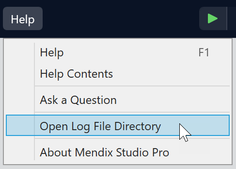

## 1 Known Issues and Troubleshooting

### 1.1 Known Issues

You may encounter the following issues:
* **Proxy servers are not supported** — we do not support connecting to Git repositories from behind a proxy server yet.
* **Symlinks are created on every commit in Studio Pro 8.15** — the version of the Git library we are using to work with Git has a bug which creates symbolic links in the cloned repositories when the user is trying to commit. This issue will be fixed in Studio Pro 8.16.
* The workaround is to disable symlinks functionality in Git. This can be done in two ways:
    - By disabling symlinks for all the repositories, the global Git can be changed. To do this, use the command line Git client:
    `git config --global core.symlinks false`
    - By disabling symlinks for the specific project. Open the command prompt in the cloned project’s folder and execute the following command:
    `git config --local core.symlinks false`

* **You might get an “Oops” dialog when setting a name and an email for Git in the Preferences dialog box or while committing** — the problem might occur if there is no global Git config file on the PC yet. To fix this issue, you can use the Git command line client and do the following:
    - Specify the user name:
    `git config --global user.name "<Name>"`
    - Specify the email:
    `git config --global user.email "<Email>"`
    - Any of these commands will create a global Git config. Subsequent interactions via the Studio Pro interface will succeed from now on.

### 1.2 Troubleshooting

#### 1.2.1 Connection Problems When Cloning the Git Repository

If you face connection problems when cloning the Git repository using the **Open App** or **Download App** dialog box, the first thing to check is whether the URL of the remote Git repository is correct. It should not be copied from the browser address bar. Most Git services have a noticeable colored **Clone** button which provides the correct URL in a pop-up window. You should use this URL with Studio Pro.

#### 1.2.2 Customer-Facing Issues

For Studio Pro developers to be able to troubleshoot issues that the customers face with experimental Git support, Studio Pro provides logging mechanism.

When filing a Git support issue with Mendix Support, attach the log files doing the following:

1.	Navigate to the **Help** menu > **Open Log File Directory**:
 

2.	Copy the file called log.txt into your ticket. You can also attach additional log.X.txt files if they exist.

#### 1.2.3 Git Properties Useful for Troubleshooting

There are properties of the Git repository that provide you the information useful for troubleshooting different issues execute the following Git command line commands in the project’s folder:

`git status -b` — provides information on the current state of the repository

`git remote -v` — lists the remotes specified for the repository

`git config --list --show-origin --show-scope` — provides information on user's Git config

{}
**WARNING**: PLEASE NOTE THAT THIS MIGHT CONTAIN PERSONALLY IDENTIFIABLE INFORMATION, SO MAKE SURE ALL THE PRIVATE INFORMATION IS REMOVED BEFORE SHARING!
{}

