## 1. Team server

In the Mendix Platform there is a central repository that contains both the model and the resources. Each person working on the app project, has a local copy of both model and resources. There are explicit actions to commit local changes to the repository and to retrieve changes by others from the repository (update). We build on top of Subversion that supports this style of working.

We chose Subversion because of its popularity, maturity and solid Windows support. Building on top of Subversion means that we inherit its reliable protocols for sending and receiving changes. Subversion has a lot of operations that allow us to support advanced features like branching and merging. The Modeler simplifies Subversion commands by providing a layer over them. All common operations can be executed right from the Modeler.

## 2\. Concepts

### 2.1 Team server Access

In order to access the Team Server project two prerequisites must be arranged;

*   You have to be Team Member of the app project
*   You need a Role with right to edit the model.

Becoming a team member is handled through an invite which has to be send to you by another team member. So if you aren’t member of an app project yet, ask a current team member to invite you.

The role is depending on the app project security/role settings. By default the roles “SCRUM Master” & “Business Engineer” are allowed to access the team server. Though this can be adjusted by the scrum master of the app project. Once a role has the “Edit” right to the development step, team members with this role will be able to download the model, change it and committing new revisions. View means that the team member is allowed to see the repository overview of the team server revisions.

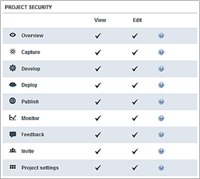

### 2.2 Repository

The repository is the central place where your app project and its complete history are stored. Each app project corresponds to a repository. The Mendix Team Server can host any number of repositories.

### 2.3 Revision

A revision in a repository is the complete state of your app project at a point in time. This includes the model (the .mpr file) and all resources (Java, custom widgets and etcetera). Every time a person commits a set of changes a new revision is created.
Revisions are numbered starting from one. Using the revision number you can uniquely identify the app project at a certain point in time. Let us say the latest revision in the repository is 20\. If a person now commits some changes, revision 21 will be created. Revision 20 is the state of the app project before those changes are applied and 21 is the revision including the changes.

### 2.4 Working copy

A working copy is a local copy of the app project. This local copy is what you work on and where you make all your changes. You create a working copy by downloading a revision from the Team Server repository. We call the revision that you download the original of the working copy (in Subversion this is called ‘base’). When you start working on your local copy it starts to deviate from the original. Working on your local copy has no effect on the repository. Once you are happy with the changes you can commit them, this will create a new revision in the repository.

Let us say you download revision 35 from the repository. This is your original. You make some changes to your working copy and then commit them. This creates revision 36 and your working copy now has this revision as its original.

### 2.5 Download from Team Server

Before you can start working on a Team Server app project you have to download it to your computer. Within the Mendix Modeler you’ll select the app Project, a development line and a disk location where to store the working copy locally. In the Modeler you can download a Team Server project by simply opening the app project.

### 2.6 Upload to Team Server

If you have an existing app project with an empty team server repository (you didn’t start modeling) and you want to start using version control, you have to upload the app project to the Team Server. You can upload to a new online app project or you can select an existing app project that is Team Server-enabled but does not store an actual Modeler app project yet. Uploading to a new app project also creates a Mendix app Project.

### 2.7 Status & change dock

The status of your app project is a summary of all the changes in your working copy when compared to the original. The Modeler shows the status both in the Project Explorer and in the new 'Changes' dock. Different kinds of changes are visualized with different icons.

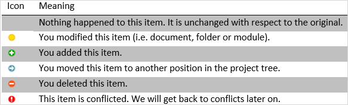

The Project Explorer shows an icon in front of items (documents, folders and modules) that are changed in some way. There is only room for one icon and if a document is both modified and moved it is shown as modified.

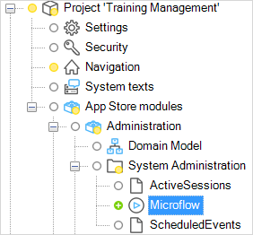

In the screenshot you can see that the document Account_NewEdit has been modified. Also a new folder called 'Flows' was added and all Microflows were moved inside this folder. Note that the folders and modules containing changes are depicted with a small yellow circle. This helps you to quickly see where in the app project the changes are.

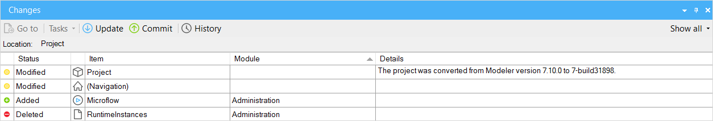

The Changes Dock shows a line for each change to an item. If a document is both modified and moved there are two lines for that document. The dock also shows items that were deleted, something the Project Explorer cannot do.

### 2.8 Commit changes

Sending changes to the repository is called ‘committing’. The idea is that you commit small, consistent pieces of work to the repository. Examples are implementing a new feature and fixing a bug. The Modeler will warn against committing while there are errors in your app project. Preferably, the revisions in the repository are always error-free.

Committing results in a new revision in the repository. You can add the following information to a commit which will be attached to the newly created revision:

**A textual message**

You can enter this message in the Modeler when committing and it should be a summary of the changes you made.

**A list of userstories**

These storiesrelate to the commit. And is documented in the platform

Our advice is to keep commits small and this means that a commit probably relates to one story. The Modeler only shows stories that are currently ‘Running’ and will not change the state of the story. Setting the status to ‘Done’ is the responsibility of the team and depends on your definition of done.

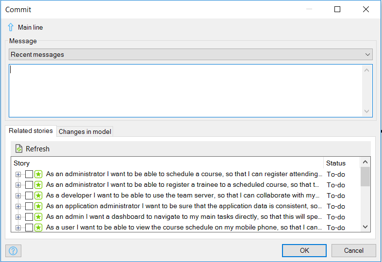

The Modeler also attaches some information automatically:

*   The author (meaning, the person who committed)
*   The date and time of the commit
*   The list of changed documents/folder/modules along with the type of the change (modify, add, delete)
*   The version of the Modeler that was used to commit

If you also changed Java source code, added widgets or made other changes that affect files other than the app project file you will get a 'Changes on disk' tab page that shows you what disk changes you are about to commit.

Committing is only allowed if your working copy is up to date with the repository. If someone else committed a change since the last time you updated, you have to update first. The reason for this is that the revision you will create with the commit should incorporate both your changes and the changes by the other person. Updating will combine the latest changes in the repository with your changes. After reviewing the result and fixing possible problems, you can commit again

### 2.9 Update

Updating is the process of retrieving the latest changes from the repository. It is advisable to frequently update so that the number of changes you retrieve is small.

In the process of updating the original of your working copy is updated as well. Let us say that the last time you updated you received all changes up to and including revision 40\. That means the original for your working copy is revision 40\. You have made some changes to your working copy. Since you started doing that other people on your team have made a total of four commits (41, 42, 43 and 44). If you now update, you will receive those changes and 44 will be the new original to which your changes are compared.

Changes you receive from the repository when updating are combined with the changes you have made to your working copy (if any). Afterwards, your working copy will contain both your changes and the changes you received. Many times combining those changes will work out fine. For example, one person adds a form and another changes a Microflow. Or two people both add a tab page to a form. Only if the changes are too close a document a conflict arises. For example, two people both change properties of the same data view. You will have to resolve such conflicts before you can commit.

### 2.10 Conflicts

A conflict arises when two changes cannot be combined. There are two places where this can happen. The first is inside a document when two modifications are too close to each other, for example two people both changing properties of the same data view. We call this a document conflict. The second place is at the level of the app project, for example when one person delete a form something that the other person modifies or two people move a Microflow to different locations in the tree. We call this an app project conflict.

The documents that are conflicted are marked as such in the Project Explorer and the changes dock. In the case of a document conflict you can zoom in to the exact spot where the conflicting change is. In the case of an app project conflict the document will be highlighted in the Project Explorer tree.

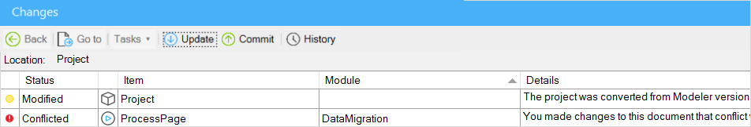

Resolving a conflict can be done in by using the ‘Use mine’ and ‘Use theirs’ button in the version control dock. In the case of an app project conflict, only the **Use mine** button is enabled and it resolves the conflict and keeps the situation as it is now in your working copy. For document conflicts both buttons are enabled and with them you can choose between your version and ‘their’ version.

### 2.11 History

The history of the app project is a list of all revisions that have been committed in reverse chronological order (newest is at top of list). The history form quickly shows you revision number, date, time, author and message of each revision. By selecting a revision you can view additional details such as related userstories, changed documents, Modeler version and changes on disk. Icons summarize the kinds of changes that happened in the app project; whether there are model changes, disk changes and whether the app project was upgraded to a new Modeler version can quickly be checked by looking at the icons.

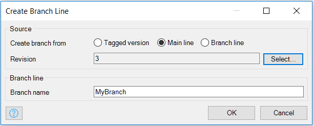

## 3\. Development lines

### 3.1 Main line vs. Branch line

A app project always starts with a single development line “Main line”. This is the development line which will be leading within the development process. A deployment from that line must contain all (released) functions of the application. Besides the Main line, a app project can have multiple branch lines.

Branches are made from a specific commit (revision) of one of the developers. Creating a branch means that a copy is made of the selected revision and this will be used as start revision for the new development line.

This allows the developer to change the model in an isolated line. Most cases a branch line is used for solving issues in a released version of the application, while the ongoing development is handled in the main line. This allows new development in the main line, without releasing not finalized/tested functionalities.

After creating a branch and solving of the issue, or creation of a new bigger feature, it is possible to merge these changes with the mainline.

### 3.2 Development lines

A repository can contain a number of development lines. Each development line offers independent development from the other development lines. In the simple case there is just one development called the main line (called ‘trunk’ in subversion). All development then happens inside that one line.

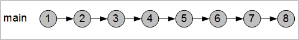

It is often convenient to have more than one development line. For example, one development line for fixing bugs in the currently deployed version of your app project and another line where you develop new functionality. If you then find a bug in the deployed version you can fix it in the corresponding development line irrespective of the state of the development line where new functionality is developed.

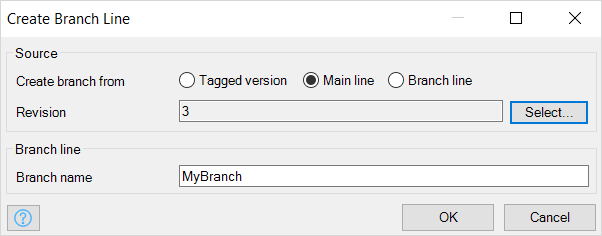

Development lines other than the main line are called branch lines. Our advice would be to develop new features in the main line and to have branch lines for fixing bugs in versions that have been deployed. This is the scenario the Modeler makes easy but other scenarios for more complex app projects are supported as well.

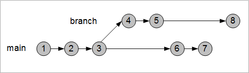

Note that revision numbers are unique across all development lines. This means that two commits in the same development line do not always have consecutive numbers, for example the jump from 3 to 6.

### 3.3 Merge

If you have multiple development lines, you sometimes want to port changes from one development line to another. For example, the fix that you made in a branch line for the production version should also be applied to the new 2.0 version you are developing in the main line. You can, of course, do this by hand but the Modeler can also help you by merging changes from one development line to another.

Merging is always done while you have a working copy open. The merge will result in extra local changes in that working copy. It is advisable to commit local changes first before merging extra changes into a working copy. Otherwise, the uncommitted local changes and the changes caused by the merge will be combined and it is very hard to untangle them if you are unhappy with the merge. The Modeler will warn you if you have uncommitted changes.

In the picture below revision 5 from the branch line is merged into a working copy of the main line that was at revision 6\. Those merged changes are then committed to form revision 7.

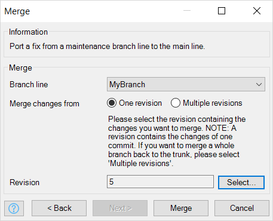

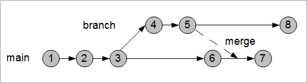

The example shows that you can merge a single revision. It is also possible to merge a whole range of revisions from one development line to another. If a branch line represents a big new feature that you completely want to integrate into the main line you can merge all revisions of the branch.

### 3.4 Best practices

*   Commit often
    *   Conflict reduction/prevention
    *   Insight of completed work
    *   Determine correct version
    *   Never commit errors
*   Update Often
    *   Conflict reduction/prevention
*   Merge often
    *   Direct after fix
    *   After feature is completed
    *   Changes are still known
    *   Conflict are limited
*   Creation of branches
    *   Fix
    *   (Big) feature (work > 1 day)
    *   Integration external work

## 4\. Related Content

*   [How to Manage Sprints and Stories](/developerportal/howto/managing-your-application-requirements-with-mendix)
*   [Contributing to a GitHub repository](contribute-to-a-github-repository)
*   [Starting your own repository](starting-your-own-repository)
*   [How to Use the Feedback Widget](/developerportal/howto/use-feedback-widget)
*   [Sharing the Development Database](sharing-the-development-database)

