## 1 Introduction

This how-to is an introduction to building a custom widget that is chainable in your Mendix application. By the end of this tutorial, you will have a basic understanding of the structure and setup of a chainable Mendix custom widget.

**This how-to will teach you how to do the following:**

* Create a chainable custom widget
* Set up and configure your Mendix app to support this

## 2 Prerequisites

Before starting with this how-to, make sure you have completed the following prerequisites:

* Install the [Mendix Modeler](https://appstore.home.mendix.com/link/modelers/)
* Install Adobe Brackets and the Widget Development Plugin for Adobe Brackets (for details, see [How to Get Started with the Widget Development Plugin for Adobe Brackets](getting-started-with-the-widget-development-plugin-for-adobe-brackets)

## 3 What Are You Going to Build?

You are going to build a Mendix app and a widget where you can select a "car" with a certain "coachwork" and "color." To show you what we mean by *chainable widget*, you can't select a coachwork if you do not have a car selected in the app. In addition, you can't select a color if you do not have a coachwork selected.

For this how-to, we created a chainable custom widget and Mendix app, and we made the project available from the following GitHub location: [https://github.com/mendix/ChainableCustomWidget](https://github.com/mendix/ChainableCustomWidget).

In this project the following user stories have been implemented:

* A uniquely logged-in user can select a car of a certain type
* Only after the user has selected a car can the coachwork can be selected (for example, 3 doors, 5 doors)
* Only after the user has selected a coachwork can the color of the car be selected
* Every time a user changes a setting, it must be stored in the database so that the user can continue at another point in time
* An overview of all the settings that users commit must be provided for a user that has administration rights

### 3.1 Taking a Look at the End-Result

To see the end result, follow these steps:

1. Log into the app:
    * **User name** – demo
    * **Password** – Asd123

    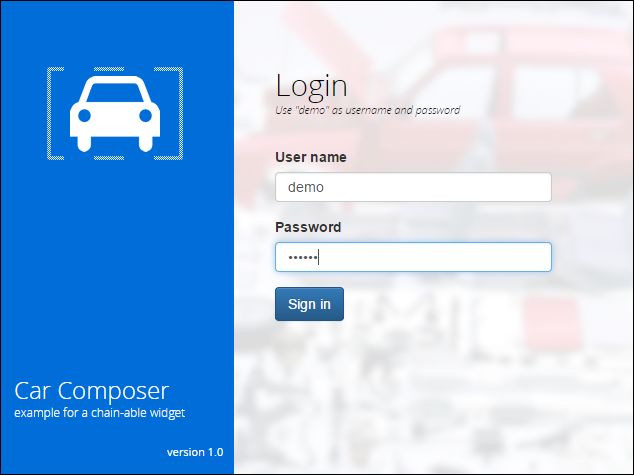

2. Select a car first:

    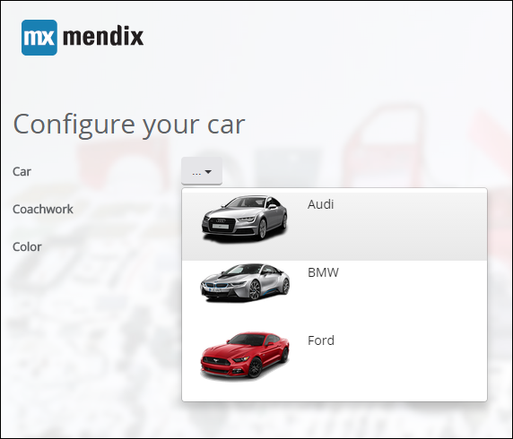

3. Select a coachwork:

    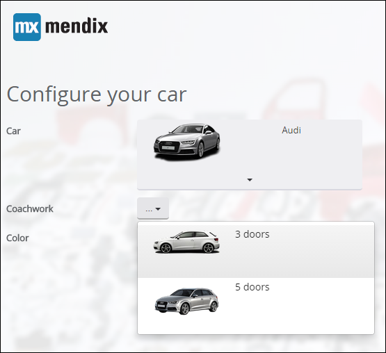

4. Once you have selected a coachwork you can select a color.

    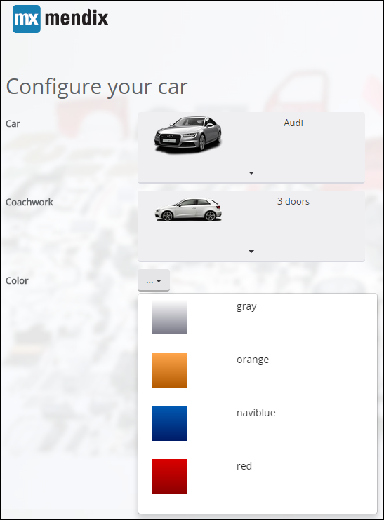

5. In the back-office, you can see that all the settings for the demo user are stored:

    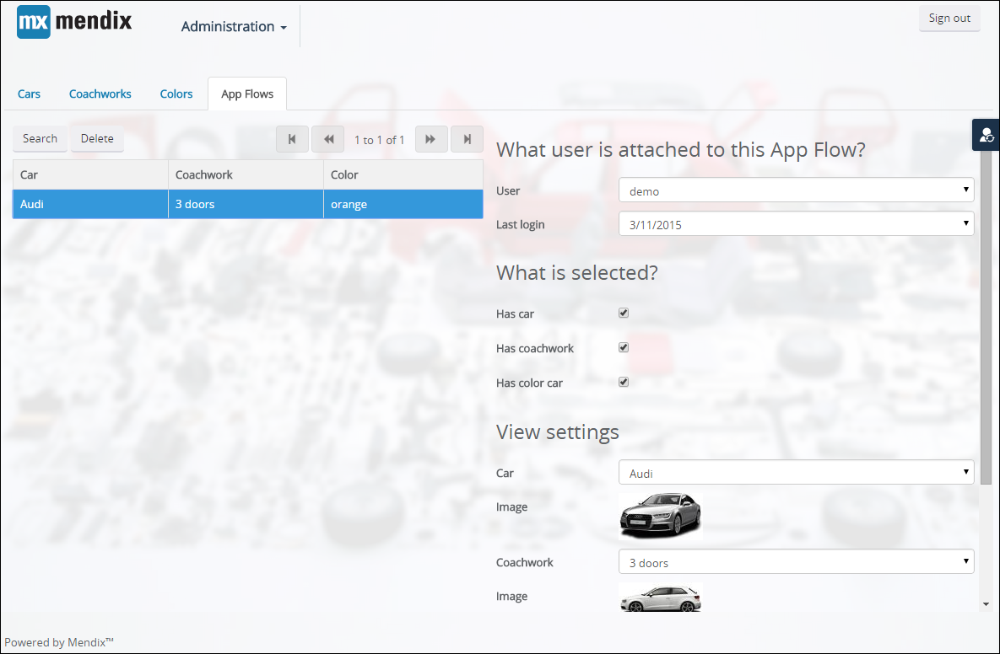

## 4 What Is Inside the GitHub Repository?

If you take a look at the GitHub repository, you will see the following directories available:

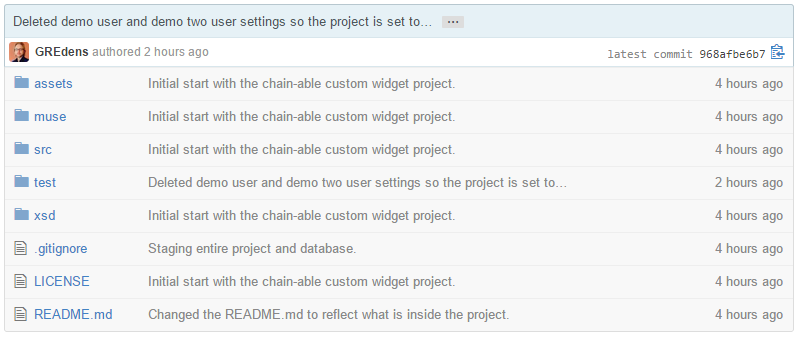

Directory | Description
---| ---
asset | Contains icons for use within the App Store and an icon for the chainable widget.
muse | An Adobe Muse project to output the login page that is inside the Mendix app. The project also contains two reusable MUCOW extensions for Adobe Muse projects to insert a Mendix login and Bootstrap.
src | Contains the source files of the Mendix custom widget.
test | The Mendix app where the widget end-result can be found.
xsd | Gives you an XSD to verify the properties that you define within your *widget.xml* file that become available inside your Mendix project.

## 5 The Domain Model

Let's take a look at the domain model in the Mendix test project:

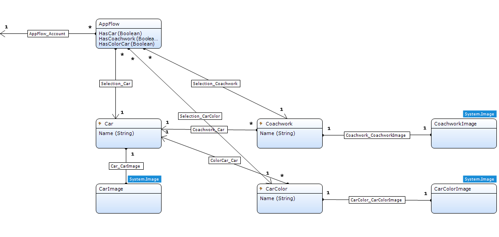

There is an **AppFlow**, **Car**, **Coachwork**, **CarColor**, **CarImage**, **CoachworkImage**, and **CarColorImage** entity. These are some important details:

* **Car**, **Coachwork**, and **CarColor** all have a one-to-one relation to an image entity
* The image entities are a generalization of **System.Image**, so you can store images for the **Car**, **Coachwork**, and **CarColor** entities
* The **AppFlow** entity is used to store the state of the flow of the application for each individual user
    * The **AppFlow** entity has an association to Administration.Account
    * The **HasCar**, **HasCoachwork**, and **HasColorCar** attribute booleans are set by the widget if a selection has been made
    * The many-to-one associations from **AppFlow** to **Car**, **CoachWork**, and **CarColor** will actually save the reference to the **Car**, **Coachwork**, and **CarColor** that the user selected

Notice the icons on the **Car**, **Coachwork**, and **CarColor** entities: 

This icon before the name of an entity indicates that there are microflows active on certain event handlers on this entity. For the Car, Coachwork, and CarColor entities, the following microflows are active:

* On the "after/create" event handler, there is a microflow that will create an image
* On the "before/delete" event handler, there is a microflow that deletes an image that was created for the entity

For the Car entity, the settings look like this:

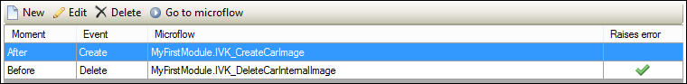

## 6 Configuration Options for the Widget

Now let's take a look at what you need to configure in your widget in order to make it chainable. Remember, when building custom widgets, you always need to build a widget that is as generic as possible. This means that the widget you build must handle all the user-stories that are defined.

### 6.1 Activation Tab

The first thing the widget needs to know is it is active. For the widget that controls the selection of the Car entity, this means that it must always be selectable. For the Coachwork and Color entities, this means setting certain options:

* For Coachwork and Color, **Always active** should be set to **No**
* **Active on selected** should point to a boolean from the AppFlow (this can be HasCar, HasCoachwork, or HasColorCar)
* **Check if active** should be set to **Yes** for Coachwork and Color

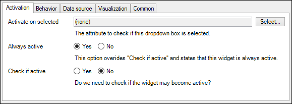

### 6.2 Behavior Tab

On this tab, you can configure what will happen when you click an item from the list of items that is returned from the microflow that you have configured on the the [Data source tab](#DataSourceTab):

* **Is selected** should be set to true, and for the Car entity, that means that HasCar will become true
    * The widget that controls Coachwork checks if HasCar is true and becomes active when it is true
* **Save microflow** is also executed to actually commit the changes for AppFlow

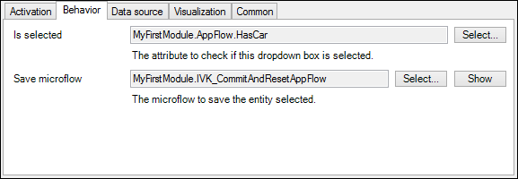

### 6.3 Data Source Tab

On this tab, you can configure What will also happen when you click an item:

* In **Entity to select**, you need to select the type of entity we can expect from the list that is returned from the microflow, because the widget is generic
* **Entity one on one** is filled with the selected entity from the list of entities that are received from the microflow

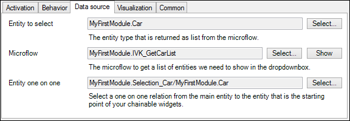

### 6.4 Visualization Tab

On this tab, you can set the visualization of the widget so that everything looks good:

* **Value to show** will use an attribute of the entity selected in **Entity to select** on the [Data source tab](#DataSourceTab) to visualize the name of the entity that is shown in the chainable widget
* **Image** is a reference to the image entity
* The image width can be set to properly render the image inside the list in the chainable widget

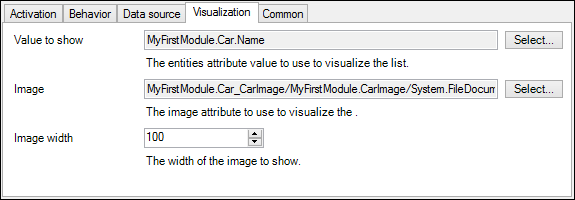

## 7 Microflows Inside the Project

On the [Mendix Model Share](https://modelshare.mendix.com/), you are able to share your microflows from the test project used in this how-to. Let's take a closer look at what is inside the Mendix test project and why it is in there.  

### 7.1 Saving the State in the AppFlow Entity

This microflow will create an AppFlow for a particular logged-in app user. If there is already an AppFlow entity created for a user, it will return that AppFlow.

<iframe width="100%" height="491px" frameborder="0" src="https://modelshare.mendix.com/models/ce3baab8-b611-4423-a049-d467db0d775c/chainable-custom-widget-project-creating-the-appflow-entity.?embed=true"></iframe>

We use this in the data view where the chainable widgets are located:

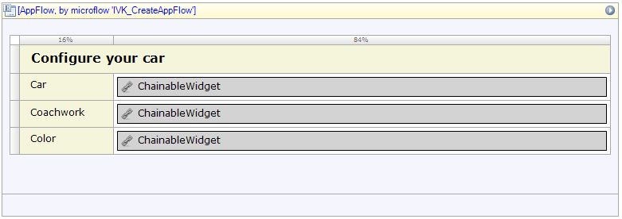

Each time a chainable widget wants to save a setting on the AppFlow entity, it triggers a microflow. This allows you to perform extra steps before a setting is actually available to other (custom) widgets and the Mendix app. The widgets that select Coachwork and Color will use the following microflow:

<iframe width="100%" height="491px" frameborder="0" src="https://modelshare.mendix.com/models/bf677fa2-2fdb-4bf2-9b6b-9b045c6493af/chainable-custom-widget-project-commit-the-appflow-entity.?embed=true"></iframe>

There is an exception for the chainable widget that handles the Car selection. Selecting a Car will require a reset of the selection of Coachwork and Color. That is why this widget has another microflow configured for that:

<iframe width="100%" height="491px" frameborder="0" src="https://modelshare.mendix.com/models/21462015-51cb-461c-91b8-743cd0e5f926/chainable-custom-widget-project-commit-the-appflow-entity-and-reset-its-associations?embed=true"></iframe>

### 7.2 Getting Lists of Entities for Car, Coachwork, and Color

The following microflows are configured at each chainable custom widget to retrieve a list of the entities it needs to show:

<iframe width="100%" height="491px" frameborder="0" src="https://modelshare.mendix.com/models/e54716bc-efbd-4bd5-ab44-5856605985e1/chainable-custom-widget-project-get-a-list-of-cars?embed=true"></iframe><iframe width="100%" height="491px" frameborder="0" src="https://modelshare.mendix.com/models/2296c444-2903-4757-8e9c-28a72d93586e/chainable-custom-widget-project-get-a-list-of-coachworks-from-a-selected-car?embed=true"></iframe><iframe width="100%" height="491px" frameborder="0" src="https://modelshare.mendix.com/models/f9506cda-a192-4ad3-8670-6d4cc46ed586/chainable-custom-widget-project-get-a-list-of-colors-attached-to-a-car.?embed=true"></iframe>

### 7.3 Saving Images for Car, Coachwork, and Color

The following microflows will create the images for each Car, Coachwork, and CarColor entity:

<iframe width="100%" height="491px" frameborder="0" src="https://modelshare.mendix.com/models/3e145efd-ab14-4068-9e1a-5916bb2df250/chainable-custom-widget-project-a-car-color-after-create-microflow.?embed=true"></iframe><iframe width="100%" height="491px" frameborder="0" src="https://modelshare.mendix.com/models/659e028c-46ad-47ed-98fa-53a26f6e9533/chainable-custom-widget-project-a-car-after-create-microflow.?embed=true"></iframe><iframe width="100%" height="491px" frameborder="0" src="https://modelshare.mendix.com/models/465b2355-2466-4d3e-8a0b-c291729edbc9/chainable-custom-widget-project-a-coachwork-after-create-microflow.?embed=true"></iframe>

### 7.4 Deleting Images for Car, Coachwork, and Color

The following three microflows will delete the images for each Car, Coachwork, and CarColor entity:

<iframe width="100%" height="491px" frameborder="0" src="https://modelshare.mendix.com/models/cc02e4c8-b5db-418f-bf33-35752c3f956a/chainable-custom-widget-project-a-car-color-before-delete-microflow.?embed=true"></iframe><iframe width="100%" height="491px" frameborder="0" src="https://modelshare.mendix.com/models/bb7addc1-9cf1-4fdb-ae92-eddfded7b182/chainable-custom-widget-project-a-car-before-delete-microflow.?embed=true"></iframe><iframe width="100%" height="491px" frameborder="0" src="https://modelshare.mendix.com/models/8065e6d8-fc42-465e-9e56-0330250d34e9/chainable-custom-widget-project-a-coachwork-before-delete-microflow.?embed=true"></iframe>

### 7.5 Important Guideline for Creating Custom Widgets

An important guideline for creating custom widgets for the Mendix Platform is that you need to let all or most of the logic be done with the tools you have in Mendix. There is no better way of knowing what other widgets are doing in your app than to listen to changes on entities. Do not try to find this out by hacking the HTML output of the Mendix Platform, because this is bad practice. If you want to know the state of a widget that does not involve entity handling in your Mendix app, you can always create custom event handlers that widgets can listen to. However, you should then make a widget have a "sender" and a "listener" mode.

## 8 Limitations of Custom Widgets

There are some important limitations in Mendix custom widgets. These limitations can help you a great deal in setting up your custom widgets.

### 8.1 Passing an Enclosed Entity

A Mendix custom widget can only handle one entity it receives from the data view in which it is placed. The following example of creating a normal microflow button **does not** work inside a Mendix custom widget:

* This example shows two data views based on Car and Coachwork:

    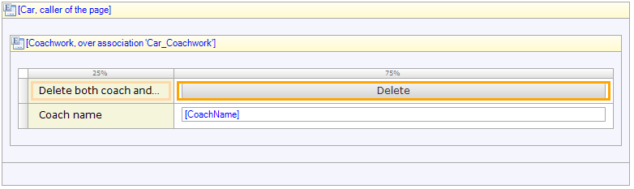

* The **Delete** button is a microflow button from the Mendix framework and has the following option:

    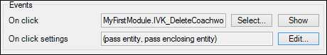

* You can select a microflow and pass an entity, but you can also pass an enclosing entity, in which case the microflow receives both the Car and Coachwork entities:

    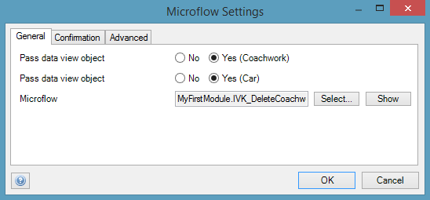

### 8.2 Passing Multiple Types of Entities to Microflows from a Custom Mendix Widget

A Mendix custom widget can only pass one type of entity as an input parameter in a microflow. It can also send a list but not fill the two different types of entities as input parameters of the microflow.

## 9 Related Content

* [How to Get Started with the Widget Development Plugin for Adobe Brackets](getting-started-with-the-widget-development-plugin-for-adobe-brackets)
* [How to Use the Mobile Slider Custom Widget](the-mobile-slider-custom-widget)
