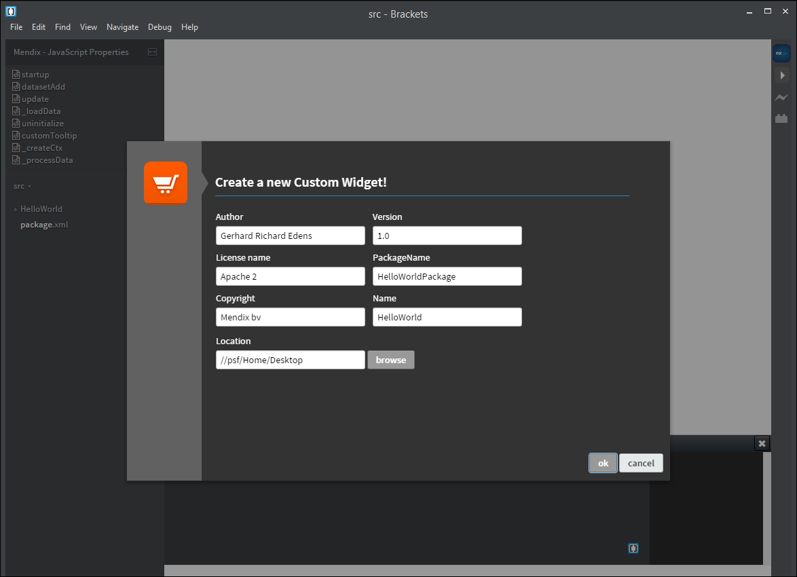

## 1 Introduction

This How-To will teach you how to use the Widget Development Plugin for Adobe Brackets. The Widget Development Plugin allows a Mendix developer to quickly create a custom widget project. Adobe Brackets is a code editor for HTML, JavaScript, and CSS. The Widget Development Plugin will turn Brackets into an integrated development environment (IDE) for creating custom widgets for the Mendix Platform.

**This how-to will teach you how to do the following:**

* Create a new widget
* Explore the widget directory

## 2 Prerequisites

Before starting this how-to, make sure you have completed the following prerequisite:

* Download Adobe Brackets [here](https://github.com/adobe/brackets/releases/tag/release-1.1) or [here](http://brackets.io/)

## 3 Getting Started with Adobe Brackets and the Widget Development Plugin

To get started with Adobe Brackets and the Widget Development Plugin, follow these steps:

1. Install Adobe Brackets on your computer and then open the editor. Your screen should look similar to this:

    

2. Select **File** > **Extension manager...**:

    

3. On the **Available** tab, search for *widget*:

    

4. For the **Widget Development Plugin for Adobe Brackets** extension, click **Install**:

    

The Widget Development Plugin will now be available in Adobe Brackets.

## 4 Creating a New Widget

The plugin adds menu options to Brackets, one of which is to start a new custom widget. You can start creating a new custom widget based on the `AppStoreWidgetBoilerplate` that is available in the [Mendix GitHub repository](https://github.com/mendix/AppStoreWidgetBoilerplate).

To create a new widget, follow these steps:

1. Select **File** > **New Widget** from the menu:

    

    The name of the widget is very important, as this name is the name used in Mendix. Using the [CamelCase](http://en.wikipedia.org/wiki/CamelCase) naming convention is strongly recommended. Each new widget should have an author, version number, copyright, license, package name, widget name, and path defined before you can click **OK**. The location directory must also exist.

    These are some details on the settings:

    * The author should only contain *a-z* and *A-Z* characters
    * The license should only contain *a-z* and *A-Z* characters
    * The copyright should only contain *a-z*, *A-Z*, and *0-9* characters
    * The version should only contain *0-9* and *.* characters
    * The package name should only contain *a-z* and *A-Z* characters
    * The name should only contain *a-z* and *A-Z* characters
    * The location should only contain a valid directory path

2. Provide the following values:

    Field | Value
    --- | ---
    **Author** | Enter your name.
    **License name** | Apache 2 / MIT
    **Copyright** | My Company B.V. 2015
    **Version** | 1.0
    **PackageName**  | MyFirstPackage
    **Name**  | MyFirstWidget
    **Location**  | Select a folder on your local drive.

    

3. Click **OK**. The plugin will get the latest version of the `AppStoreWidgetBoilerplate` from GitHub, unpack all the contents in the location directory, rename all the files and folders, and alter the content inside the files according to these settings.

    

    The location directory is now automatically opened inside Adobe Brackets:
    
    

## 5 Exploring the Widget Directory

Open the widget source directory, which is the directory you entered when creating the widget. 

{}

Because the boilerplate is used, you will have a widget that is compliant with the standards defined for a GitHub custom widget repository.

{}

The new widget source contains the following directories:

### 5.1 The Dist Directory

The `dist` directory must eventually contain the *.mpk* file you create with the SDK:

### 5.2 The Src Directory

The `src` directory contains the source files for your widget:

### 5.3 The Test Directory

The `test` directory contains a fully prepared Mendix test project for testing your widget:

## 6 Building the Widget

To package the widget source into an *.mpk* file, follow these steps:

1. Create an *.mpk* file by pressing **F4** or clicking the the play button on the right side of the editor:

    

    You are then informed that the widget has been created:

    

2. The newly created *.mpk* package is placed in the **test > widgets** directory:

    

## 7 Conclusion

This how-to has enabled you to start working and building a custom widget for the Mendix Platform using Adobe Brackets as your main integrated development environment. The code examples in the `AppStoreWidgetBoilerplate` will provide you a quick overview of what you need to interact with both the user interface and Mendix.

## 8 Related Content

### 8.1 Internal Resources

* [How to Create a Chainable Custom Widget](create-a-chainable-custom-widget)
* [How to Use the Mobile Slider Custom Widget](the-mobile-slider-custom-widget)

### 8.2 External Resources

These are some interesting books and articles you can read to dive into the source code of the `AppStoreWidgetBoilerplate`:

* Custom Mendix widgets are based on DOJO widgets – for more information, see this blog post: 
[Writing Your Own Widget](http://dojotoolkit.org/reference-guide/1.10/quickstart/writingWidgets.html)
* To communicate with Mendix, you need to use the Mendix JavaScript Client API – for more information, see the [Mendix Client API Documentation](https://apidocs.mendix.com/6/client/)
* This is a nice book that helps you understand what JavaScript is all about: [Learning JavaScript Design Patterns](http://addyosmani.com/resources/essentialjsdesignpatterns/book/)
